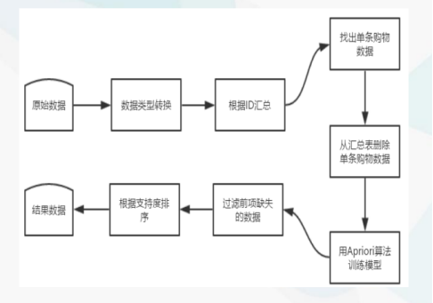
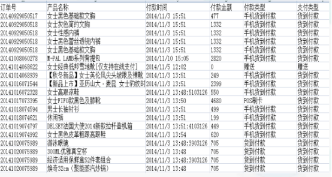
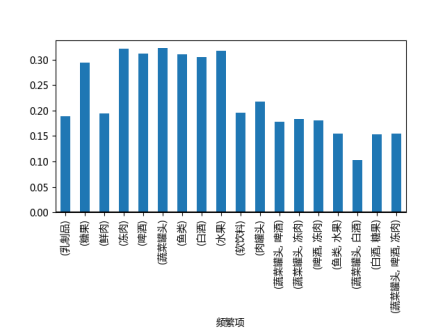
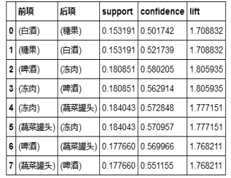

## 中期报告

### 1.问题描述：
&emsp;&emsp;当今社会已步入信息爆炸时代，大量信息已经成为信息社会最重要的特征。然而如何更好的利用信息，如何从海量数据中发现知识创造价值是人类面对的一个重要课题。目前，商家对于积累的顾客销售数据未能开展有效的研究分析，较少商家能够利用数据挖掘方法对营销决策提供有价值的帮助。传统的关联规则的缺点就是没有考虑关联规则的商业价值。如果采用传统的关联规则评价标准，同时销售“一瓶昂贵的红酒和一盒鱼子酱”与销售“一盒牛奶和一袋面包”对于关联规则挖掘过程来说意义相差不大。但事实上，零售商会更倾向推销前者，显然该组合能为企业带来比后者更大的净利润。 利用开放出来的超市购物蓝数据进行关联规则分析，因为人们在选择购买商品的时候往往会购买多个商品，如果这些商品摆放在一起，就会增加用户购买的可能性。

### 2.实验方案：
&emsp;&emsp;实验过程中主要按下图的步骤进行：  

&emsp;&emsp;&emsp;&emsp;&emsp;&emsp;&emsp;&emsp;&emsp;&emsp;

### 3.模型设计：  
&emsp;&emsp;经过分析和讨论，决定采用Aprior算法实现，而Aprior算法的基本思想是首先是找出所有大于最小支持度的频繁项集，然后由频繁项集产生关联规则，这些规则必须满足最小支持度和最小可信度。Apriori算法是用来发现频繁项集的一种方法。Apriori算法的两个输入参数分别是最小支持度和数据集。该算法首先生成所有单个物品的项集列表，遍历之后去掉不满足最小支持度要求的项集；接下来对剩下的集合进行组合生成包含两个元素的项集，去掉不满足最小支持度的项集；重复该过程直到去掉所有不满足最小支持度的项集。  

&emsp;&emsp;其步骤是：依据支持度找出所有频繁项集（频度），依据置信度产生关联规则（强度），根据最后产生的关联规则，并考虑到利润因素，辅助商家做出商品的营销决策。

### 4.数据来源：
&emsp;&emsp;来自于数据堂的65535条数据，其中包括了订单号、产品名称、付款时间、付款金额、付款类型以及支付类型等属性，属于典型的电商购物型数据。  

&emsp;&emsp;&emsp;&emsp;&emsp;&emsp;&emsp;&emsp;&emsp;&emsp;

### 5.项目进度：
&emsp;&emsp;为了调试代码，已经在小数据集上完成了简单的关联规则挖掘。小数据集中包含2800条购物数据，共1000次购物，其中包含物品11种。本文根据顾客的id号生成购物篮元组数据。接着按Apriori算法产生相应的候选项集C1，再有由C1产生L1……在设置minSupport=0.15，minCof=0.5时，生成的频繁项集和关联规则如下图所示：  

&emsp;&emsp;&emsp;&emsp;&emsp;&emsp;&emsp;&emsp;&emsp;&emsp;

&emsp;&emsp;&emsp;&emsp;&emsp;&emsp;&emsp;&emsp;&emsp;&emsp;&emsp;&emsp;  
&emsp;&emsp;&emsp;&emsp;&emsp;&emsp;&emsp;&emsp;&emsp;&nbsp;&nbsp;&emsp;&emsp;&emsp;&emsp;&emsp;&emsp;挖掘得到的部分关联规则  

&emsp;&emsp;在测试的小数据集上，Apriori算法取得了较好的效果。说明算法的程序实现和分析步骤不存在明显的错误，可以进行进一步在大数据集上进行调试。  

&emsp;&emsp;本项目的方案已经确定，实验实际使用的大数据的收集也已经完成，基于数据的Apriori算法、生成关联规则算法在小数据上已经完成调试。目前在大数据上粗略调试，挖掘出的关联规则有122条，这是初步的结果。为了实现商业利益最大化，本文在传统的关联规则分析时加入了利润项，使得最后产生的营销决策能够对商家产生更大的收益。

### 6.下一步要完成的内容：
&emsp;&emsp;对参数进行进一步的调优，并且在传统的关联规则分析的基础上加上利润参考因素，使得最后产生的营销决策能够使商家在更大程度上获益。

