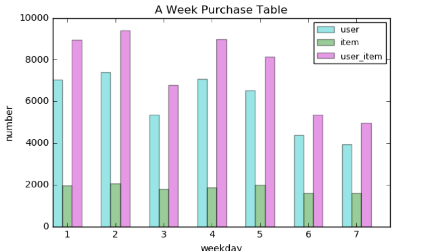

# 高潜用户购买意向预测（阶段报告）

## 一、小组成员

- 孟玉立 2120161024 
- 谢瑄  2120161065 
- 王龙    2120161054 
- 王欣欣 2120161059 
- 商军英 2120161032 

## 二、完成情况

### 1.数据清理

对于高潜用户购买意向预测这个问题，从数据挖掘的角度来讲我们可以认为这是一个二分类的任务。那么我们就是尝试去构建自己的正负样本.

由于我们拿到的是原始数据,里面存在很多噪声,因而第一步我们先要对数据清洗,比如说:

去掉只有购买记录的用户(没有可用的历史浏览等记录来预测用户将来的购买意向)

去掉浏览量很大而购买量很少的用户(惰性用户或爬虫用户)

去掉最后5(7)天没有记录(交互)的商品和用户

为了能够进行上述清洗,在此首先构造了简单的用户(user)行为特征和商品(item)行为行为特征,对应于两张表user_table和item_table

user_table特征包括:

user_id(用户id),age(年龄),sex(性别),

user_lv_cd(用户级别),browse_num(浏览数),

addcart_num(加购数),delcart_num(删购数),

buy_num(购买数),favor_num(收藏数),

click_num(点击数),buy_addcart_ratio(购买加购转化率),

buy_browse_ratio(购买浏览转化率),

buy_click_ratio(购买点击转化率),

buy_favor_ratio(购买收藏转化率)

item_table特征包括:

sku_id(商品id),attr1,attr2,

attr3,cate,brand,browse_num,

addcart_num,delcart_num,

buy_num,favor_num,click_num,

buy_addcart_ratio,buy_browse_ratio,

buy_click_ratio,buy_favor_ratio,

comment_num(评论数),

has_bad_comment(是否有差评),

bad_comment_rate(差评率)

接下来我们将采用python2.7, pandas等工具实现上述过程.

### 2.数据分析

1）导入相关包

2）定义文件名

3）周一到周日各天购买情况分析，提取购买的行为数据

分析: 一周用户购买数量分布相对比较均衡,周六周日购买数相对较少,可能是此时大家去过周末了。

4）查看特定用户对特定商品的活动轨迹。

### 3.探索高潜用户的行为

题目是高潜用户购买意向预测, 那么理解清楚什么是高潜用户对于数据分析,特征抽取,以及之后的建立模型有着至关重要的作用.
 
简单来讲,作为训练集的高潜用户应该具有以下特征:

1）必须有购买行为

2）对一个商品购买和其他交互行为(浏览,点击,收藏等)时间差应该多于一天

3）更新Note: 可能存在买了又买的情况，这部分用户也不可忽略.

那么接下来,我们先尝试找出这些高潜用户,之后对他们的行为做一些数据分析.

项目目前进行到的就是这一阶段了，后面的工作还在进行之中。