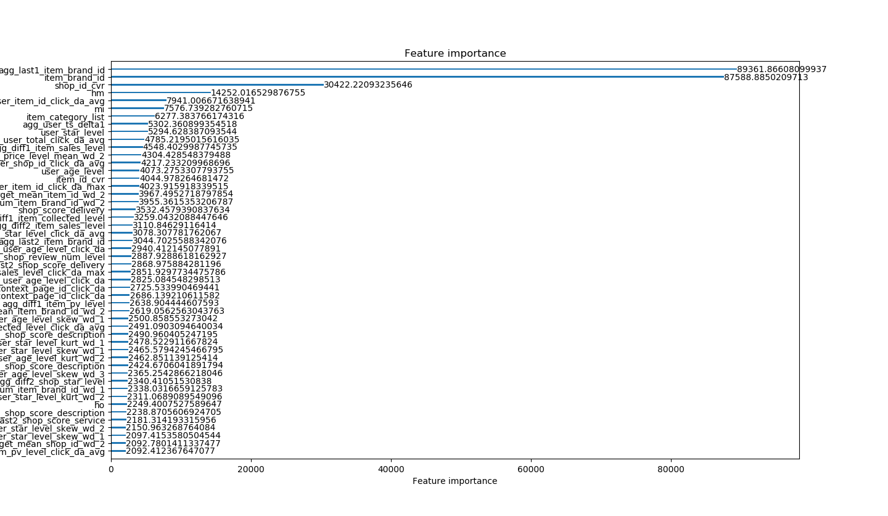

---
layout: page
mathjax: true
permalink: /2018/projects/p02/midterm/
---

## 项目进展报告

### 数据获取及预处理
#### 数据来源
本次实验数据来自赛事“IJCAI-18 阿里妈妈搜索广告转化预测”官方提供的数据，以阿里电商广告为研究对象，提供了淘宝平台的海量真实交易数据。
#### 数据说明
数据包含5类数据：基础数据、广告商品信息、用户信息、上下文信息和店铺信息。每种数据所包含的信息见下表。

| 数据类型 | 说明 | 包含字段 |
| - | :-: | :-: |
| 基础数据 |广告基本信息以及“是否交易”标记|is_trade等|
| 广告商品信息 |广告中商品的属性信息|item_id,item_property_list等|
| 用户信息 |点击广告的用户的基本信息|user_age_level,user_star_level等|
| 上下文信息 |与广告有关的展示时间、页面、查询词等信息|timestamp等|
| 店铺信息 |店铺基本信息|shop_star_level,shop_core_description等|

其中，基础数据提供了搜索广告最基本的信息，以及“是否交易”的标记。广告商品信息、用户信息、上下文信息和店铺信息等4类数据，提供了对转化率预估可能有帮助的辅助信息。
#### 数据预处理
特征是数据中抽取出来的对结果预测有用的信息，可以是文本或者数据。特征工程是使用专业背景知识和技巧处理数据，使得特征能在机器学习算法上发挥更好的作用的过程。过程包含了特征提取、特征构建、特征选择等模块。特征工程的目的是筛选出更好的特征，获取更好的训练数据。因为好的特征具有更强的灵活性，可以用简单的模型做训练，更可以得到优秀的结果。
所以，对特征的处理就显得尤为重要。
为了方便处理，我们将数据添加时间维度特征后，合并数据并将数据保存为pkl格式。接着进行后续的数据处理工作。
#### 用户点击量统计
首先，对于每一个广告，统计每天、每个时段的用户点击量以及总点击量，并根据用户年龄、星级、页面等信息分类统计。
#### CVR平滑处理
由于原始数据存在噪声，数据波动较大，不利于分析，所以我们对CVR进行贝叶斯平滑处理使得数据更易于分析处理。
#### 统计特征
对每个属性计算均值、方差、标准差等数理统计特征，以方便进行特征选择和对特征进行分析。
#### 用户最近行为记录
考虑到用户在产生购买行为的心理，我们认为用户产生购买行为之前的行为与其产生购买行为有很大的关联度，所以对用户u最近的行为记录统计。

##### 

### 数据分析与可视化
#### 数据分析
根据数据预处理得到的有关特征，在两种模型下计算特征的重要程度。
#### 数据可视化
下图展示了在lightGBM模型下，各个特征的重要性排名。
 
下图展示了在CatBoost模型下，各个特征的重要性排名。

### 模型选取
我们选择LightGBM以及CatBoost分别进行数据挖掘。
lightGBM：基于决策树算法的分布式梯度提升框架。其采取了提前histogram binning，再在bin好的数据上面进行搜索，实现速度具有很大的优势。CatBoost在实现速度上虽较慢，但是其精度与lightGBM相比拥有较大的优势，所以我们同时采用了两种模型，分别得到挖掘结果并简单对比了两种挖掘结果。

### 挖掘实验的结果
目前，我们进行了数据预处理工作，之后将继续有关数据挖掘的相关任务。

### 存在的问题
数据缺失值较多，对缺失值的处理需要针对不同的数据确定不同填充办法。当前我们仅对部分关键特征进行了具体的填充分析，这样可能导致结果出现偏差。

### 下一步工作
1、根据特征重要性排名，对重要的特征细化缺失值的处理办法。

2、分别采用lightGBM和CatBoost进行数据挖掘
