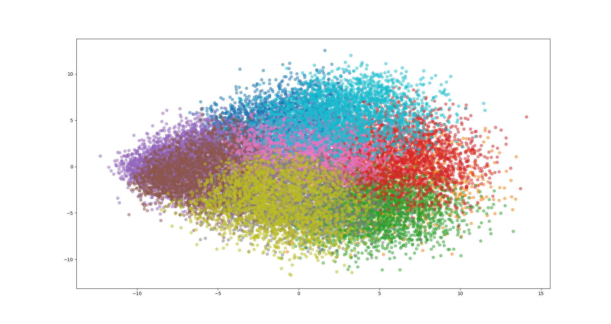
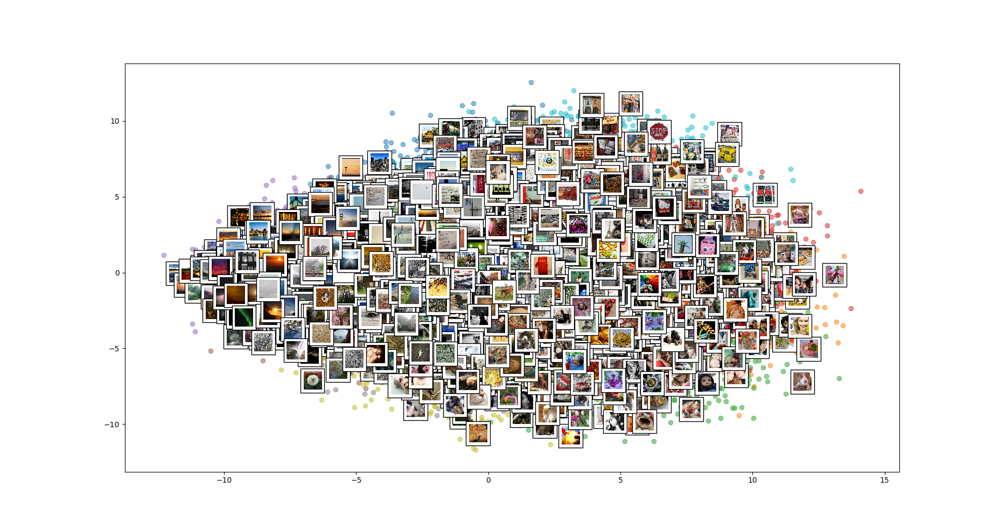
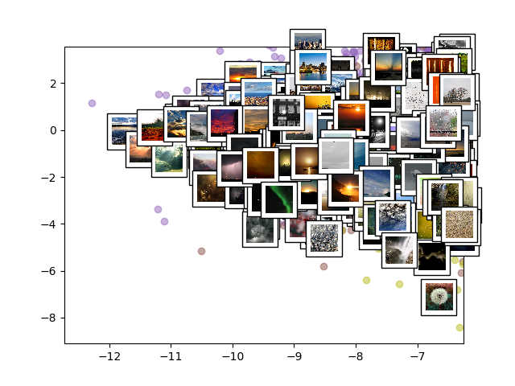
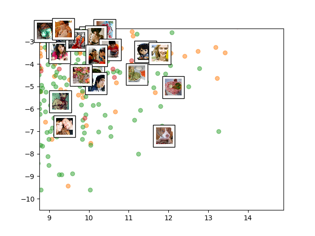
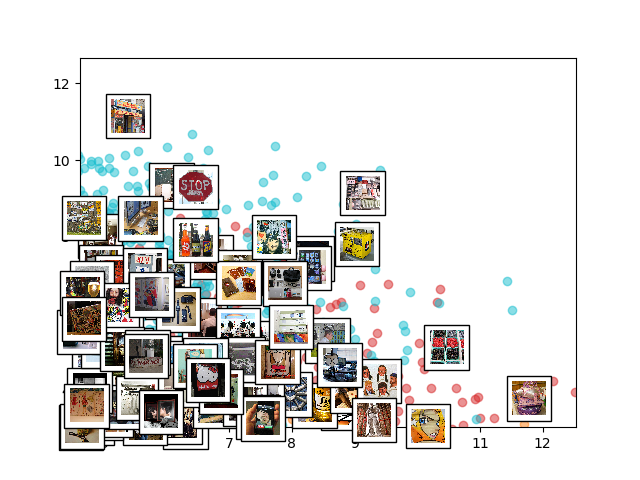

# 基于内容的图像检索分析——中期报告

## 成员
- 汪汗青
- 毛婷
- 王钰

## 目录

1. [引言](#引言)
2. [模型选取](#模型选取)
    - [VGGNet提取图像特征](#VGGNet提取图像特征)
    - [PCA降维](#PCA降维)
    - [K-D树进行相似性度量](#K-D树进行相似性度量)
3. [实验及分析](#实验及分析)
    - [数据集获取及预处理](#数据集获取及预处理)
    - [基于特征的数据集分析](#基于特征的数据集分析)

## 引言

随着数码相机、扫描仪等数字化设备的快速发展和普及使用，使得媒体数据库的总量以及类别都有很大提高。怎样才能又快又准的从海量的数据库中检索到我们想要找的图片，成为了最近几年研究的热点。通常情况下，图像检索分为以下两种方法：基于文本的图像检索和基于内容的图像检索。但是由于基于文本的图像检索的局限性较大，目前使用较多的是基于内容的图像检索。
基于内容的图像检索系统是被广泛关注和研究的计算机视觉领域的一个分支，其根据大规模的数字图像内容在已有的图像数据集查找到具有相同或者相似内容的图片。基于内容的图像检索系统是根据图像的内容，在已有图像集中找到最相近的图片，这类系统的效果（精确度和速度）和两个方面有关：（1）图像特征的表达能力；（2）近似最近邻查找。下面简单介绍下这两个点。
图像特征的表达能力一直是基于内容的图像检索中最核心却又最困难的点之一，计算机所看到的图片的像素层面表达的低层次信息与人所理解的图像多维度高层次信息内容之间有很大的差距，因此我们需要一个尽可能丰富的表达图像层次信息的特征。以前的传统算法中多是运用人工设计提取图像特征，如SIFT特征、HOG特征等，这种特征提取方法提取到的多为低级特征，达到的准确率有限。而深度学习是一个对于图像这种层次信息非常丰富的数据有更好的表达能力的框架，其中每一层的中间数据都能表达图像某些维度的信息，相对于传统的Hist, SIFT等特征，表达的信息更丰富，因此我们想要用深度网提取的特征来代替传统的手工提取特征，希望能对图像有更精准的描绘程度。
第二点为近似最近邻(Approximate Nearest Neighbor)。由于在大量样本的情况下，遍历所有样本并计算被检索图像与样本图像之间的距离，精确地找出最接近的Top k个样本是非常耗时的，因此我们选择牺牲掉一小部分精度来完成时间上的缩短，常见的ANN算法包括局部敏感度哈希，K-D树，Vantage-Point树等，而我们的系统中将采用K-D树来完成这个过程。

## 模型选取

本文采用卷积神经网络提取图像特征，利用PCA进行降维，然后用K-D树的近似最近邻方法计算被检索图像与样本图像之间的欧式距离，找出与被检索图像最接近的Top 5个样本。

### VGGNet提取图像特征
图像检索归根到底是特征的匹配，传统方法是作者自己来发掘有用的特征，比如SIFT,SURF,AKAZE等，而深度学习是只要输入原始图像，然后设计好卷积神经网络，那么网络会选择最合适的特征。因此与传统特征提取的方法相比，深度网络提取的特征对图像有更精准的描绘程度，其中每一层的中间数据都能表达图像某些维度的信息，表达的信息更丰富，于是我们采取了深度网络提取图像特征的方法。 

 
我们这里所用的网络模型是VGGNet,是由牛津大学和GoogleDeepMind公司一起研发的深度卷积神经网络。VGG可以看成是加深版本的AlexNet，它继承了AlexNet的框架。VGG包括5个group的卷积，2层fc图像特征，1层fc分类特征，总共8个部分。根据前5个卷积group中的不同配置，VGG论文中给出了A-E五种配置（如上图所示），卷积层数从8到16递增。随着卷积层从8-16的一步步加深，网络的性能得到一步步提高。VGG相对其他的方法，参数空间很大，最终的model有500M左右，所以训练一个VGG模型通常要花费更长的时间，所幸有公开的预训练好的模型供我们使用，因此我们直接用在ImageNet上预训练好的VGG-16模型来进行图像特征的提取，并与HOG提取的特征以及哈希提取的特征进行比较。

### PCA降维

大部分神经网络产生的中间层特征维度非常高，输出包含丰富图像信息的维数往往也很高，例如当维度为4096维时，在进行被检索图像与样本图像之间的相似性度量时，需要比较4096维的浮点数向量与4096维的浮点数向量之间的相似度，运算量很大，因此Babenko等人在论文Neural codes for image retrieval中提出用PCA算法对4096维的特征进行PCA降维压缩，然后用于基于内容的图像检索，实验证明降维之后的效果优于大部分传统图像特征。因此我们在用VGG网络提取了图像特征以后对特征进行了PCA降维，
分别降维到2048维，1024维，512维，256维，128维，64维以及32维，并进行不同维度下的实验比较。

### K-D树进行相似性度量

提取了图像特征以后，便要进行被检索图像与样本图像之间距离的比较，即通过距离函数在高维矢量之间进行相似性检索的问题。一般来说，针对特征点匹配有两种方法：(1)线性扫描，即穷举搜索，依次计算样本集E中每个样本到输入实例点的距离，然后抽取出计算出来的最小距离的点即为最近邻点。此种办法简单直白，但当样本集或训练集很大时，它的速度会很慢。(2)构建数据索引，因为实际数据一般都会呈现簇状的聚类形态，因此我们想到建立数据索引，然后再进行快速匹配。索引树是一种树结构索引方法，其基本思想是对搜索空间进行层次划分。根据划分的空间是否有混叠可以分为Clipping和Overlapping两种。前者划分空间没有重叠，其代表就是K-D树；后者划分空间相互有交叠，其代表为R树。我们采用了K-D树的方法进行图像特征的相似性度量，以快速地找出最接近的Top k个样本。K-D树构造的主要过程为：对于所有的样本点，统计它们在每个维度上的方差，挑选出方差中的最大值，对应的维度就是spilt域的值；然后将所有样本点按其第split维的值进行排序，位于正中间的那个数据点选为分裂节点的dom_elt域，分割超平面就是通过分裂节点并垂直于分割轴的平面，因此将整个空间分为左子空间和右子空间两部分；然后分别对左子空间和右子空间的数据点重复上面的步骤构建左子树和右子树直至经过划分的子样本集为空。构建好K-D树后便进行K-D树的最近邻搜索，搜索距离被检索图像最近的前5个图像作为检索结果。

## 实验及分析

### 数据集获取及预处理
我们的图像检索系统采用的数据集是MIRFLICKR数据集。MIRFLCKR通过雅虎旗下的FLICKR图片分享平台获取到25K张图片，并对这些图片添加了标签和分类，用于图像相似性特征描述和分类研究。我们将其中的90%用作检索，其中的10%为被检索图像。用VGG网络提取了该数据集中每张图像的特征后，将特征向量送入K-D树中，对于每张待检索图像，在K-D树中进行最近邻搜索，取Top 5个相似图像作为检索结果。
- 召回率(Recall)

召回率=系统检索到的相似图像/所有相似的图像总数，即检索到的相似图像占所有相似图像总数的百分比。
- 准确率(Precision)

准确率=系统检索到的相似图像/系统所检索的全部图像总数，即检索到的相似图像占检索到的图像总数的百分比。

- 平均准确率(mAP)

mAP是为了解决Precision以及Recall的局限性的，同时考虑了检索效果的排名情况。mAP的计算方法如图2所示。其中灰色矩形代表相似图像（真实值）。
我们对每组实验的mAP值进行了比较，mAP越高，代表检索性能越好。并作出了每组实验的Precision-Recall曲线进行比较。

### 基于特征的数据集分析

利用我们的特征提取系统，我们将数据集中的图片用特征来表示，使用聚类方法进行分析，首先对特征样本点聚类，再投影到主成分方向的二维空间中，进行可视化分析。

结果表明，提取出的特征在l1-norm上具有类内距离小，类间距离大的优秀特点。且特征的变化可以线性地体现在图片上。

<table>
    <tr>
        <th></th>
        <th></th>
        <th></th>
    </tr>
</table>

## 下一步工作

之后还会补充其他的分析实验。
