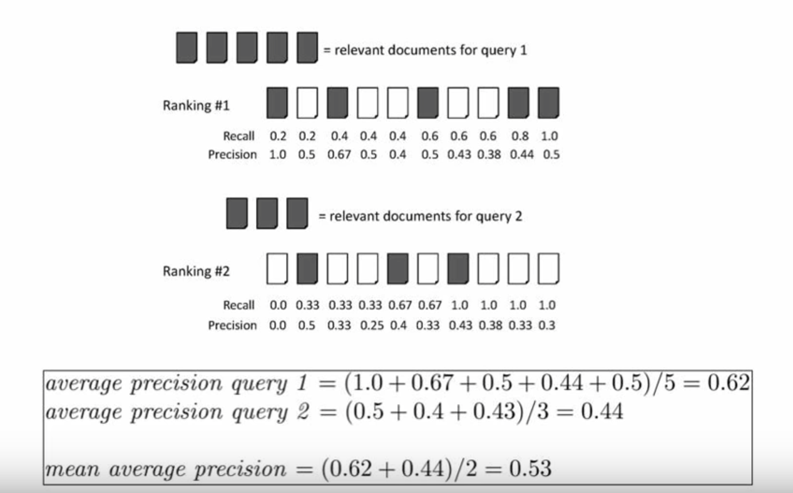

## 基于内容的图像检索

### 成员

- 汪汗青
- 毛婷
- 王钰

### 问题描述

#### 1、问题背景分析

随着数码相机、扫描仪等数字化设备的快速发展和普及使用，使得媒体数据库的总量以及类别都有很大提高。怎样才能又快又准的从海量的数据库中检索到我们想要找的图片，成为了最近几年研究的热点。通常情况下，图像检索分为以下两种方法：基于文本的图像检索和基于内容的图像检索。但是由于基于文本的图像检索的局限性较大，目前使用较多的是基于内容的图像检索。基于内容的图像检索系统是被广泛关注和研究的计算机视觉领域的一个分支，其根据大规模的数字图像内容在已有的图像数据集查找到具有相同或者相似内容的图片。

#### 2、问题描述

2.1. 数据准备

数据集：

- 雅虎$MIRFLICKR$数据集，该数据集包含了用户通过雅虎旗下的$FLICKR$分享平台获取到25K张图片，并对这些图片添加了标签和分类，用于图像相似性特征描述和分类研究。在本课题中用作检索和被检索数据集。
- ImageNet图片数据集，它包含了14M张涵盖了21841个类的图片。在本实验中用作训练数据集。

2.2. 模型建立

本检索系统主要由两个部分构成，1）特征提取网络，2）相似特征检索引擎

- 特征提取网络

  我们采用了在ImageNet数据集上训练的VGG网络来提取图片特征，VGG网络的结构如下图所示

  

  我们采用soft-max层前倒数第二个FC层的输出作为特征输出。

- 相似特征检索引擎

  我们对提取的特征向量建立K-D树，用$L_2$距离来评估两个特征向量的相似程度。

  ​

### 项目评估

我们另外选取了HoG特征和pHash指纹来作为本方法的对比实验。并采用三个指标来评估不同检索算法之间的效果。

- 召回率(Recall)

  召回率=系统检索到的相似图像/所有相似的图像总数，即检索到的相似图像占所有相似图像总数的百分比。

- 准确率(Precision)

  准确率=系统检索到的相似图像/系统所检索的全部图像总数，即检索到的相似图像占检索到的图像总数的百分比。

- 平均准确率(mAP)

  

  ​

### 项目分工

数据集准备预处理、算法实现：汪汗青

文档编写、实验分析：毛婷、王钰、汪汗青