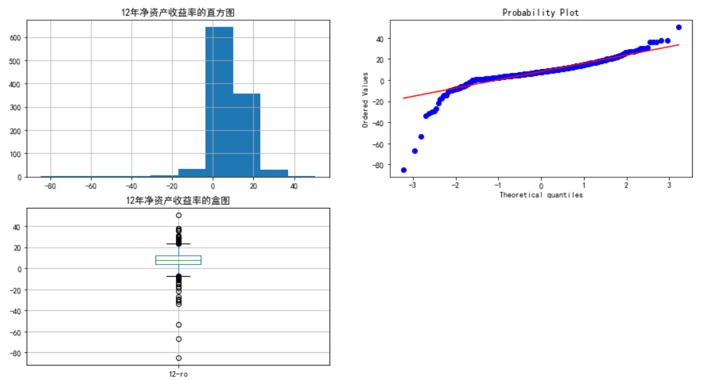

> 注意: 上方的内容不要删除

## 利用上市公司财务报表决策投资 

### 成员

姓名 | 学号
---- |-----|
李斌斌 | 3120181094
王文杰 | 3120181095
罗妹秋 | 3220180726
赵鹏飞 | 3220180904

## 项目进展报告

### 数据获取及预处理

上市公司的财务数据均来自于上市公司对外发布的财务报表等信息，我们希望根据这些信息预测下一年的企业净资产收益率，首先需要把这些财务报表中的财务数据抓取出来。本项目数据爬取自[**东方财经网**](http://data.eastmoney.com/bbsj/201812/yjkb/13.html)`2012`年至`2018`年的年度业绩快报，共`12828`条记录，包含了股票代码、营业收入、净利润等21条财务信息。

爬取各年份业绩快报后，选取每年的**营业收入同比增长**、**净利润同比增长**、**净资产收益率**作为特征，按年份进行合并做缺失值处理：将`2012`年至`2017`年的财务信息合并为训练数据集`train.csv`，将`2013`年至`2018`年的财务信息合并为测试数据集`test.csv`。

> 数据获取代码：https://github.com/mijeff/datamining_homework/blob/master/team_project/eastmoney_crawler.py

> 测试数据预处理代码：https://github.com/mijeff/datamining_homework/blob/master/team_project/data-test.ipynb

> 训练数据预处理代码：https://github.com/mijeff/datamining_homework/blob/master/team_project/data-train.ipynb

### 数据分析与可视化

我们在分析财务数据时主要采用趋势分析法。通过比较企业连续几年财务报表中的财务项目，通过统计学方法，计算存储财务项目的发展趋势函数，来预测财务状况和经营成果的变化和发展趋势。具体是通过比较企业财务数据来分析企业的财务状况，可以分为按金额分析和按百分比分析两种方式。

根据上述爬虫获得的2012年至2018年的企业年报业绩快报数据, 主要从企业盈利能力、盈利质量、偿债能力、营运能力和发展能力五个方面选择特征，找到特征之间的依赖关系。经过分析，我们选取每年的**营业收入同比增长**、**净利润同比增长**、**净资产收益率**作为决定企业净资产收益率的关键特征，将企业的净资产收益率区间作为分类结果。
净资产收益率是反映上市公司盈利能力及经营管理水平的核心指标，指标值越高，说明投资带来的收益越高。所以本系统以净资产收益率为指标，来评估企业的投资价值，当企业的净资产收益率低于当年的存款利率时，说明企业是不值得投资的。

通过进行数据分析和处理，以12年的净资产收益率为例，我们得到如下的结果：

> 数据分析和可视化的代码：https://github.com/mijeff/datamining_homework/blob/master/team_project/decisionTrees.ipynb

### 模型选取

模型选择方面我们计划采用Logistic回归模型和决策树算法模型，进行对比实验。Logistic回归是一种特殊的回归模型，也可以用来进行分类预测，主要用于二分类分析。Logistic回归模型是研究二分类观察结果与一些影响因素之间关系的一种多变量分析方法。其基本原理是利用一组数据拟合一个Logistic回归模型，然后借助这个模型揭示总体若干个自变量与一个因变量取某个值的概率之间的关系。决策树可以用于数据的分析和分类，同样也可以用来做预测。决策树依据已有的数据生成决策树模型，用模型来预测分类未来的技术。决策树优点是分类精度高、生成的模型简单并且对噪声有很好的容错性等。决策树分类算法一般分为两个步骤，决策树的生成和决策树的修剪。

为了便于进行分类预测，我们将净资产收益率预先进行如下分类:
<table>
    <tr>
        <th>分类条件</th>
        <th>分类结果</th>
    </tr>
    <tr>
        <td>净资产收益率 &lt; 0</td>
        <td>low</td>
    </tr>
    <tr>
        <td>净资产收益率 &ge; 0 & 净资产收益率 &le; 20 </td>
        <td>middle</td>
    </tr>
    <tr>
        <td>净资产收益率 &gt; 20 </td>
        <td>high</td>
    </tr>
</table>

### 挖掘实验的结果

我们将`2012`年至`2017`年的财务信息合并为训练数据集`train.csv`，将`2013`年至`2018`年的财务信息合并为测试数据集`test.csv`，依据决策树模型得到如下实验结果：

> 决策树代码：https://github.com/mijeff/datamining_homework/blob/master/team_project/decisionTrees.ipynb

### 存在的问题

> (1) 数据获取阶段：爬取到的每年的企业年度业绩报表较少，后期可以爬取更多的报表。

> (2)在数据预处理阶段：由于数据获取的格式是文本类型的，数据格式不是特别统一，所以首先要对一些不规范的文本进行去除。同时数据中存在缺失值，需要进行处理。

> (3)获取到的数据质量不佳选取的，经过决策树分类后的准确度并不好，仅71%。

### 下一步工作

下一步将按照小组既定的计划进行相关的实验，同时选取更加有效的特征，提高预测的准确度，形成最终的报告。
