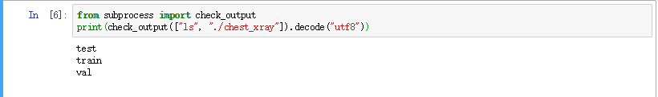
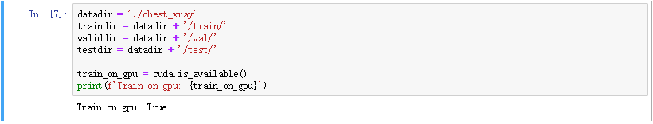
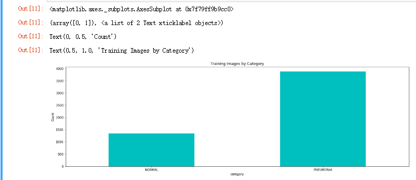
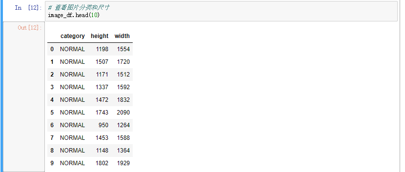
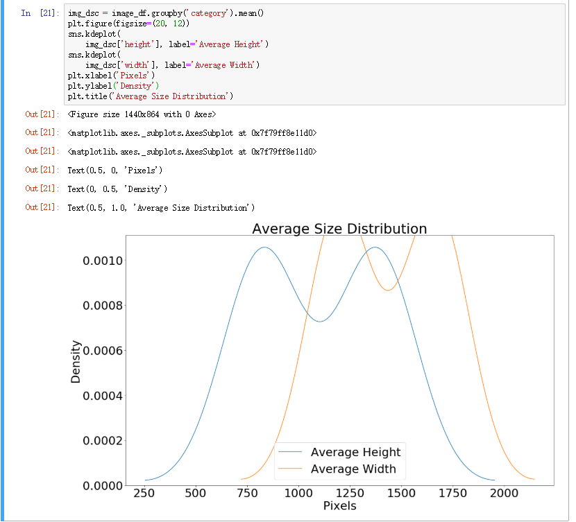
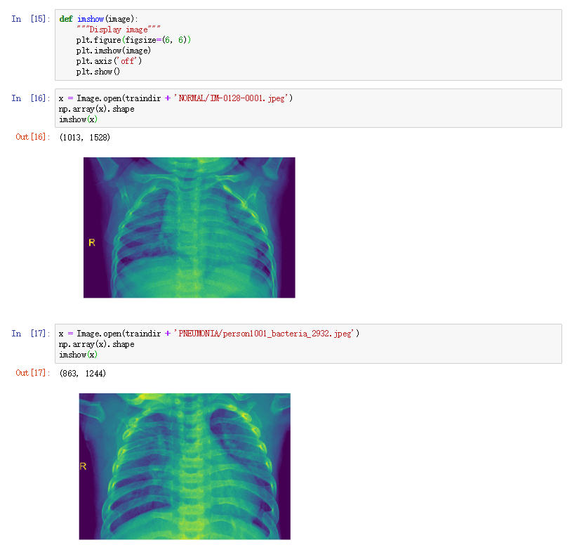
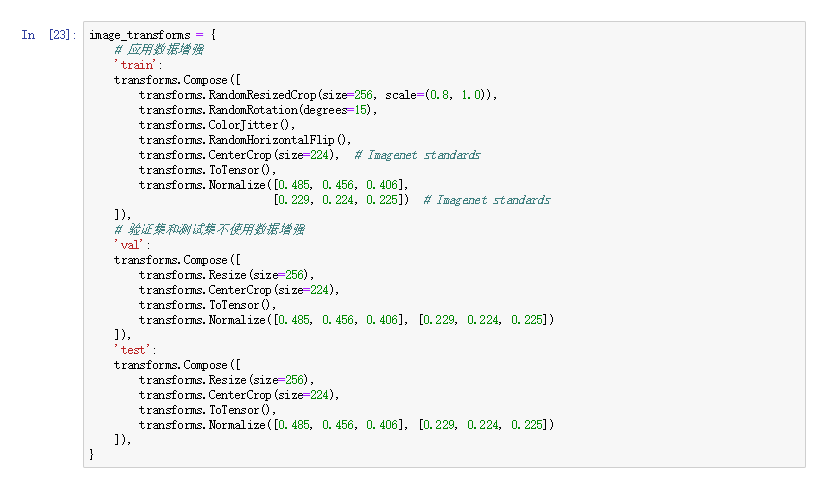
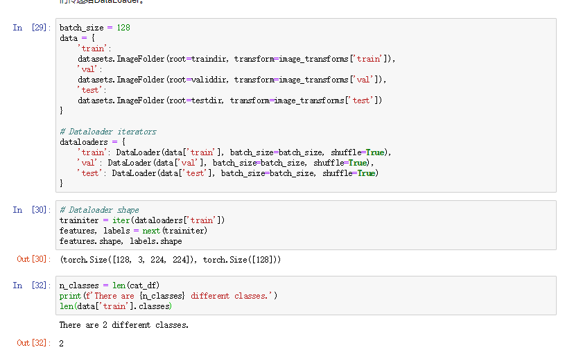

# Chest X-Ray Images (Pneumonia)

## 数据来源
机器学习和深度学习在医疗领域有着广阔的应用前景，但是实际上的部署并不是一件简单的事。目前的深度学习算法在图像处理领域还处于初步阶段，虽然经过训练的模型对图像的分类检测等任务有了很高的准确率甚至达到了人类的水平，但是由于其抗干扰能力仍然不足，应用于实际的医疗工作中应该非常谨慎。
这个项目是Kaggle上的应用胸部X光肺炎检测任务，肺炎存在多种分类，数据集只包含了细菌性肺炎和病毒性肺炎，并且样本数并不是非常丰富。我们知道深度模型通常是数据驱动的，怎样通过有限的样本数训练一个可靠的模型是我们需要完成的任务。

## 项目框架
这个项目希望能够在肺炎X光图像的分类问题上提出一个比较完整的模型。主要分为以下几个部分：
1. 观察数据集
2. 探索数据
3. 图像预处理构建DataLoader
4. 选择在图像分类上预训练好的模型
5. 训练模型
6. 完成预测
7. 结果分析

## 1.观察数据集

可见数据集已经包含了训练集验证集和测试集，下面我们将浏览这些分类，对此进行一些分析及查看一些样本，检查样本数量等。
首先查看gpu支持和文件夹划分： 

通过查看数据说明我们可以知道每一个目录下都包含两种分类：  	
1. NOMAL：这些是描述正常（无肺炎）病例的样本。
2. PNEUMONIA：该目录包含那些肺炎病例。

我们看到数据并非对称分布，患肺炎的样本占大多数。
下面我们看一下图像尺寸的分布，然后采取相应的图像增强策略： 

可以看到图像的height在750-1400之间的居多，weight在1250-1750之间多，考虑到现在流行的网络架构通常输入尺寸为224* 224，所以我们需要对图像进行缩放或者裁剪。
下面我们查看一些具体的示例： 

##2. 图像预处理构建DataLoader
为我们的网络准备图像，需要将我们的图像调整为224×224，并通过减去平均值并除以标准差来标准化每个颜色通道。还要在这个阶段通过图像变换来扩展我们的训练数据。
**数据增强**
对于训练，我们会随机调整大小并裁剪图像，并将其水平翻转。每个epoch（训练时）应用不同的随机变换，因此网络可以学习同一图像的许多不同版本。在标准化之前，所有数据也都转换为Torch张量。验证和测试数据不会增加，但只会调整大小并进行标准化。因为我们采用的预训练模型在Imagenet上是经过标准化训练的。
**数据预处理**

**构建DataLoader** 
为避免一次将所有数据加载到内存中，我们使用了训练DataLoaders。首先，我们从图像文件夹创建一个数据集对象，然后将它们传递给DataLoader。

## 3. 选择Model
working...
## 4. 训练模型
## 5. 完成预测
## 6. 结果分析
