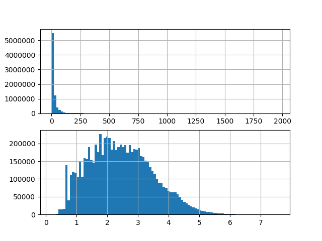
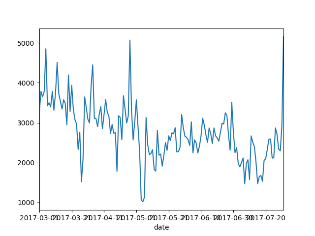
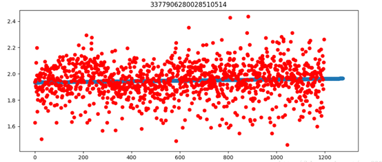
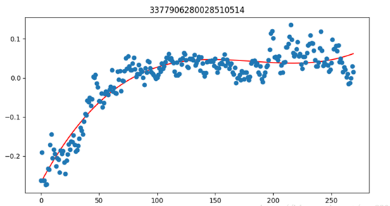
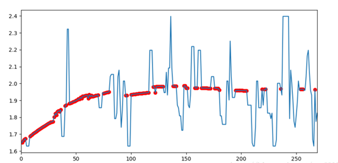
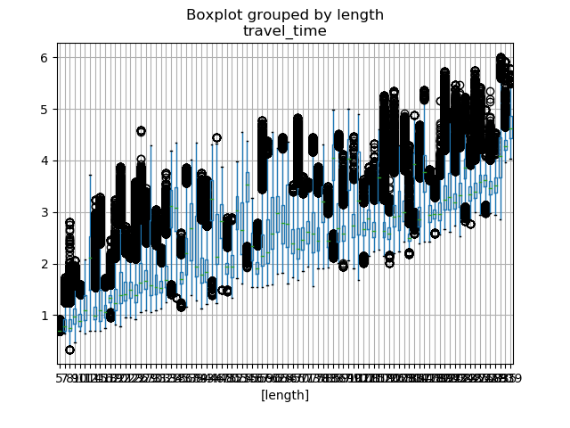
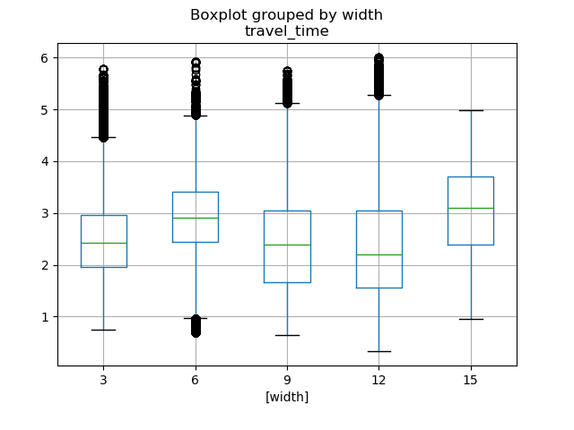
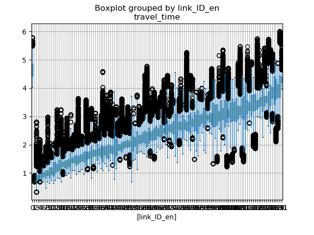
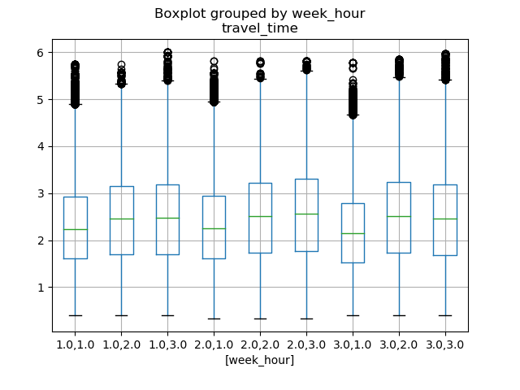
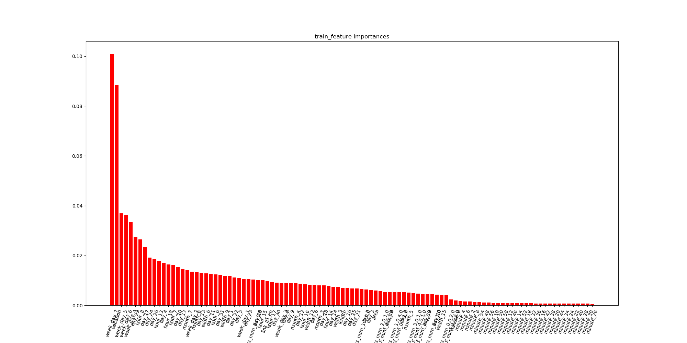

---
layout: page
mathjax: true
permalink: /2019/projects/p16/final/
---

# 数据挖掘期末大作业报告

成员：文宗正(3220180751), 曹健健(3220180683), 高宇(3220180692)
本文利用天池数据挑战赛-交通流量预测这一题目和数据集进行程序编写和分析，本文程序主要分成两部分：
* preprocess.py: 数据预处理（类型转换，缺失值处理，特征提取）
* xgbosst.py: 训练模型和交叉验证

# 1. 数据和题目说明

比赛的目标是提供一些路段流量的历史信息, 以此来预测未来一段时间的交通流量, 提供的数据一共有3个表: link_info, link_tops 和travel_time. 分别如下所示:

```
link_infos = pd.read_csv('../raw/gy_contest_link_info.txt', delimiter=';', dtype={'link_ID': object})
print link_infos.head(5)

               link_ID  length  width  link_class
0  4377906289869500514      57      3           1
1  4377906284594800514     247      9           1
2  4377906289425800514     194      3           1
3  4377906284525800514     839      3           1
4  4377906284422600514      55     12           1
```

link_info表里共存着每条路的id, 长度, 宽度和类型,共有132条路

```
link_tops = pd.read_csv('../raw/gy_contest_link_top.txt', delimiter=';', dtype={'link_ID': object})
print link_tops.head(5)

               link_ID                                 in_links            out_links
0  4377906289869500514                      4377906285525800514  4377906281969500514
1  4377906284594800514                      4377906284514600514  4377906285594800514
2  4377906289425800514                                      NaN  4377906284653600514
3  4377906284525800514                      4377906281234600514  4377906280334600514
4  4377906284422600514  3377906289434510514#4377906287959500514  4377906283422600514

```
link_top里储存每一条路的上下游关系, in_links里放着这条路的上游路id, 中间用`#`分割, 而out_links里则给出了这条路的下游路id; 下游路可以理解为出路, 上游路为入路
```
df = pd.read_csv('../raw/quaterfinal_gy_cmp_training_traveltime.txt', delimiter=';', dtype={'link_ID': object})
print df.head(5)

               link_ID        date                              time_interval  travel_time
0  4377906283422600514  2017-05-06  [2017-05-06 11:04:00,2017-05-06 11:06:00)         3.00
1  3377906289434510514  2017-05-06  [2017-05-06 10:42:00,2017-05-06 10:44:00)         1.00
2  3377906285934510514  2017-05-06  [2017-05-06 11:56:00,2017-05-06 11:58:00)        35.20
3  3377906285934510514  2017-05-06  [2017-05-06 17:46:00,2017-05-06 17:48:00)        26.20
4  3377906287934510514  2017-05-06  [2017-05-06 10:52:00,2017-05-06 10:54:00)        10.40
```
travel_time表里存着这132条路从2017.4-2017.6以及2016.7每天车通过路的平均旅行时间, 统计的时间间隔为2分钟; 除了2016.4到6月每天的信息, 还有2017.7月每天6:00-8:00, 13:00-15:00, 16:00-18:00的记录, 我们要根据这些预测2017年7月每天在早高峰, 午平峰, 晚高峰三个时间段(8:00-9:00, 15:00-16:00, 18:00-19:00)每条路上的车平均旅行时间


# 2. 题目分析和思路

这是一个关于时间序列预测的问题, 属于自回归问题, 我们要预测的也是未来的平均旅行时间, 而且根据我们的常识, 现在的路况跟过去一段时间的路况是很有关系的, 因此该问题应该是一个自回归问题, 用过去几个时刻的交通状况去预测未来时刻的交通状况

传统的自回归模型有自回归模型（AR）、移动平均模型（MA）、自回归移动平均模型（ARMA）以及差分自回归移动平均模型（ARIMA）我们程序思路用的是基于树的非线性模型, 比如随机森林和梯度提升树.

# 3. 数据分析

## 3.1 特征变换

先对原始数据进行一些分析, 首先了解一下平均旅行时间的分布:

```
fig, axes = plt.subplots(nrows=2, ncols=1)
df['travel_time'].hist(bins=100, ax=axes[0])
df['travel_time'] = np.log1p(df['travel_time'])
df['travel_time'].hist(bins=100, ax=axes[1])
plt.show()
```




我们发现这个平均旅行时间变量travel_time是一个长尾分布, 大数值的特别少, 而大部分数据都集中在很小的区域, 如上面的图, 我们做一个log的特征变换, 一般对数变换为ln(x+1), 避免x=0而出现负无穷大, 可以看出经过对数变换后, 数据的分布非常均匀, 类似正态分布, 比较适合模型来处理

## 3.2 数据平滑

即使做了log变换后, 还是有部分travel_time值过于大, 为了消除一些离群点的影响, 我们对travel_time做一个百分位的裁剪clip, 我们把上下阈值设为95百分位和5百分位, 即将所有大于上阈值的travel_time归为95百分位数, 而小于小阈值的travel_time设为05百分位数:


## 3.3 缺失值补全

### 3.3.1 缺失值补全的方法

通常缺失值补齐的方式有中位数，众数，平均数等，在此题目中，缺失值可以被这条路当天所有travel_time的中位数替代，更具体说可以细化到哪个小时的中位数；第二种做法是做插值（interpolate），以现在已有的数据拟合一条曲线或者折线，然后缺失值在就取在这条拟合的线上，具体的有线性插值和样条曲线插值，这种方法比前一种效果要好一些，毕竟插值考虑了缺失值附近的数据，但是问题是：如果这段时间序列有大量的缺失值（或者全是缺失值），那么现在用插值就不合适了，因为拟合的曲线无法反应真实的情况，这种情况下可以用统计历史的情况来解决，也就是用前一天或者几天的这段时间的中位数来补齐缺失值．

自动补全的方法就是用预训练一个模型去补全缺失值：训练已有的数据，把缺失的数据当做是要预测的数据，有很多模型可以补全缺失值，例如随机森林等，程序这里采用训练模型的方法来预测缺失值

### 3.3.2找到缺失值

在此数据集中，缺失的时间序列是没有出现在数据集，需要手动插入数据，然后把travel_time用nan标识出来，所以需要找到这些缺失值，通过pandas的merge方法能很容易实现：先申明完整的dare_range，然后与所有的link_ID进行笛卡尔积，得到的就是一个完整的数据集，这个数据集所有的travel_time都是空值nan，再用这个完整数据集与提供的数据集做表连接（left join），那么原来已有的travel_time就添加到表里，缺失的值还是nan.

```
link_df = pd.read_csv('../raw/gy_contest_link_info.txt', delimiter=';', dtype={'link_ID': object})

date_range = pd.date_range("2016-07-01 00:00:00", "2016-07-31 23:58:00", freq='2min').append(
    pd.date_range("2017-04-01 00:00:00", "2017-07-31 23:58:00", freq='2min'))

new_index = pd.MultiIndex.from_product([link_df['link_ID'].unique(), date_range],
                                       names=['link_ID', 'time_interval_begin'])
df1 = pd.DataFrame(index=new_index).reset_index()
df3 = pd.merge(df1, df, on=['link_ID', 'time_interval_begin'], how='left')
```
标示出缺失值后，利用程序看一下缺失值的分布情况，这里选择了每天6, 7, 8, 13, 14, 15, 16, 17, 18小时的数据（因为与要预测的就是8,15,18小时），然后去掉2017年7月每天第8,15,18小时，因为这部分是我们的预测值，不属于缺失值，这样我们画出每天缺失值的个数如下：

```
df3 = df3.loc[(df3['time_interval_begin'].dt.hour.isin([6, 7, 8, 13, 14, 15, 16, 17, 18]))]
df3 = df3.loc[~((df3['time_interval_begin'].dt.year == 2017) & (df3['time_interval_begin'].dt.month == 7) & (
    df3['time_interval_begin'].dt.hour.isin([8, 15, 18])))]

df3['date'] = df3['time_interval_begin'].dt.strftime('%Y-%m-%d')

df3.loc[df3['travel_time'].isnull() == True].groupby('date')['link_ID'].count().plot()
plt.show()
```



根据此图，程序用2017年的3,4,5,6四个月来预测7月的交通流量

### 3.3.3 补全步骤

**1.Seasonal date trend**: 首先从大的趋势来看，车流量应该是有个季节性的变化的，我们第一步研究研究这个季节性的变化，我们针对每一条路，画出它从3月到7月的travel_time变化，时间粒度单位为小时，也就是3月到7月每个小时travel_time的变化量，如下代码：

```
def date_trend(group):
    tmp = group.groupby('date_hour').mean().reset_index()

    def nan_helper(y):
        return np.isnan(y), lambda z: z.nonzero()[0]

    y = tmp['travel_time'].values
    nans, x = nan_helper(y)
    if group.link_ID.values[0] in ['3377906282328510514', '3377906283328510514', '4377906280784800514',
                                   '9377906281555510514']:
        tmp['date_trend'] = group['travel_time'].median()
    else:
        regr = linear_model.LinearRegression()
        regr.fit(x(~nans).reshape(-1, 1), y[~nans].reshape(-1, 1))
        tmp['date_trend'] = regr.predict(tmp.index.values.reshape(-1, 1)).ravel()
    group = pd.merge(group, tmp[['date_trend', 'date_hour']], on='date_hour', how='left')
    plt.plot(tmp.index, tmp['date_trend'], 'o', tmp.index, tmp['travel_time'], 'ro')
    plt.title(group.link_ID.values[0])
    plt.show()
    return group


df['date_hour'] = df.time_interval_begin.map(lambda x: x.strftime('%Y-%m-%d-%H'))
df = df.groupby('link_ID').apply(date_trend)
df = df.drop(['date_hour', 'link_ID'], axis=1)
df = df.reset_index()
df = df.drop('level_1', axis=1)
df['travel_time'] = df['travel_time'] - df['date_trend']

```
这是link_id为3377906280028510514的路从3月到7月每个小时travel_time的变化，红色点表示真实数据，蓝色线表示我们对这个趋势的回归，这里用的是线性回归，也可以用曲线来回归，例如spline，




**2.Daily hour trend** :　前面我们获得了季节性的残差，我们还可以构造更细的残差，也就是daily hour trend，我们可以观察车流量在一天里的变化趋势，我们针对每一条路，画出它从第6,7,8,13,14,15,16,17,18小时的travel_time变化，时间粒度单位为分钟，此时travel_time为这条路从3月到7月每天在这个时间点（分钟）的平均值，如下代码:

```
def minute_trend(group):
    tmp = group.groupby('hour_minute').mean().reset_index()
    spl = UnivariateSpline(tmp.index, tmp['travel_time'].values, s=1, k=3)
    tmp['minute_trend'] = spl(tmp.index)
    plt.plot(tmp.index, spl(tmp.index), 'r', tmp.index, tmp['travel_time'], 'o')
    plt.title(group.link_ID.values[0])
    plt.show()
    # print group.link_ID.values[0]
    group = pd.merge(group, tmp[['minute_trend', 'hour_minute']], on='hour_minute', how='left')

    return group

df['hour_minute'] = df.time_interval_begin.map(lambda x: x.strftime('%H-%M'))
df = df.groupby('link_ID').apply(minute_trend)

df = df.drop(['hour_minute', 'link_ID'], axis=1)
df = df.reset_index()
df = df.drop('level_1', axis=1)
df['travel_time'] = df['travel_time'] - df['minute_trend']
```

下图给出其中link_id为3377906280028510514的路在一天之内travel_time的变化走势，这个走势综合了所有3月到7月每天的travel_time，因此能被看做是这条路一天里比较普适的情况，而且这里我们具体到了分钟，因为如果只具体到hour数据点太少．下图中蓝色点为每分钟的travel_time数据，而红线为我们为此回归的一条曲线来表示这个走势，使用的是样条曲线拟合：




**3.Xgboost predict**: 基本上大概的走势已经被date_trend和hour_trend决定了，剩下就是研究这个travel_time如何围绕这两个trends上下变化的，我们使用非线性的xgboost来训练，关于时间的feature非常简单，基本上为minute, hour, day, week_day, month, vacation, 其他关于的路本身的feature后面再讲，训练的数据train_df 为travel_time非空的数据，而测试集test_df为travel_time空的数据，训练好后的模型能直接将这些空的数据预测出来并储存在`test_df['prediction']`里，最后与原来的数据合并．我们这里使用`df['imputation1']`标记出这个travel_time是原数据还是后来补全的数据，以便于查看补全的效果．

```
link_infos = pd.read_csv('raw/gy_contest_link_info.txt', delimiter=';', dtype={'link_ID': object})
link_tops = pd.read_csv('raw/gy_contest_link_top.txt', delimiter=';', dtype={'link_ID': object})
link_tops['in_links'] = link_tops['in_links'].str.len().apply(lambda x: np.floor(x / 19))
link_tops['out_links'] = link_tops['out_links'].str.len().apply(lambda x: np.floor(x / 19))
link_tops = link_tops.fillna(0)
link_infos = pd.merge(link_infos, link_tops, on=['link_ID'], how='left')
link_infos['links_num'] = link_infos["in_links"].astype('str') + "," + link_infos["out_links"].astype('str')
link_infos['area'] = link_infos['length'] * link_infos['width']
df = pd.merge(df, link_infos[['link_ID', 'length', 'width', 'links_num', 'area']], on=['link_ID'], how='left')

df.loc[df['date'].isin(
    ['2017-04-02', '2017-04-03', '2017-04-04', '2017-04-29', '2017-04-30', '2017-05-01',
     '2017-05-28', '2017-05-29', '2017-05-30']), 'vacation'] = 1

df.loc[~df['date'].isin(
    ['2017-04-02', '2017-04-03', '2017-04-04', '2017-04-29', '2017-04-30', '2017-05-01',
     '2017-05-28', '2017-05-29', '2017-05-30']), 'vacation'] = 0

df['minute'] = df['time_interval_begin'].dt.minute
df['hour'] = df['time_interval_begin'].dt.hour
df['day'] = df['time_interval_begin'].dt.day
df['week_day'] = df['time_interval_begin'].map(lambda x: x.weekday() + 1)
df['month'] = df['time_interval_begin'].dt.month

def mean_time(group):
    group['link_ID_en'] = group['travel_time'].mean()
    return group

df = df.groupby('link_ID').apply(mean_time)
sorted_link = np.sort(df['link_ID_en'].unique())
df['link_ID_en'] = df['link_ID_en'].map(lambda x: np.argmin(x >= sorted_link))

def std(group):
    group['travel_time_std'] = np.std(group['travel_time'])
    return group

df = df.groupby('link_ID').apply(std)
df['travel_time'] = df['travel_time'] / df['travel_time_std']


params = {
    'learning_rate': 0.2,
    'n_estimators': 30,
    'subsample': 0.8,
    'colsample_bytree': 0.6,
    'max_depth': 10,
    'min_child_weight': 1,
    'reg_alpha': 0,
    'gamma': 0
}

df = pd.get_dummies(df, columns=['links_num', 'width', 'minute', 'hour', 'week_day', 'day', 'month'])

print df.head(20)

feature = df.columns.values.tolist()
train_feature = [x for x in feature if
                 x not in ['link_ID', 'time_interval_begin', 'travel_time', 'date', 'travel_time2', 'minute_trend',
                           'travel_time_std', 'date_trend']]

train_df = df.loc[~df['travel_time'].isnull()]
test_df = df.loc[df['travel_time'].isnull()].copy()

print train_feature
X = train_df[train_feature].values
y = train_df['travel_time'].values

X_train, X_test, y_train, y_test = train_test_split(X, y, test_size=0.1, random_state=0)

eval_set = [(X_test, y_test)]
regressor = xgb.XGBRegressor(learning_rate=params['learning_rate'], n_estimators=params['n_estimators'],
                             booster='gbtree', objective='reg:linear', n_jobs=-1, subsample=params['subsample'],
                             colsample_bytree=params['colsample_bytree'], random_state=0,
                             max_depth=params['max_depth'], gamma=params['gamma'],
                             min_child_weight=params['min_child_weight'], reg_alpha=params['reg_alpha'])
regressor.fit(X_train, y_train, verbose=True, early_stopping_rounds=10, eval_set=eval_set)

test_df['prediction'] = regressor.predict(test_df[train_feature].values)

df = pd.merge(df, test_df[['link_ID', 'time_interval_begin', 'prediction']], on=['link_ID', 'time_interval_begin'],
              how='left')

feature_vis(regressor,train_feature)

df['imputation1'] = df['travel_time'].isnull()
df['travel_time'] = df['travel_time'].fillna(value=df['prediction'])
df['travel_time'] = (df['travel_time'] * np.array(df['travel_time_std']) + np.array(df['minute_trend'])
                     + np.array(df['date_trend']))
```

缺失值补全就结束了，我们可以看一下补全的效果, 我们画出某路某天的travel_time变化如下图，红色的部分是补全的数据，蓝线为原来的数据，可以看出补全的数据基本贴近于hour_trend：

```
def vis(group):
    group['travel_time'].plot()
    tmp = group.loc[group['imputation1'] == True]
    plt.scatter(tmp.index, tmp['travel_time'], c='r')
    plt.show()

df.groupby(['link_ID', 'date']).apply(vis)
```



## 3.4 分析提取特征
在这里，我们选用Xgboost算法进行模型的建立，从而进行数据特征的分析和预测。

数据挖掘或机器学习中使用的决策树有两种主要类型：

1 分类树分析是指预测结果是数据所属的类（比如某个电影去看还是不看）

回归树分析是指预测结果可以被认为是实数（例如房屋的价格，或患者在医院中的逗留时间）

2 而术语分类回归树（CART，Classification And Regression Tree）分析是用于指代上述两种树的总称，由Breiman等人首先提出。

xgboost的核心算法思想不难，基本就是


1 不断地添加树，不断地进行特征分裂来生长一棵树，每次添加一个树，其实是学习一个新函数，去拟合上次预测的残差。

2 当我们训练完成得到k棵树，我们要预测一个样本的分数，其实就是根据这个样本的特征，在每棵树中会落到对应的一个叶子节点，每个叶子节点就对应一个分数

3 最后只需要将每棵树对应的分数加起来就是该样本的预测值。

这次比赛用的特征主要是分为时间相关的特征和每条路本身的特征，时间特征主要是前几个时刻的travel_time, 这个被叫做lagging，然后是hour和day_of_week, 与路相关的特征为路的长度，宽度，id，路的类型．选特征是有一定的依据的，应该是这个特征的存在对于区分预测值有贡献才会入选，我们先看一下路的特征：

### 3.4.1 与路相关的特征

**１.基本特征(长度，宽度)：**像路的长度，宽度这种特征肯定是直接影响车通行的时间的．常识告诉我们，路越长，车需要跑完这段路需要的时间越长；路越宽，车跑起来越快，那么通行时间越短，那我们看一下是不是这么回事，我们根据车的长度和宽度画出travel_time的箱线图(盒图)如下：



毫无疑问，路的长度与travel_time是成正比的，路越长，travel_time越大，所以路的长度特征应该是非常重要的，图中黑色的圈是箱线图中的离群点，表示这些点处于1.5倍的四分位极差（IQR）之外，这些离群点大部分正是堵车造成的，导致travel_time有时候异常的高



反观路的宽度，随着路的宽度的增大，车的通行时间并没有很明显的增大，在宽度为12米的时候有所下降。

**2.其他特征(上下游关系，ID特征)**：此题给了我们这132条路的上下游关系，那么对于每一条路来说, 基本上都有上游和下游，但是有的路处于尽头，本身就没有上游或者下游，我们这里只根据上游和下游的数量进行划分，统计每一条路的上游和下游路的个数，然后画出箱线图：


上图的in_links和out_links分别表示的上游路和下游路的数量，可以看出根据in_links和out_links组合方式划分对travel_time来说还是比较有区分度的，因此这个特征是有必要的，表示了路的类型．

ID作为唯一标识一条路的指示符，应该也能作为特征之一，但是ID为类别特征，不能直接输入到模型里，一般需要onehot处理，而且onehot后，特征维度会增加132维，计算量会极大增加，对于树模型来说，一个类别特征onehot后，这个类别的重要性会极大的下降，特别是随机森林

 scikit库有直接将ID映射到标签的工具，映射后ID特征变为了从1到132离散的数字，首先要明白原来的ID类别是不具有任何顺序和大小的(categorical variables)，而映射后的１到132是orderd，而且是有大小的(numerical variable)．我们知道xgboost和随机森林能够同时处理连续和离散的特征，但是以现在的实现来看，这两者还不具备对把这1到132数字当做类别去看待，因为这两者(scikit的random forest和官方xgboost)对特征划分方式的实现(回归)是基于Numerical的， 与基于信息熵的决策树不同，他们会认为根据id的大小去选择划分点，因此对于想要使用scikit的随机森林和xgboost来说，onehot是必要的。

我的做法还是使用label encode, 但是从ID特征到1-132数字的映射我是根据平均的travel_time排序生成的，也就是说现在ID为1的路本身travel_time就很小，而ID为132的确travel_time是最大的，这样这个1-132数字就与travel_time有了比较强的关联，这种编码方式也使这个ID feature有了比较高的重要性。



以下代码为关于路的特征的生成和可视化：

```
link_infos = pd.read_csv('../raw/gy_contest_link_info.txt', delimiter=';', dtype={'link_ID': object})
link_tops = pd.read_csv('../raw/gy_contest_link_top.txt', delimiter=';', dtype={'link_ID': object})
link_tops['in_links'] = link_tops['in_links'].str.len().apply(lambda x: np.floor(x / 19))
link_tops['out_links'] = link_tops['out_links'].str.len().apply(lambda x: np.floor(x / 19))
link_tops = link_tops.fillna(0)
link_infos = pd.merge(link_infos, link_tops, on=['link_ID'], how='left')
link_infos['links_num'] = link_infos['in_links'] + link_infos['out_links']
link_infos['links_num'] = link_infos["in_links"].astype('str') + "," + link_infos["out_links"].astype('str')
link_infos['area'] = link_infos['length'] * link_infos['width']
df = pd.merge(df, link_infos[['link_ID', 'length', 'width', 'in_links', 'out_links', 'links_num', 'area']],
              on=['link_ID'], how='left')

def mean_time(group):
    group['link_ID_en'] = group['travel_time'].mean()
    return group

df = df.groupby('link_ID').apply(mean_time)
sorted_link = np.sort(df['link_ID_en'].unique())
df['link_ID_en'] = df['link_ID_en'].map(lambda x: np.argmin(x >= sorted_link))

df.boxplot(by=['length'], column='travel_time')
plt.show()
df.boxplot(by=['width'], column='travel_time')
plt.show()
df.boxplot(by=['in_links', 'out_links'], column='travel_time')
plt.show()
df.boxplot(by=['link_ID_en'], column='travel_time')
plt.show()

```

### 3.4.2 与时间相关的特征

**1.lagging特征**: 前面分析过，我们的主要目的是通过前几个时刻的travel_time来预测下一个时刻的travel_time，那么就需要构造lagging特征，lagging的个数我们取5,  也就是用lagging1, lagging2, lagging3, lagging4 和lagging5来预测现在t时刻的travel_time，其中lagging1表示t-1时刻的travel_time, 以此类推．通过pandas的表连接操作，我们能很容易构造出来：

```
def create_lagging(df, df_original, i):
    df1 = df_original.copy()
    df1['time_interval_begin'] = df1['time_interval_begin'] + pd.DateOffset(minutes=i * 2)
    df1 = df1.rename(columns={'travel_time': 'lagging' + str(i)})
    df2 = pd.merge(df, df1[['link_ID', 'time_interval_begin', 'lagging' + str(i)]],
                   on=['link_ID', 'time_interval_begin'],
                   how='left')
    return df2

df1 = create_lagging(df, df, 1)
for i in range(2, lagging + 1):
    df1 = create_lagging(df1, df, i)

print df1.head(7)

               link_ID        date time_interval_begin  travel_time  imputation1  lagging1  lagging2  lagging3  lagging4  lagging5
0  3377906280028510514  2017-03-06 2017-03-06 06:00:00         1.63         True       nan       nan       nan       nan       nan
1  3377906280028510514  2017-03-06 2017-03-06 06:02:00         1.61         True      1.63       nan       nan       nan       nan
2  3377906280028510514  2017-03-06 2017-03-06 06:04:00         1.62         True      1.61      1.63       nan       nan       nan
3  3377906280028510514  2017-03-06 2017-03-06 06:06:00         1.64         True      1.62      1.61      1.63       nan       nan
4  3377906280028510514  2017-03-06 2017-03-06 06:08:00         1.67         True      1.64      1.62      1.61      1.63       nan
5  3377906280028510514  2017-03-06 2017-03-06 06:10:00         1.69         True      1.67      1.64      1.62      1.61      1.63
6  3377906280028510514  2017-03-06 2017-03-06 06:12:00         1.72         True      1.69      1.67      1.64      1.62      1.61
```

**2.基本时间特征(week_day, hour, vacation)**:  基本的时间特征有很多，比如minute_of_hour, hour_of_day, day_of_month, day_of_week, month_of_year以及year，这些都是可以挖掘的，经过我的尝试，我只发现day_of_week, hour_of_day以及vacation是比较有用的，根据常识来说，车在工作日是比较多的，travel_time相对大，而在一天之内，上下班高峰期也直接影响travel_time，而且假期也是很影响大家的出行的．我们可以跟上面一样对week_day和hour以及vacation分别画出箱线图看看，但我后来发现了week_day和hour是有一定的关联的，比如周一的早上8点与周末的早上8点是完全不一样的，下面给一天之内每个小时平均travel_time的变化情况




上图为组合后week_hour的盒图，这里我并没有直接将week_day和hour直接组合，week里把周1,2,3归为一类，周4,5归为一类，周6,7归为一类；hour里分三类为：6,7,8(早高峰)，13,14,15(午平峰), 16,17,18(晚高峰)．

```
df2['day_of_week'] = df2['time_interval_begin'].map(lambda x: x.weekday() + 1)
df2.loc[df2['day_of_week'].isin([1, 2, 3]), 'day_of_week_en'] = 1
df2.loc[df2['day_of_week'].isin([4, 5]), 'day_of_week_en'] = 2
df2.loc[df2['day_of_week'].isin([6, 7]), 'day_of_week_en'] = 3

df2.loc[df['time_interval_begin'].dt.hour.isin([6, 7, 8]), 'hour_en'] = 1
df2.loc[df['time_interval_begin'].dt.hour.isin([13, 14, 15]), 'hour_en'] = 2
df2.loc[df['time_interval_begin'].dt.hour.isin([16, 17, 18]), 'hour_en'] = 3

df2['week_hour'] = df2["day_of_week_en"].astype('str') + "," + df2["hour_en"].astype('str')
df2.boxplot(by=['week_hour'], column='travel_time')
plt.show()
```

最后是vacation, 直接0,1对当前日期是否为法定假期进行编码：

```
df2.loc[df2['date'].isin(
    ['2017-04-02', '2017-04-03', '2017-04-04', '2017-04-29', '2017-04-30', '2017-05-01',
     '2017-05-28', '2017-05-29', '2017-05-30']), 'vacation'] = 1

df2.loc[~df2['date'].isin(
    ['2017-04-02', '2017-04-03', '2017-04-04', '2017-04-29', '2017-04-30', '2017-05-01',
     '2017-05-28', '2017-05-29', '2017-05-30']), 'vacation'] = 0
```

## 4. 训练模模型和Cross Valid

训练模型时直接用上面的feature训练对应的travel_time就可以，但是时间序列feature在交叉验证和测试的时候就不能跟训练一样了，因为当我们在预测出t时刻的travel_time后，需要把这个travel_time作为预测t+1时刻travel_time的lagging1特征，这个lagging特征是需要根据上次预测的结果进行更新的，如此反复直到预测到最后一个时刻的travel_time，然后在划分本地训练集和本地验证集的时候，不能随机划分，标准的话要根据时间顺序来划分，比如现在根据时间顺序将训练集分为5-fold，那么５次交叉验证的训练集和测试集分别为如下：

 - fold 1 : training [1], test [2]
 - fold 2 : training [1 2], test [3]
 - fold 3 : training [1 2 3], test [4]
 - fold 4 : training [1 2 3 4], test [5]
 - fold 5 : training [1 2 3 4 5], test [6]




最后训练的结果本地CV为0.267324，而线上为0.268095，我们画出各个特征的重要性，可以看出lagging特征是最重要的，说明前几个时刻的travel_time对下一个时刻的travel_time预测的贡献最大．

