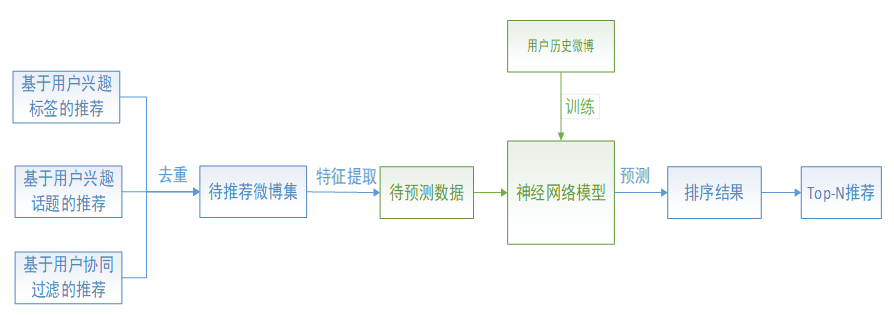
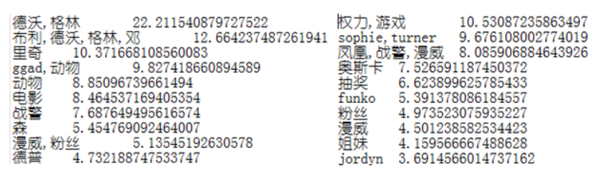
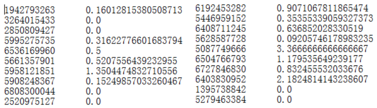
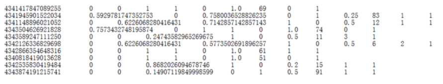

## 基于数据挖掘技术的个性化微博推荐

### 成员

* 彭成（3120191033）
* 高佳萌（3220190942）
* 赵嘉旌（3220190923）
* 李家硕（3220190952）
* 张博（3220190995）

#### 1、问题背景分析

随着移动互联网的发展，各种移动社交应用不断涌现，如国外的Facebook、Twitter，国内的微博等，社交应用的出现和飞速发展深深影响了人们的交流和娱乐方式，成为人们生活中不可或缺的一部分。用户可以通过PC、手机等多种移动终端，实现信息的即时分享、传播互动。微博由于其自身内容的丰富性和实时性吸引了大量的用户，是当下最热门的社交平台之一。目前，微博内容存量已超过千亿，庞大的用户生成内容带来的信息过载问题，使得用户难以从大量的信息中获取自己感兴趣的。

微博用户主要的信息获取方式来源于主页，也就是通过关注其他用户，接收他们的微博，形成自己的收听列表。一个活跃的微博用户每天在主页能收取到成百上千的微博，用户无法看完所有微博，并且其中很多微博未必是用户感兴趣的内容。所以，准确的挖掘用户兴趣，利用好的推荐算法，优先给用户展现其感兴趣的内容，对提升用户体验起着至关重要的作用。

本项目以微博为例，利用数据挖掘技术挖掘用户兴趣，为用户提供准确和高效的知识服务，辅助解决信息过载问题。

#### 2、模型设计

上图为微博推荐模型流程图。模型主要分为两大部分：待推荐微博获取和微博排序。

2.1 待推荐微博获取

本模型采用三种不同的推荐策略挖掘用02户兴趣，并从不同角度为用户推荐微博。

1、基于用户兴趣标签的推荐：用户标签是一种个性化信息，描述了用户的个人兴趣，对于推荐系统来说是构造用户画像挖掘、用户兴趣的重要信息。但实际上很少有用户主动为自己添加兴趣标签，且微博中的用户简介等信息往往长度很短且结构不统一，严重的数据稀疏使得难以进行基于标签的推荐。本模型利用TextRank with TF-IDF关键词提取算法，从用户历史微博内容中提取关键词作为标签，并针对标签描述不准确问题，采用关联规则Apriori算法的对用户兴趣标签进行扩展，更准确的表达用户兴趣。最后利用获得的兴趣标签为用户召回待推荐的微博。

2、基于用户兴趣话题的推荐：传统的微博推荐只利用了微博中的文本信息，而忽略了微博中包含的丰富的链接信息。本模型提取出微博中超话和话题链接等，采用TF-IDF算法发现用户感兴趣的话题，并为用户推荐内容上相似的微博。

基于用户的协同过滤的推荐：基于协同过滤的推荐是目前个性化推荐算法中研究和应用最为广泛的推荐算法，也是推荐效果最好的算法之一。算法的主要思想是：根据目标用户的历史行为，找到与其兴趣相似的用户集合，并将这个集合中的用户喜欢且目标用户没有见过的物品推荐给目标用户。本文使用基于用户的协同过滤算法，利用用户的历史交互行为（即对微博的发布、转发行为）计算用户间相似度，并为用户推荐与其相似用户的微博。

2.2 微博排序

传统的推荐算法，如基于内容或协同过滤的推荐，往往只考虑了内容或社交关系等一种或两种影响因素，而用户对一条微博感兴趣程度的影响因素有很多，比如用户对微博内容的感兴趣程度、对微博作者的喜好或熟悉程度、微博本身内容是否丰富、吸引人等。本模型将2.1三种推荐策略获得的待推荐微博混合去重，并充分考虑影响用户对微博感兴趣程度的多重因素，从微博中提取特征。将用户历史微博作为训练样本，类标签为用户是否对微博产生行为（0/1），将排序看作机器学习的二分类问题，训练深度神经网络模型，预测用户对待推荐微博的感兴趣程度，按得分进行Top-N推荐。

本模型通过主要的三大影响因素：个人兴趣、作者偏好和微博质量，选取下表中八个特征用于构建神经网络模型。

| 影响因素 | 特征名 | 含义 |
| --- | --- | --- |
| 个人兴趣 | Tag_score | 微博内容与目标用户兴趣标签匹配得分 |
|  | Topic_score | 微博内容与目标用户兴趣话题匹配得分 |
| 作者偏好 | Author_score | 目标用户与微博作者的相似度得分 |
|  | Is_huguan | 目标用户与微博作者是否互相关注，是为1，否为0 |
| 微博质量 | Has_pic | 微博是否包含图片，是为1，否为0 |
|  | Has_video | 微博是否包含视频，是为1，否为0 |
|  | Text_length | 微博文本内容长度 |
|  | Topic_num | 微博中包含的话题链接数目 |

#### 3、已经完成

目前主要完成了基于三种推荐策略的微博推荐，并已经提取了微博的8个特征。以下为完成部分的截图展示。

3.1 基于用户兴趣标签的推荐

部分用户兴趣标签展示：

3.2 基于用户兴趣话题的推荐

部分用户兴趣标签展示：

3.3 基于用户协同过滤的推荐

部分用户兴趣标签展示：

3.4 微博特征提取

从用户历史微博中选择正负样本作为训练集，利用以上三种推荐策略获得待推荐微博作为测试集，按照表格提取八个分类特征，部分特征展示：

（从左到右依次为微博id，微博内容与用户兴趣标签匹配得分，微博内容与用户兴趣话题匹配得分，目标用户与微博作者的相似度得分，微博是否包含图片，微博是否包含视频，目标用户与微博作者是否互相关注，微博文本内容长度，微博中包含的话题链接数，类标签）

#### 4、下一步要进行的工作

微博特征数据分析、可视化，构建神经网络模型，训练模型，模型效果评估及分析。
