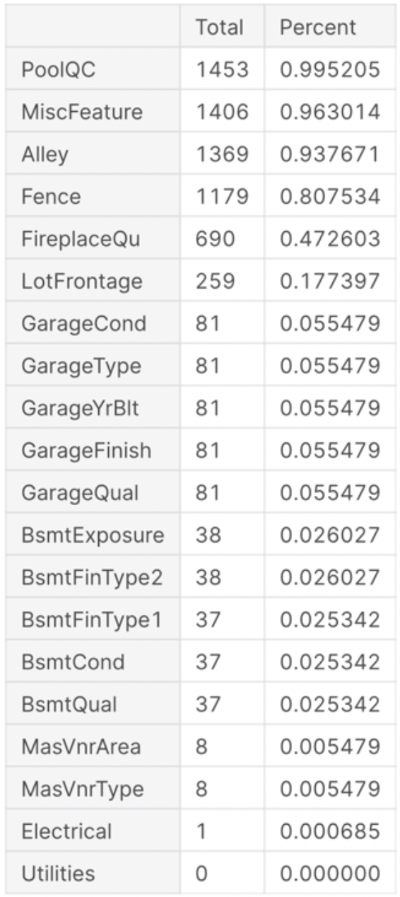
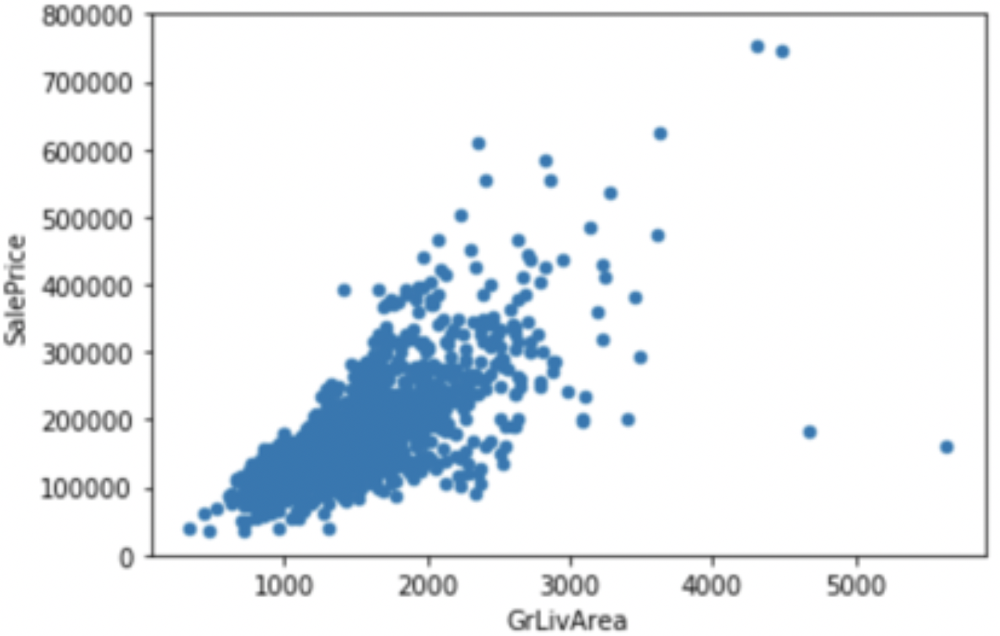
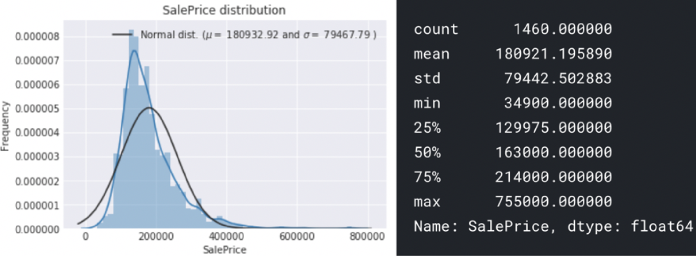
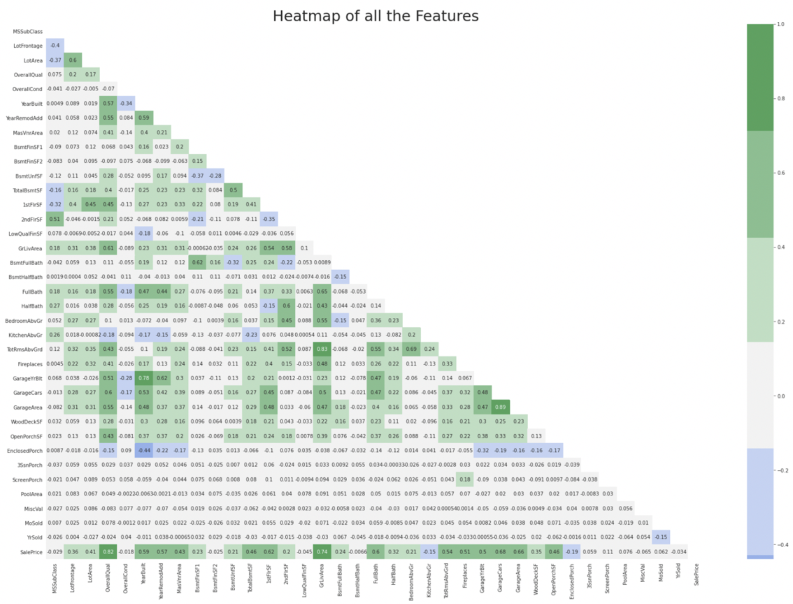
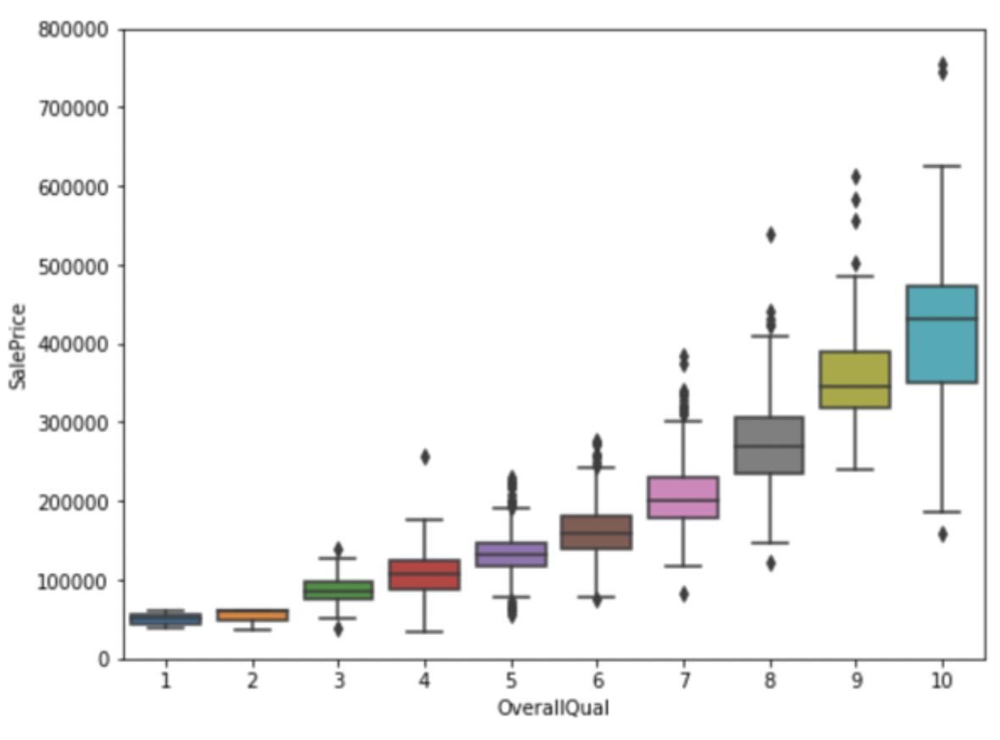
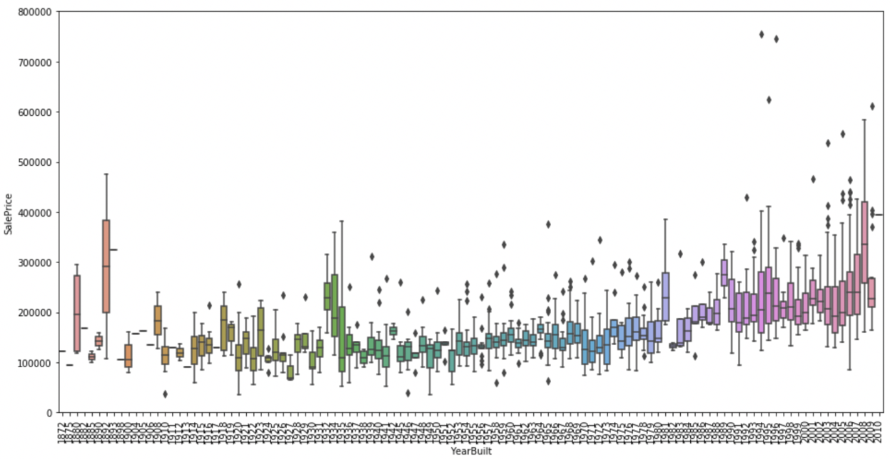

## 爱荷华州埃姆斯市房价预测

### 1. 数据获取及预处理

#### 1.1 数据来源

我们使用的数据集来自Kaggle。

#### 1.2 数据说明

数据集中包括训练模型所需的训练数据集(train.csv)，以及用于测试模型性能的测试数据集(test.csv)。每一条数据记录表示的是每间房屋的相关信息，其中训练数据有1460条，测试数据有1459条。数据的特征列有79个，其中35个是数值类型的，44个类别类型。由于特征过多，受篇幅限制，我们选取其中比较重要的特征进行介绍，其余特征可以参考数据集中的data_description.txt。

* YearBuilt：建造年份
* TotalBsmtSF: 地下室面积
* GrLivArea: 生活面积
* 1stFlrSF：一楼面积
* FullBath: 带浴缸或淋浴的盥洗室数量
* OverallQual：对房子的整体材料和装修进行评估
* GarageCars：车库可容纳的车辆数
* GarageArea: 车库面积
* YearBuilt：建造年份

#### 1.3 数据预处理

完成了如下的数据预处理工作。

##### 1.3.1 缺失值处理

我们统计一下数据的缺失值，

    

可以发现有一些特征缺失值达到了50%以上，对于此类我想在后续处理过程中最好直接剔除该特征。那些缺失值少的特征，我们可以根据不同特征进行不同的分析。其中Garage为前缀的几个特征，可以发现它们具有相同的缺失值个数，有可能这些缺失是来自同几条数据。经过后续的数据可视化以及数据相关度分析，我们发现车库的重要特征是GarageCars和GarageArea，其他的特征对于房屋价格影响甚微，外加我们的经验可以判断，这几个车库特征可以舍弃。同样的，我们可以发现这后边的这几个缺失值似乎都是不那么重要的特征，外加有非常多（将近80个）的特征待分析，可以直接删去含有缺失值的特征。不过Electrical这个特征只有一个缺失值，我们可以选择删除该条数据而不是特征。这样我们就得到了不含缺失值的数据了。

##### 1.3.2 异常值处理

我们经过后续的相关性分析，选出具有代表性的特征，之后根据这个特征和房价的关系分析异常值。选出的代表特征是‘GrLivArea’，很好理解，房屋价格和居住面积的关系密不可分。画出房屋价格和售价的散点图：

    

 一般来讲房屋价格和居住面积应该呈正比关系，那么右下角的两个点应该是异常值，我们剔除这两条数据。

在最终报告中会有一些更详细的预处理策略。

### 2. 数据分析与可视化

先看下房屋价格的分布情况：

    

近似呈正态分布(positively skewed)。均值方差等见右图。

之后看一下各个特征的相关矩阵：

    

我们先删去相关性大的特征，再选取和房屋价格相关系数最大的几项特征列出：

* ‘OverallQual’，‘GrLiveArea’和房屋价格的相关性非常强，入选后续预测的判断标准。
* 'GarageCars'和'GarageArea'因为相关系数为0.89，很大，留一个就够了，选择和房屋价格相关系数更大的'GarageCars'。
* ‘TotalBsmSF’和'1stFlrSF'同理，这二者也类似，所以我们选择‘TotalBsmSF’。
* ‘YearBuilt’建造年份入选，按道理该特也会和价格相关。

接下来我们看一下房屋价格和这些特征的关系图： 首先看下价格和总评的关系，用盒图来展示：

    

可以看到，总体评估越高，房屋价格越高。

接下来看一下价格和建造年份的关系：

    

关系不是非常明显，不过似乎处于中间区域的房子价格偏低。

在最终报告中会有一些更详细的可视化策略。

### 3. 模型选取

使用LASSO回归、弹性网络回归、核岭回归、XGBoost等进行预测，也可以使用深度学习的方法（CNN，LSTM）进行预测。

### 4. 挖掘实验的结果

选出了重要程度较高的几个特征，如前文分析所示。接下来根据这些特征进行房屋价格预测。

### 5. 存在的问题

一些特征可能不是很有代表性，导致结果不是非常好。我们也许可以构造出一些特征进行预测。同时可以结合CNN，或许可以提高准确率。

### 6. 下一步工作

完善之前的方案，进行更精准的预测。

### 7. 任务分配与完成情况

任务分配如开题报告所述，每个人的任务进展都根据任务需求互相稳步推进中。
