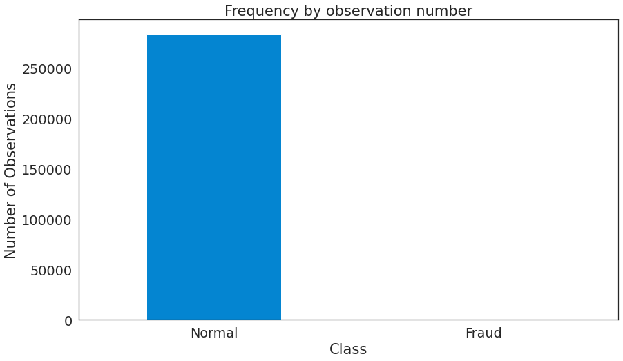
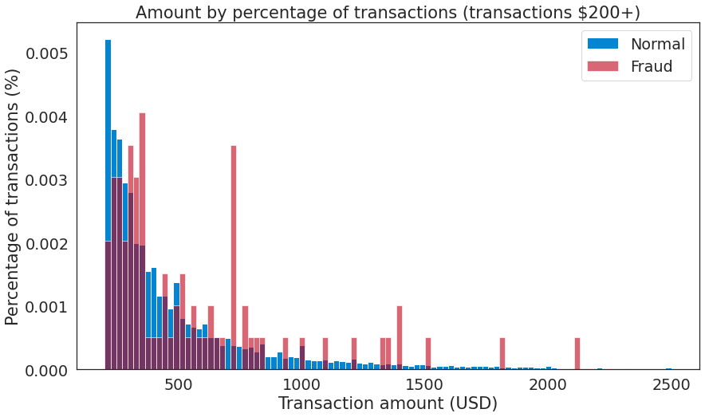
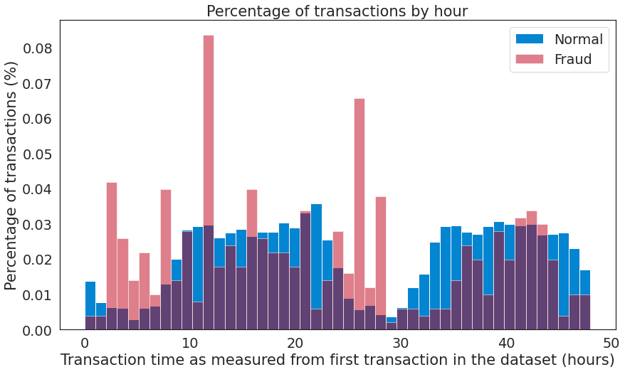
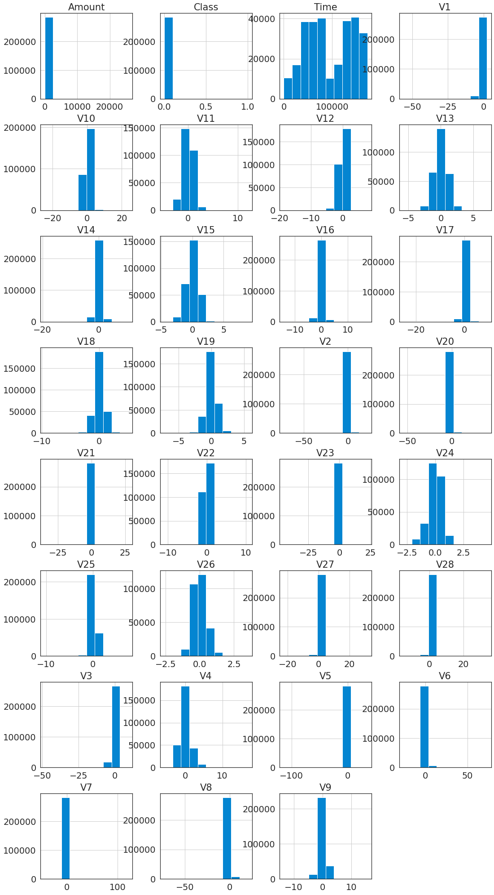
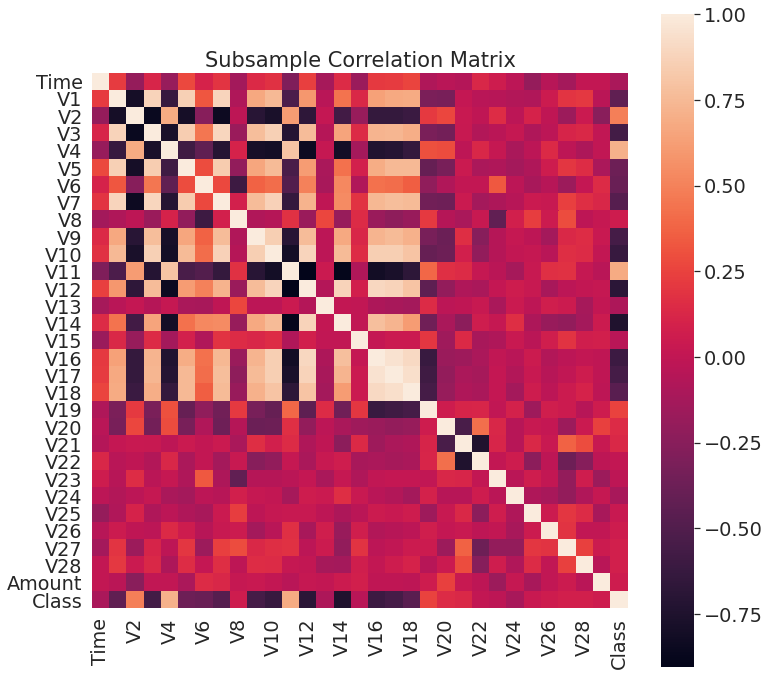

## 异常检测-信用卡欺诈分析

### 1. 数据获取及预处理

> 主要说明一下数据的来源，原始数据的基本情况，如数量，字段，含义等  再就是到目前为止，对数据预处理的情况，如噪声的处理，缺失值的处理等。

#### 1.1 数据来源

信用卡公司能够识别欺诈性的信用卡交易是非常重要的，这样顾客就不会为他们没有购买的物品收取费用。用于本项目的信用卡欺诈检测数据集来自Kaggle：[Credit Card Fraud Detection](https://www.kaggle.com/mlg-ulb/creditcardfraud)

#### 1.2 数据说明

* 该数据集包含2013年9月欧洲持卡人通过信用卡进行的交易。此数据集显示了两天内发生的交易，在284,807笔交易中有492起欺诈。
* 数据集高度不平衡，阳性类别（欺诈）仅占所有交易的0.172％。
* 数据集仅包含数字输入变量，它们是PCA转换的结果。其中包含来自28个“主成分分析（PCA）”转换特征的数值，即V1至V28。 此外，由于机密性问题，我们无法得到相关数据的原始特征和更多背景信息。
* 特征值`Time`和`Amount`尚未经过PCA转化。`Time`包含数据集中每个事务和第一个事务之间经过的秒数。`Amount`是交易金额，此特征可以用于与示例相关的成本敏感型学习。
* 特征值`Class`是响应变量，在发生欺诈时其值为1，否则为0.
* 数据集中没有缺失值。

#### 1.3 数据预处理

* 归一化`Time`和`Amount`属性列
* 重采样
    * 对数据集进行重采样，使得采样后的子数据集是一个欺诈和非欺诈交易比率为50/50的数据集，也就是采样后的数据集将具有相同数量的欺诈和非欺诈交易。不平衡的数据集可能导致过拟合以及错误的相关性，使用采样后的平衡数据集可以缓和或者消除该问题的发生。

### 2. 数据分析与可视化

> 数据探索性分析的结果，可以使用统计工具，聚类分析等工具  使用可视化来展示分析结果

* 交易类型分布

可以看到原始数据集是极度不平衡的，绝大多数交易不是欺诈的

* 交易金额分析
    * 交易属于欺诈和非欺诈数据的五数概括
    * | 交易类型 | 最小值 | Q1 | Q2(中位数) | Q3 | 最大值 |
        | --- | --- | --- | --- | --- | --- |
        | 欺诈 (Amount/$) | 0.00 | 1.00 | 9.25 | 105.89 | 2125.87 |
        | 非欺诈 (Amount/$) | 0.00 | 5.65 | 22.00 | 77.05 | 25691.16 |
        | 全部 (Amount/$) | 0.00 | 5.60 | 22.00 | 77.20 | 25691.16 |

        交易金额分布

* 交易时间分析

* V1-V28以及`Amount`，`Class`，`Time`特征分布

### 3. 模型选取

> 围绕选题要解决的问题，考虑使用哪些模型来进行挖掘  说明选择的理由

选题要解决的问题：信用卡欺诈检测，即标记匿名信用卡交易为欺诈的或真实的

所考虑的模型：

* Isolation Forest
  * 南大周志华老师在2010年提出一个异常检测算法Isolation Forest，在工业界很实用，算法效果好，时间效率高，能有效处理高维数据和海量数据。孤立森林（Isolation Forest）和随机森林类似，但每次选择划分属性和划分点（值）时都是随机的，而不是根据信息增益或者基尼指数来选择。在建树过程中，如果一些样本很快就到达了叶子节点（即叶子到根的距离d很短），那么就被认为很有可能是异常点。因为那些路径d比较短的样本，都是因为距离主要的样本点分布中心比较远的。也就是说，可以通过计算样本在所有树中的平均路径长度来寻找异常点。
* SVM
  * 当我们事先了解观察类别时，我们可以使用有监督的学习算法。我们使用不平衡分类技术（如欠采样）来帮助增加检测到的欺诈数量。 SVM分类器的集合提供最高的检测率，而随机森林具有最低的误报率。
* LOF
  * 异常点因为和正常点的分布不同，因此相似度较低，由此衍生出了一系列算法通过相似度来识别异常点。比如最简单的k近邻就可以做异常检测，一个样本和它第k个近邻的距离就可以被当作是异常值，显然异常点的k近邻距离更大。同理，基于密度分析，如LOF主要通过局部的数据密度来检测异常。显然异常点所在空间的数据点少，密度低。

### 4. 挖掘实验的结果

* 相关矩阵

  

  相关矩阵可帮助理解的数据的本质。探索某些特征是否会严重影响特定交易为欺诈，结果：

* 负相关：V17，V14，V12和V10呈负相关。这些值越低，欺诈交易最终结果的可能性就越大。
* 正相关：V2，V4，V11和V19正相关。这些值越高，最终结果越可能是欺诈交易。

### 5. 存在的问题

* 由于隐私原因，对特征进行了PCA变换，我们无法获得元数据。所以很难进行频繁模式与关联规则挖掘的挖掘
* 信用欺诈中如何更好地处理不平衡的数据集

### 6. 下一步工作

* 更深入的数据分析与可视化
* 降维和聚类
* 频繁模式与关联规则挖掘
* 利用随机森林的信用卡欺诈模型分析出哪些特征更重要并做出预测
* 探索简单神经网络在随机欠采样和过采样数据帧中的行为，并查看它们是否可以准确地预测非欺诈和欺诈案件
* 分析更多的挖掘结果，形成最终报告

### 7. 任务分配与完成情况

| 组员 | 任务 | 完成情况 |
| --- | --- | --- |
| 李世林 | SVM，LOF，Isolation Forest三种方法对带标签的数据进行分类建模， | 完成 |
| 谢斌辉 | 降维和聚类 | 即将完成 |
| 葛晶 | 数据分析与挖掘实验的结果 | 即将完成 |
| 赵一诺 | 数据预处理与可视化 | 即将完成 |
| 吴楠楠 | 频繁模式与关联规则挖掘 | 即将完成 | 
