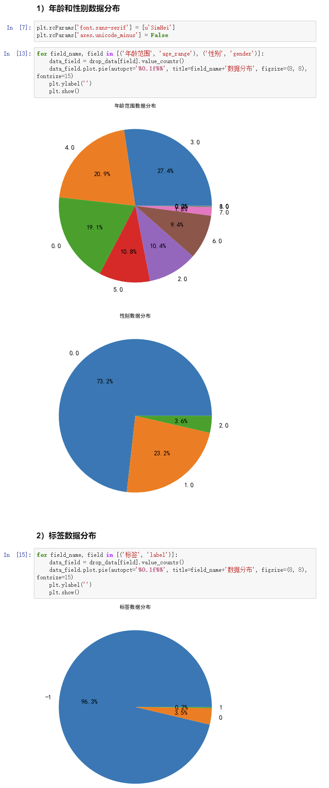

## 天池竞赛-商家促销后的重复买家预测

### 1. 数据获取及预处理

#### 1.1 数据来源

题目的背景，来源：本题目来自于天池IJCAI-15 Contest。我们知道，国内外的电商有各种各样促销活动，像国外的黑五（Black Friday），国内的双十一等等。大量商家通过打折促销吸引顾客。其中，有许多顾客是被商家的促销所吸引的新顾客，那么他们会不会在促销之后继续在这家店买东西呢？本次比赛题目就是预测这些会重复购买的顾客。  数据和分析  该数据集包含过去6个月“双11”日之前和当天匿名用户的购物日志，以及标签上是否重复购买的信息。由于隐私问题，数据以偏颇的方式进行采样，因此该数据集的统计结果将偏离天猫的实际数据，但它不会影响解决方案的适用性。该问题和数据集与推荐系统领域的Sequential Recommendation（序列推荐）类似：主要框架为，利用不同的模型（CNN，attention居多，逐渐取代RNN）学习每个user的item序列信息作为其short-term特征，单独的user embedding视作其long-term偏好，两者分开学习，或同时学习，并作最终预测。

#### 1.2 数据说明

* 该数据集包含过去6个月“双11”日之前和当天匿名用户的购物日志，以及标签上是否重复购买的信息。由于隐私问题，数据以偏颇的方式进行采样，因此该数据集的统计结果将偏离天猫的实际数据，但它不会影响解决方案的适用性。
* 数据描述

User Behaviour Logs

| Data Fields | Definition |
| --- | --- |
| user_id | A unique id for the shopper. |
| item_id | A unique id for the item. |
| cat_id | A unique id for the category that the item belongs to. |
| merchant_id | A unique id for the merchant. |
| brand_id | A unique id for the brand of the item. |
| time_tamp | Date the action took place (format: mmdd) |
| action_type | It is an enumerated type {0, 1, 2, 3}, where 0 is for click, 1 is for add-to-cart, 2 is for purchase and 3 is for add-to-favourite. |

User Profile

| Data Fields | Definition |
| --- | --- |
| user_id | A unique id for the shopper. |
| age_range | User's age range: 1 for = 50;0 and NULL for unknown. |
| gender | User’ s gender: 0 for female, 1 for male, 2 and NULL for unknown. |

Training and Testing Data

| Data Fields | Definition |
| --- | --- |
| user_id | A unique id for the shopper. |
| merchant_id | A unique id for the merchant. |
| label | It is an enumerated type {0, 1}, where 1 means repeat buyer, 0 is for non-repeat buyer. This field is empty for test data. |

#### 1.3 数据预处理

我们提取了过去7个月的数据，以及20多个用户观察到的种类，形成最终的数据集。每天的用户行为被视为一个会话，而所有单例会话（即只包含一个项目）被剔除。同时，对于出现次数少于K次的物品，我们也将其剔除（K是一个参数，供后续调整，目前设为5）。我们将随机选择的20%用户的最后一个会话作为测试会话，并在每个测试会话中随机删除一个项目作为下一个要预测的项目。然后，所有会话（包括已处理的会话）都被分为长期和短期会话来训练模型。

### 2. 数据分析与可视化

输出数据集中的关联规则，Metric选为conviction和lift, 下表包含了conviction大于1的规则，其中，发现18到24岁的用户很少重复去某家店购买商品，同时女性用户不喜欢填写具体的年龄。

|  | antecedents | consequents | conviction | lift |
| --- | --- | --- | --- | --- |
| 0 | (18~24) | (non-repeat) | 1.239229 | 1.012574 |
| 1 | (male) | (non-repeat) | 1.136363 | 1.007816 |
| 2 | (unknown years) | (female) | 1.101078 | 1.043945 |
| 3 | (unknown years, non-repeat) | (female) | 1.088355 | 1.038862 |
| 4 | (unknown years) | (non-repeat, female) | 1.085804 | 1.045891 |
| 5 | (unknown years) | (non-repeat) | 1.050385 | 1.003124 |
| 6 | (25~29) | (non-repeat) | 1.039696 | 1.002487 |
| 7 | (non-repeat, female) | (unknown years) | 1.013016 | 1.045891 |
| 8 | (female) | (unknown years) | 1.012457 | 1.043945 |
| 9 | (female) | (unknown years, non-repeat) | 1.010186 | 1.038862 |
| 10 | (non-repeat) | (male) | 1.003091 | 1.007816 |
| 11 | (non-repeat) | (18~24) | 1.001700 | 1.012574 |
| 12 | (non-repeat) | (25~29) | 1.000902 | 1.002487 |
| 13 | (non-repeat) | (unknown years) | 1.000876 | 1.003124 |

​

### 3. 模型选取

根据促销期间用户购买商品的行为，来预测在促销结束后用户购买商品的行为。这个问题等价于构造一个问答系统(quesion answering system)或一个推荐系统(recommendation system)以往的研究证明了，构造基于Knowledge Base（KB）的问答系统和Sequential recommendation系统，能有效解决这一类问题，除此之外，许多广泛应用的模型RNN，LSTM也有较好的表现。同时，预测用户行为这一问题，也同样能当作多分类问题来处理，于是，许多经典的机器学习模型也能发挥作用，我们挑选了如下4种框架，KA-Memnn，KV-Memnn，LSTM和Navie Bayes，  列举不同框架的特点，方便下一步工作挑选合适的框架来解决问题。

* KA-Memnn

考虑到静态和动态用户的偏好，next-item recommendation引起了广泛的研究兴趣。 现有方法通常利用用户-项目二进制关系(binary relation)，并为每个用户在项目上采用统一的偏好分布。 但是，这种假设忽略了用户意图和用户偏好之间的层次区分，从而导致该方法描述意图特定偏好的能力有限。实际上，消费者的购买行为涉及自然的顺序过程，即，用户首先打算购买一种类型的商品，然后在此意图下根据其偏好选择特定的商品。 为此，我们提出了一种新颖的key-array memory network（KA-MemNN），该网络将用户的意图和偏好都考虑在内，以便进行下一项推荐。下图展示了该框架的整体流程[1]。

* KV-Memnn

相对于预测用户的购买行为，直接阅读文档并能够回答文档中的问题也是一项尚未解决的挑战。 为了避免其固有的困难，已将问题回答（QA）改为使用知识库（KB），事实证明这是有效的。不幸的是，KB经常会受到过于严格的限制，因为架构无法支持某些类型的答案，并且过于稀疏，例如 Wikipedia比Freebase包含更多的信息。为了解决这些问题，一种新的方法，即key-value memory network(KV-Memnn)被提出，该方法通过在存储器读取操作的寻址和输出阶段中使用不同的编码，使文档阅读更为可行。下图展示了KV-Memnn的一些细节。在预测用户购买行为这方面，相当于回答“用户可能购买什么商品？”这个问题，因此，这种基于知识库的网络，在预测用户行为方面也能起作用[2]

* LSTM

根据用户已有的数据，预测用户未来的行为，是一种比较典型的基于QA的策略来解决的问题。 这个种解决方法起源于自然语言理解(natural language understand)，但与对话或总结之类的任务不同，QA易于评估（特别是在对错或多选方案中）的属性，使其吸引了大量的人投入研究。 而困难在于，在现实世界中回答一个问题，需要一个确实存在的对象，比如成年人或儿童，来说出问题的答案，这意味着这个对象必须在理解内容的基础上回答问题，比如，问成年人这个故事讲了什么，那么这个成年人至少需要通读几遍文章才能做出一个模棱两可的答案。对于机器而言，需要准备一系列问答的模板，通过学习这些模板，能够对新的问题进行回答。LSTM就是一种常用于自然语言处理领域的框架，下图展示了在QA系统中的准备的问答模板，而在预测用户的购买行为方面， 用户进行过的购买行为，就相当于在QA中的问答模板，通过学习用户已有的行为模板，也可以预测用户未来的行为方式。[3]

* Naive Bayes

许多研究人员通过使用词法网络来得到一个轻量的问答系统（QA），该系统与标记器(taggers), 查询分类器(query classifiers), 和答案提取器(answer  extractors) 结合在一起，方式复杂且特殊。利用词法关系给对应的question和answer评分。贝叶斯推理对词法关系的有效性的影响因素包括软词义歧义消除，参数平滑以改善数据稀疏性以及估计词的联合概率，从而克服了朴素贝叶斯方法的不足，除此之外，IR的向量空间排序技术的引入，大大提升QA系统的准确性。QA问题与推荐问题类似，都是从一系列候选者中选出最有可能的一个，在预测用户行为这方面，引入贝叶斯决策的优势在于，不必像深度学习模型进行复杂的参数调整工作，同时也更具有可解释性。下图给出了把Bayesian network应用于QA系统中的整体框架。这个框架的quesion可以是测试用的用户购买行为，documents相对应的换成不同的商品，那么这个框架就相当于根据给出的用户行为，找出最可能购买的商品，而这正是预测用户行为的整体流程。[4]

### 4. 挖掘实验的结果

根据具体的实验数据，我们调整了预测的目标，对于测试集中的用户和商家，bu'shi不是预测用户是否会继续在该商家进行购买。而是根据用户现有的session，去预测这个session中用户可能点击的下一个物品。通过训练模型，我们对召回率进行了评估。对于Recall@20，目前的模型可以达到10%的召回率。

### 5. 存在的问题

在现有的模型中，我们只考虑了用户的购买行为，但从数据中可以看到，用户存在各种不同的行为，如点击，购买，加入购物车，收藏等，这些行为没有在模型中进行体现，有待改进。

### 6. 下一步工作

对用户的各种行为进行建模，并在模型中进行体现。

### 7. 任务分配与完成情况

* 周泳宇（3120191079）：数据处理与分析，算法调研与实现，文档撰写（80%）
* 邵江逸（3120191038）：数据处理与分析，算法调研（80%）
* 周田（3220190931）：数据处理与分析，算法调研（80%）
* 林瀚熙（3120191020）：数据处理与分析，结果分析（80%）
* 李彤（3120191018）：数据处理与分析，算法实现（80%）

## Reference

1. ZHU N, CAO J, LIU Y, et al. Sequential Modeling of Hierarchical User Intention and Preference for Next-item Recommendation [M]. Proceedings of the 13th International Conference on Web Search and Data Mining. Houston, TX, USA; Association for Computing Machinery. 2020: 807–15.
2. MILLER A, FISCH A, DODGE J, et al. Key-value memory networks for directly reading documents [J]. arXiv preprint arXiv:160603126, 2016,
3. JASONWESTON A B, SUMIT CHOPRA, ALEXANDER M. RUSH,, BART VAN MERRI¨ENBOER A J T M. TOWARDS AI-COMPLETE QUESTION ANSWERING:  A SET OF PREREQUISITE TOY TASKS, F, 2016 [C]
4. RAMAKRISHNAN G, JADHAV A, JOSHI A, et al. Question Answering via Bayesian inference on lexical relations [M]. Proceedings of the ACL 2003 workshop on Multilingual summarization and question answering - Volume 12\. Sapporo, Japan; Association for Computational Linguistics. 2003: 1–10.
