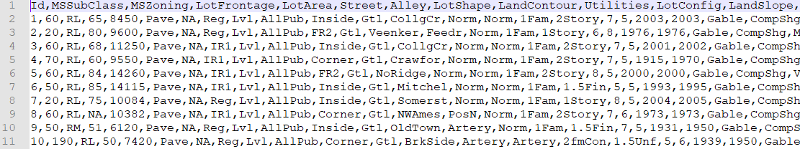
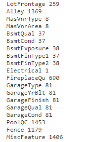
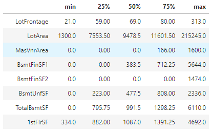
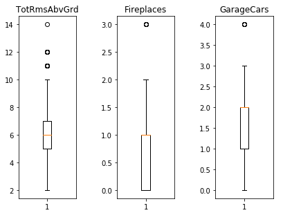
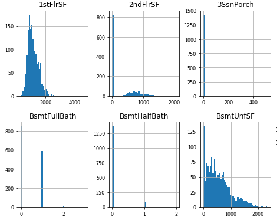
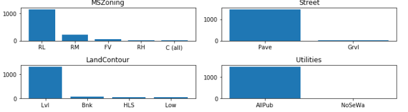
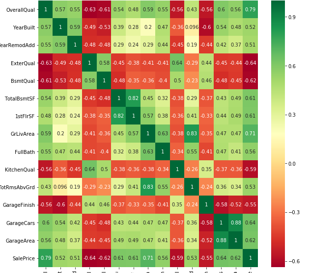

## 基于多种回归方法的Kaggle房价预测

### 1. 数据获取及预处理

#### 1.1 数据来源

数据来自kaggle上的Ames Housing dataset（爱荷华州埃姆斯市住宅数据集），数据集中包含81条条目。

#### 1.2 数据说明

训练集中的每条记录包含79项特征，用于描述市区住宅的属性，其部分属性简短描述如下所示：

* SalePrice-该房产的售价。这是我们要预测的目标变量。
* MSSubClass：建筑分类
* MSZoning：常规分区分类
* LotFrontage：街道的线性尺寸
* LotArea：以平方英尺为单位的地块大小
* Street：街道的类型
* Alley：胡同的类型
* LotShape：房产的一般形状
* LandContour：房产的平坦度
* Utilities：可用的公共设施类型
* LotConfig：地块配置
* LandSlope：房产的坡度
* Neighborhood：埃姆斯市区范围内的地理位置
* Condition1：接近主干道或铁路
* Condition2：接近主要道路或铁路（如果有）
* BldgType：住宅类型
* HouseStyle：住宅风格
* OverallQual：总体材料和加工质量
* OverallCond：总体状况的评价
* YearBuilt：原始施工日期
* YearRemodAdd：改型日期
* RoofStyle：屋顶类型
* RoofMatl：屋顶材料
* Exterior1st：房屋外墙
* Exterior2nd：房屋的外墙覆盖物（如果使用一种以上的材料）
* MasVnrType：砖石饰面类型
* MasVnrArea：砌面贴面面积（平方英尺）
* ExterQual：外部材料质量
* ExterCond：外部材料的当前状态
* Foundation：基金会的类型
* BsmtQual：地下室的高度
* BsmtCond：地下室的一般状况
* BsmtExposure：罢工或花园水平的地下室墙壁
* BsmtFinType1：地下室成品区域的质量
* BsmtFinSF1：1型成品的尺寸（平方英尺）
* BsmtFinType2：第二个完成区域的质量（如果存在）
* BsmtFinSF2：2型成品尺寸（平方英尺）
* BsmtUnfSF：未完成的地下室面积（平方英尺 ）
* TotalBsmtSF：地下室总平方英尺
* Heating：供热方式
* HeatingQC：供热质量和条件
* CentralAir：中央空调
* Electrical：电气系统
* 1stFlrSF：一楼面积
* 2ndFlrSF：二楼面积
* LowQualFinSF：低质量完成面积（所有楼层）
* GrLivArea：地面（地面）以上居住面积
* BsmtFullBath：地下室全浴室
* BsmtHalfBath：地下室半浴室
* FullBath：地上全浴室
* HalfBath：地上半浴室
* Bedroom：地下室以上的卧室数量
* Kitchen：厨房数量
* KitchenQual：厨房质量
* TotRmsAbvGrd：上等客房总数（不包括浴室）
* Functional：家庭功能等级
* Fireplaces：壁炉数量
* FireplaceQu：壁炉质量
* GarageType：车库位置
* GarageYrBlt：车库建成年份
* GarageFinish：车库的内部装饰
* GarageCars：车库中车库的大小
* GarageArea：车库的大小（平方英尺）
* GarageQual：车库质量
* GarageCond：车库条件
* PavedDrive：铺装的车道
* WoodDeckSF：木制地板面积（平方英尺）
* OpenPorchSF：开放式阳台面积（平方英尺）
* EnclosedPorch：封闭的走廊面积（以平方英尺为单位）
* 3SsnPorch：三季走廊面积（以平方英尺为单位）
* ScreenPorch：纱窗走廊面积（以平方英尺为单位）
* PoolArea：游泳池面积
* PoolQC：泳池质量
* Fence：围栏质量
* MiscFeature：未包括在其他类别中的各方面特点
* MiscVal：各方面特点的价值
* MoSold：已售月份
* YrSold：已售年份
* SaleType：销售类型
* SaleCondition：销售条件

#### 1.3 数据预处理

如图为缺失内容的数据及缺失的数量。

选择删除ID属性以及缺失百分之三十内容的属性 Alley, PoolQC, Fence, MiscFeature

将标称属性转变成one-hot形式，便于进行下一步的模型构建

### 2. 数据分析与可视化

* 进行数值属性的五数概括

    

* 绘制数值属性的盒图

    

* 绘制数值属性的直方图分布

    

* 绘制标称属性的频率直方图

    

* 绘图查看各属性与salePrice的相关性

    

### 3. 模型选取

使用线性回归，随机森林回归，xgBoost等算法，线性回归算法对线性数据有很好的解释性，随机森林用于回归任务，其非线性特性可以使其比线性算法更具优势，而XGBoost高效地实现了GBDT并进行了改进，速度快，效果好

### 4. 挖掘实验的结果

选取'OverallQual', 'Foundation', 'CentralAir', 'Electrical', 'PavedDrive', 'RoofStyle', 'SaleCondition','Neighborhood', 'HouseStyle'、'GrLivArea'、'GarageCars'、'TotalBsmtSF'、'FullBath'、'TotRmsAbvGrd'、'YearBuilt'、'YearRemodAdd'作为特征进行下一步的模型构建

### 5. 存在的问题

属性条目较多，在特征的选择方面还需要进行探索。

### 6. 下一步工作

构建模型，绘制图表展示模型预测结果。

对模型参数进行修改，优化模型，以获取到更好的预测效果。

### 7. 任务分配与完成情况

* 郝家辉、韩亚辉：数据分析和可视化、数据预处理、特征工程、文档编写（已完成）
* 许达、李生椰、李思远：模型构建和优化、文档编写（待完成）
