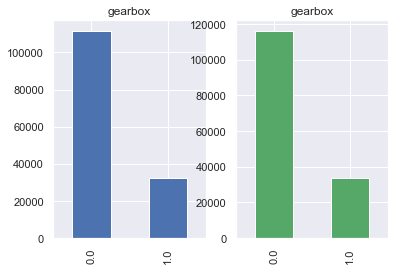

## 二手车交易价格预测-天池比赛

### 1. 数据获取及预处理

#### 1.1 数据来源

该项目为天池官方比赛，表格数据从天池比赛官方下载（[https://tianchi.aliyun.com/competition/entrance/231784/information](https://tianchi.aliyun.com/competition/entrance/231784/information)）。数据来自某交易平台的二手车交易记录，总数据量超过40w，包含31列变量信息，其中15列为匿名变量。

#### 1.2 数据说明

下面为训练集数据信息。共有150000条数据，有31列变量信息。包括名称、品牌、公里数、价格等。v_0 ~v_14为匿名变量。

```python
RangeIndex: 150000 entries, 0 to 149999
Data columns (total 32 columns):
Unnamed: 0.1         150000 non-null int64
SaleID               150000 non-null int64
name                 150000 non-null int64
regDate              150000 non-null int64
model                149999 non-null float64
brand                150000 non-null int64
bodyType             145494 non-null float64
fuelType             141320 non-null float64
gearbox              144019 non-null float64
power                150000 non-null int64
kilometer            150000 non-null float64
notRepairedDamage    125676 non-null float64
regionCode           150000 non-null int64
seller               150000 non-null int64
offerType            150000 non-null int64
creatDate            150000 non-null int64
price                150000 non-null int64
v_0                  150000 non-null float64
v_1                  150000 non-null float64
v_2                  150000 non-null float64
v_3                  150000 non-null float64
v_4                  150000 non-null float64
v_5                  150000 non-null float64
v_6                  150000 non-null float64
v_7                  150000 non-null float64
v_8                  150000 non-null float64
v_9                  150000 non-null float64
v_10                 150000 non-null float64
v_11                 150000 non-null float64
v_12                 150000 non-null float64
v_13                 150000 non-null float64
v_14                 150000 non-null float64
dtypes: float64(21), int64(11)
memory usage: 36.6 MB
​
缺失数据及个数：

Unnamed: 0.1             0
SaleID                   0
name                     0
regDate                  0
model                    1
brand                    0
bodyType              4506
fuelType              8680
gearbox               5981
power                    0
kilometer                0
notRepairedDamage    24324
regionCode               0
seller                   0
offerType                0
creatDate                0
price                    0
v_0                      0
v_1                      0
v_2                      0
v_3                      0
v_4                      0
v_5                      0
v_6                      0
v_7                      0
v_8                      0
v_9                      0
v_10                     0
v_11                     0
v_12                     0
v_13                     0
v_14                     0
dtype: int64
```

各属性说明如下：

| **Field** | **Description** |
| --- | --- |
| SaleID | 交易ID，唯一编码 |
| name | 汽车交易名称，已脱敏 |
| regDate | 汽车注册日期，例如20160101，2016年01月01日 |
| model | 车型编码，已脱敏 |
| brand | 汽车品牌，已脱敏 |
| bodyType | 车身类型：豪华轿车：0，微型车：1，厢型车：2，大巴车：3，敞篷车：4，双门汽车：5，商务车：6，搅拌车：7 |
| fuelType | 燃油类型：汽油：0，柴油：1，液化石油气：2，天然气：3，混合动力：4，其他：5，电动：6 |
| gearbox | 变速箱：手动：0，自动：1 |
| power | 发动机功率：范围 [ 0, 600 ] |
| kilometer | 汽车已行驶公里，单位万km |
| notRepairedDamage | 汽车有尚未修复的损坏：是：0，否：1 |
| regionCode | 地区编码，已脱敏 |
| seller | 销售方：个体：0，非个体：1 |
| offerType | 报价类型：提供：0，请求：1 |
| creatDate | 汽车上线时间，即开始售卖时间 |
| price | 二手车交易价格（预测目标） |
| v系列特征 | 匿名特征，包含v0-14在内15个匿名特征 |

#### 1.3 数据预处理

上述数据信息显示存在缺失值，利用属性的相关关系来填补。选择拉格朗日插值方法——最近邻插值法对缺失值进行填补。下面展示存在缺失值属性的填补前后可视化对比：

车身类型：

```python
before
count    145494.000000
mean          1.792369
std           1.760640
min           0.000000
25%           0.000000
50%           1.000000
75%           3.000000
max           7.000000
Name: bodyType, dtype: float64
​
after
count    150000.000000
mean          1.791493
std           1.760303
min           0.000000
25%           0.000000
50%           1.000000
75%           3.000000
max           7.000000
Name: bodyType, dtype: float64
```

.png)

燃料类型：

```python
before
count    141320.000000
mean          0.375842
std           0.548677
min           0.000000
25%           0.000000
50%           0.000000
75%           1.000000
max           6.000000
Name: fuelType, dtype: float64
​
after
count    150000.000000
mean          0.375767
std           0.548581
min           0.000000
25%           0.000000
50%           0.000000
75%           1.000000
max           6.000000
Name: fuelType, dtype: float64
```


变速箱类型：

```python
before
count    144019.000000
mean          0.224943
std           0.417546
min           0.000000
25%           0.000000
50%           0.000000
75%           0.000000
max           1.000000
Name: gearbox, dtype: float64
​
after
count    150000.000000
mean          0.225213
std           0.417724
min           0.000000
25%           0.000000
50%           0.000000
75%           0.000000
max           1.000000
Name: gearbox, dtype: float64
```



是否有未修复损伤：

```python
before
count    125676.000000
mean          0.113904
std           0.317696
min           0.000000
25%           0.000000
50%           0.000000
75%           0.000000
max           1.000000
Name: notRepairedDamage, dtype: float64
​
after
count    150000.000000
mean          0.114247
std           0.318112
min           0.000000
25%           0.000000
50%           0.000000
75%           0.000000
max           1.000000
Name: notRepairedDamage, dtype: float64
```


缺失值填补后，对数据进行探索性分析。

### 2. 数据分析与可视化

对不同列数据进行统计分析并可视化：

#### 2.1 标称属性

分别对model、brand、bodyType、fuelType、gearbox、notRepairedDamage、regionCode、seller、offerType进行柱状图可视化：


对于model属性，其不同标签数量分布较为分散，其按从多到少排列的柱状图构成的曲线与反比例函数相似。


对于brand属性，其不同标签数量分布较为分散，但总体集中于标签0、4、14、10、1 。其中数量最多的品牌标签为0，数量约为第二名的两倍。


对于bodyType属性，数量最多的三种类型为豪华轿车：0、微型车：1、厢型车：2。搅拌车：7交易数量最少


对于fuelType属性，可见汽油（标签0）数目最多、柴油（标签1）其次、其余类型数目较少。


对于gearbox属性，其为二值属性且以手动（0标签）为主，自动（1）标签为辅。


对于notRepairedDamage属性，其为二值属性且以0标签为主。大多数二手车在交易时存在未修复的车损。


对于regionCode属性，除数量最多的地区419和次多的地区764外，其余各地区数量分布较为均匀。


对于seller属性，几乎全部为个体（标签0），存在个别车辆的卖家为非个体（标签1）。


对于offerType属性，均为提供类型（标签0），无请求类型（标签1）。

#### 2.2 数值属性

分别对regDate、power、kilometer、createDate、price 通过绘制盒图、散点图和直方图来可视化数据：


以上为regDate属性的盒图、散点图和直方图。由直方图走势可看出二手车注册量自1990年至2000年呈递增态势，2000至2005年呈谷形，自2005年之后注册量走低。


以上为power属性的盒图、散点图和直方图。盒图于300附近扁平、散点图于300附近聚集、直方图于300附近尖峰看出二手交易车辆的发动机功率于300附近呈正态分布。


以上为kilometer属性的盒图、散点图和直方图。从散点图和直方图可看出公里数分布呈离散型，从盒图和直方图可看出汽车行驶公里数多位于12-15万公里间。


以上为createDate属性的盒图、散点图和直方图。可以看出汽车上线时间主要集中于2016年初，一些汽车的上线时间集中于2015年初。


以上为price属性的盒图、散点图和直方图。从三图中可共同看出数据集中于0值，从直方图走势可看出价格由低到高交易数量逐渐减少，人们比较倾向于选择较低价格的二手车。

### 3. 模型选取

本选题要求预测二手汽车的交易价格。该问题可通过对训练集数据进行回归来构建预测模型，并将测试集作为输入进行预测。

首先，依据属性特点与现实意义，选择'gearbox', 'power', 'kilometer'三个属性以及匿名的 'v_0'~ 'v_14'属性作为输入。然后分别使用目前广为使用的XGBoost回归算法和LightGBM回归算法对输入与价格进行回归，得到价格预测模型。

XGBoost是在 Gradient Boosting 框架下实现机器学习算法，可以快速准确地解决许多数据科学问题；而LightGBM算法则相比于XGBoost要更加快速且准确。为了进一步提升预测准确度，将此两种模型进行加权融合，得到最终的预测模型。

最后，对模型进行评价与预测。

### 4. 挖掘实验的结果

模型的评价标准为MAE：


利用xgb进行五折交叉验证查看模型的参数效果：

```python
## xgb-Model
xgr = xgb.XGBRegressor(n_estimators=120, learning_rate=0.1, gamma=0, subsample=0.8,\
        colsample_bytree=0.9, max_depth=7) #,objective ='reg:squarederror'
​
scores_train = []
scores = []
​
## 5折交叉验证方式
sk=StratifiedKFold(n_splits=5,shuffle=True,random_state=0)
for train_ind,val_ind in sk.split(X_data,Y_data):

    train_x=X_data.iloc[train_ind].values
    train_y=Y_data.iloc[train_ind]
    val_x=X_data.iloc[val_ind].values
    val_y=Y_data.iloc[val_ind]

    xgr.fit(train_x,train_y)
    pred_train_xgb=xgr.predict(train_x)
    pred_xgb=xgr.predict(val_x)

    score_train = mean_absolute_error(train_y,pred_train_xgb)
    scores_train.append(score_train)
    score = mean_absolute_error(val_y,pred_xgb)
    scores.append(score)
​
print('Train mae:',np.mean(score_train))
print('Val mae',np.mean(scores))
```

训练集和验证集的MAE分别为：

```python
Train mae: 628.7640032655389
Val mae 714.982737201206
```

分别定义xgb和lgb模型函数：

```python
def build_model_xgb(x_train,y_train):
    model = xgb.XGBRegressor(n_estimators=150, learning_rate=0.1, gamma=0, subsample=0.8,\
        colsample_bytree=0.9, max_depth=7) #, objective ='reg:squarederror'
    model.fit(x_train, y_train)
    return model
​
def build_model_lgb(x_train,y_train):
    estimator = lgb.LGBMRegressor(num_leaves=127,n_estimators = 150)
    param_grid = {
        'learning_rate': [0.01, 0.05, 0.1, 0.2],
    }
    gbm = GridSearchCV(estimator, param_grid)
    gbm.fit(x_train, y_train)
    return gbm
```

切分数据集（Train,Val）进行模型训练，评价和预测：

```python
## Split data with val
x_train,x_val,y_train,y_val = train_test_split(X_data,Y_data,test_size=0.3)
print('Train lgb...')
model_lgb = build_model_lgb(x_train,y_train)
val_lgb = model_lgb.predict(x_val)
MAE_lgb = mean_absolute_error(y_val,val_lgb)
print('MAE of val with lgb:',MAE_lgb)
​
print('Predict lgb...')
model_lgb_pre = build_model_lgb(X_data,Y_data)
subA_lgb = model_lgb_pre.predict(X_test)
print('Sta of Predict lgb:')
Sta_inf(subA_lgb)
```

lgb预测结果的MAE以及预测数据的统计特征如下：

```python
MAE of val with lgb: 690.5215735944785
​
Sta of Predict lgb:
_min -1339.23962259458
_max: 91324.72689961622
_mean 5909.949573700309
_ptp 92663.9665222108
_std 7352.61037521163
_var 54060879.3296697
```

同理，xgb预测结果的MAE和预测数据的统计特征如下：

```python
MAE of val with xgb: 712.259832479318
​
Sta of Predict xgb:
_min -378.67053
_max: 91137.12
_mean 5909.634
_ptp 91515.79
_std 7343.3955
_var 53925460.0
```

由此可见lgb的预测准确度更高。下面对两个模型的结果进行加权融合：

```python
## 这里我们采取了简单的加权融合的方式
val_Weighted = (1-MAE_lgb/(MAE_xgb+MAE_lgb))*val_lgb+(1-MAE_xgb/(MAE_xgb+MAE_lgb))*val_xgb
val_Weighted[val_Weighted
```


此图为预测的价格分布（橙）和训练集价格分布（蓝），该结果显示对测试集各项输入属性的预测价格普遍在10000以下，且数量随价格升高而降低，这一趋势与训练集数据的价格趋势是一致的。

融合后模型的MAE如下：

```python
MAE score:674.3673
```

该值小于lgb和xgb的结果，由此可见加权融合后的预测模型更为准确。

### 5. 存在的问题

个别数据属性的定义域与设定值不符，可视化结果不够清晰。

### 6. 下一步工作

对数据做进一步处理，得到更好的可视化结果。

### 7. 任务分配与完成情况

任务分配：

* 王宇彬，于明菲：数据的收集和预处理，数据分析，数据可视化，协助完成模型设计与实现；
* 韩秉峰，赵柏翔：算法实现，模型设计；
* 孙心桐：结果分析，文档编写；

完成情况：

各部分内容均已大体完成，还需进一步优化现有结果。
