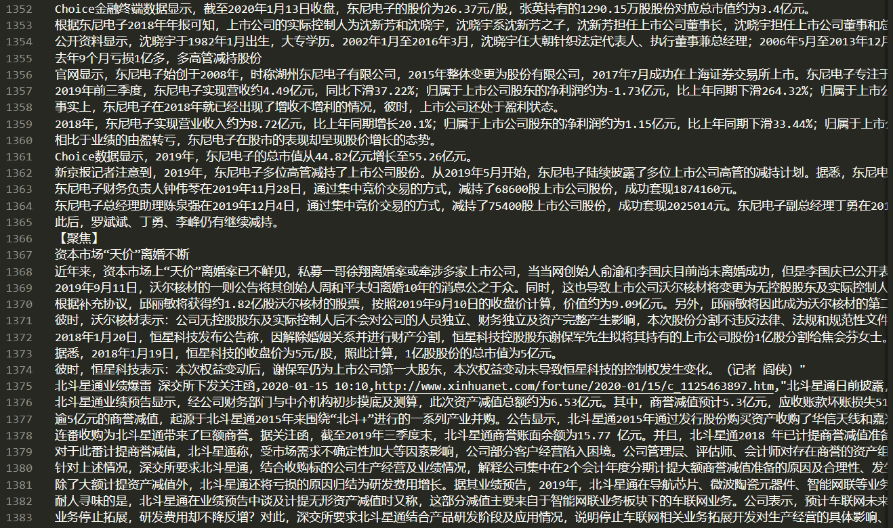
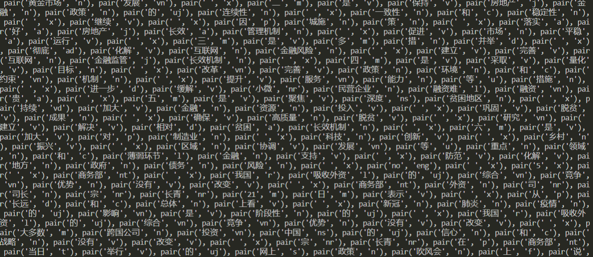

## 热点话题检测

### 1. 数据获取及预处理

#### 1.1 数据爬取

爬虫爬取的新闻网站为新浪、搜狐、新华网。爬取的流程为，首先利用网站的新闻API爬取新闻标题、时间、url，然后利用lxml模块获取新闻的详细信息，最后，设置3个线程爬取新闻网站的新闻。

在爬取过程中，首先找到这三个网站解析新闻网页内容的API，然后用API请求数据，最后就可以得到最近新闻的相关信息，各个网站解析网页内容的API如下表所示。

表1 新华网、搜狐网、新浪网三个网站解析网页内容的API

| 新华网 | [https://feed.mix.sina.com.cn/api/roll/get?pageid=153&lid=2516&k=&num=](https://feed.mix.sina.com.cn/api/roll/get?pageid=153&lid=2516&k=&num=){}&page={}&r={} |
| --- | --- |
| 搜狐网 | [http://v2.sohu.com/public-api/feed?scene=CHANNEL&sceneId=15&page=](http://v2.sohu.com/public-api/feed?scene=CHANNEL&sceneId=15&page=){}&size={} |
| 新浪网 | [http://qc.wa.news.cn/nodeart/list?nid=11147664&pgnum=](http://qc.wa.news.cn/nodeart/list?nid=11147664&pgnum=){}&cnt={}&tp=1&orderby=1 |

在爬虫爬取过程中，选择python自带的urllib模块爬取信息，最后得到这三个网站的新闻字典dict，该字典中包含新闻的标题、发布时间以及url。除上述信息外，还要获取新闻的详细内容，本设计选择lxml模块的html解析器对url数据进行解析，得到该新闻页面的所有html信息，最后再通过xpath提取新闻内容。

为了提高三个网站新闻信息的爬取速度，我们还采用多线程信息爬取策略，新浪、搜狐、新华网每个网站分配一个线程，最后将三个网站的信息合并在一起，这样就可以大大增加新闻信息爬取的效率。

#### 1.2 数据清洗

对爬取新闻信息的清洗包括两个流程：整体清洗和局部清洗，整体清洗适用于所有的信息记录，如：去除乱码记录，去除严重信息缺失记录，不合法的字段信息统一清除为null，去掉前后的空格、去掉多个因为缺失新闻内容连在一起的情况等；局部清洗适用于特定的类别，如发布时间字段的统一，将新闻中多出“图片来源”、“资料来源”等无关的信息替换为空字符等。

对于新闻的聚类，多数标点符号也会影响聚类效果，所以需要将新闻内容的标点符号全部删除以便剩下的中文、英文和数字能很好的反映新闻内容。另外，为了方便jieba分词的进行，在清洗时，需要将句子中特殊字符分离。

#### 1.3 爬取结果

通过定义好的爬取规则，对新闻网站的信息进行爬取，得到大量新闻结果。

图1  爬虫爬取结果

按照顺序分别从新华网、新浪、搜狐等新闻网页进行信息爬取。针对新闻的日期等因素进行限制，可以初步过滤新闻，将重复的新闻与时效性差的新闻进行滤除。根据新闻的标题、日期、原始url来源、新闻内容进行切分，最后将内容保存到本地的csv文件中，将新闻文件进行组合之后，得到大约10M的纯文本信息。

### 2. 数据分析与可视化

在信息爬取的过程中，我们针对爬取规则、重复新闻等特点，对新闻进行了第一次清洗。在对新闻进行处理的过程中，我们发现爬取到的新闻内容中，部分新闻的内容存在大量的颜文字、空白等非常规语义信息。同时，由于部分新闻内容编码方式不一致，导致在处理的过程中出现断词错误现象。因此，我们针对这些新闻内容进行了二次处理，将无法编码的内容与缺失的内容进行清洗。最后，将新闻内容中无效的信息（责任编辑、资料来源、标点符号）进行剔除，得到了可以进行分析的文本信息。

我们采用了jieba分词的方法，将新闻文本内容进行分词。在实验的过程中，我们发现使用jieba进行自动分词，会出现部分专用名词也被切断的现象，对我们后续的结果分析带来了不利的影响。因此，在充分利用jieba分词的基础上，我们自己定义了一个专有名词词典，将新闻内容中被错分概率高的词汇进行有针对性地处理，这会大大降低程序处理错误的现象。

同时，在分词的过程中，我们得到了词汇的词性信息，因此根据词性信息，我们将对话题主题无关的连接词、副词与助词等词汇进行过滤，只保留对话题贡献度大的名词、动词等词语，这样大大降低了词向量的维度。最后，我们通过自己定义的同义词词典，将具有相同意义的词语进行合并，得到了最终的分词结果。

图2 分词结果示意图

在得到了分词结果之后，对这些词语进行特征提取，通过提取到的特征来实现对新闻更好的表达。本实验选择了TF-IDF来对新闻进行特征提取，减小了新闻中无意义词的影响，可以更好的体现新闻内容的主题。首先统计出所有新闻中出现的所有词，将每个词当成词向量的一个维度，若新闻中存在该词语，则在该维度上计算该词语的TD-IDF特征值；若不存在该词语，则将其置为0。得到了可以表达所有新闻内容的稀疏矩阵。

### 3. 模型选取

#### 3.1 DBSCAN聚类算法

DBSCAN聚类算法是一种基于高密度连通区域的聚类算法，能够将高密度的区域划分为簇，并在有噪声的数据中发现任意形状的簇。

其原理为：首先检查数据集中每点的邻域，如果其邻域包含的点大于阈值，则创建一个以该点为核心的簇；然后迭代地聚集从这些核心对象直接密度可达的对象；最后，当没有新点添加到簇时结束。

#### 3.2 TextRak排序算法

TextRank是基于图的文本的排序算法，类似于网页的排名，对于词语或者句子均可以得到排名，所以它可以进行关键词提取和自动文摘。其用于自动文摘时的思想是：将每个句子看成PageRank图的节点，若两个句子的相似度大于阈值，则认为它们有相似联系，它们间就有一条无向有权边，权值是相似度，再用PageRank算法得到句子的得分，把得分较高的句子作为文章的摘要。

### 4. 挖掘实验的结果

目前，我们做了数据爬取和预处理的工作，爬取后做了jieba分词和关键词提取的相关工作，接下来利用聚类方法和textrank排序算法的数据挖掘工作还在做中。

### 5. 存在的问题

1. 爬取数据的过程中，由于网站设置了反爬虫机制，所以我们不能够一直爬取；
2. 目前还没有对数据挖掘结果进行较好的可视化展示。

### 6. 下一步工作

1. 采用DBSCAN聚类算法对新闻热点进行聚类分析，得到新闻热点话题；
2. 然后，采用textrank算法对热点话题进行排行，最后，将它们进行可视化表示。