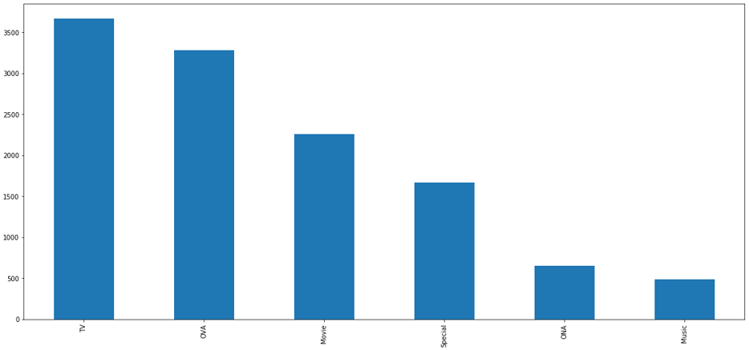

## 动漫推荐系统设计与实现

### 1. 数据获取及预处理

#### 1.1 数据来源

数据来自myanimelist.net网站，包含关于12294部动漫作品的73516个用户的偏好信息。每个用户都可以将动漫添加到他们的完整列表中，并为其指定一个评分。

#### 1.2 数据说明

数据集包含anime.csv和rating.csv两个csv文件。anime.csv文件包含12293部动漫作品信息，由anime_id, name, genre, type, episodes, rating以及members等属性信息组成。rating.csv文件包含73516个用户，共7813736个评分意见，由user_id, anime_id以及rating等属性信息组成。

#### 1.3 数据预处理

anime.csv和rating.csv文件中部分属性信息存在缺失值，但缺失值数量与数据集总体数量相比可忽略不计，因此在数据预处理阶段直接将缺失值剔除。由于anime.csv文件中anime_id这一属性信息并不连续，我们将每一个anime对应的序号作为新的标识符，保存为anime_row。观察anime.csv和rating.csv可以发现两个文件中都有rating这一数值属性，但两者含义不同，anime.csv中rating属性表示每部anime的用户总评分，rating.csv中rating属性表示每个用户对某部anime的评分，为了加以区分我们将其分别重命名为anime_rating和user_rating。最后将anime.csv和rating.csv文件中属性信息根据anime_id进行整合，将整合后的用户评分记录保存在uratings_df中，得到有动漫作品详细信息的用户评分列表。

### 2. 数据分析与可视化

* 在对anime.csv文件进行可视化分析发现，数量最多的动漫题材是comedy，其次是action, adventure, fantasy等题材，其中comedy的数量是其余题材的一倍，说明大众更偏爱comedy题材的动漫。在对用户进行动漫推荐时，推荐comedy题材动漫的可能性较大。

* 除了对动漫题材进行探索外，我们还对动漫类型进行了分析。数据集中的动漫一共有六类，分别是TV, movie, OVA, special, ONA和music。我们分别对anime.csv和rating.csv文件中type属性进行了可视化分析，从分析结果可看出不同类型动漫的数量和用户观看不同类型的数量顺序大小是大致相同的，但不同类型动漫的观看数量差距是十分巨大的。

在anime.csv文件中，我们可以看出TV和OVA类型的动漫数量差距较小。但在rating.csv文件中，我们发现TV类型的动漫观看量远高于其他类型的动漫。说明虽然现在市面上TV和OVA类型的动漫数量相差无几，但用户更偏爱于观看TV类型的动漫。在对用户进行动漫推荐时，推荐TV类型的动漫概率更大。

* 我们对用户评分数最多的动漫进行了分析，可以看出最受欢迎的动漫是Death Note，其次是Sword Art Online, Shingeki no Kyojin, Code Geass: Hangyaku no Lelouch。在对用户进行动漫推荐时，推荐评分人数较多的动漫的概率较大。

### 3. 模型选取

本推荐系统主要实现两个功能，分别为：从群集的特征中提取推荐的动漫。 按用户动漫评分历史细分用户；对用户(id)进行动漫推荐。对于前个功能可以通过聚类的方式来实现，后个功能则可以用协同过滤的方法来挖掘用户和动漫作品之间的数据关联。主要思路如下：

1. 数据预处理，去掉rating表中未评分的用户记录，以及重组anime和rating表。
2. 创建动漫评分矩阵rating和评分记录矩阵record。
3. 构建模型，损失函数由两部分组成，最小化参数和rating表的距离和最小化参数大小。用adam优化器进行训练。
4. 生成模型(anime_num*user_num的矩阵)，进行评估和用户推荐。

### 4. 挖掘实验的结果

目前已完成的内容有数据清洗，分析可视化，初步推荐系统的设计，基于协同过滤的推荐算法4000次迭代后结果测试误差在2左右。

得到的预测模型为动漫-用户矩阵，输入用户的id，在矩阵中搜索该用户列下前20评分最高的动画。

### 5. 存在的问题

rating中用户数据量太大，若是直接全部导入会导致内存溢出，本次实验在推荐算法这一块是截取了原数据中的一部分。

### 6. 下一步工作

对数据的输入处理做优化，解决内存溢出问题，优化训练模型，采取更为精准的推荐算法。
