## Airbnb短租数据集挖掘

### 1. 数据获取及预处理

#### 1.1 数据来源

本组希望能够通过对短租数据集进行数据分析，并将数据可视化，以此来分析北京地区的短租房房源分布和房源价格以及房源的类型，同时对数据集进行频繁模式和关联规则挖掘。数据来自Airbnb于2019年4月17日公开的北京地区数据。数据均来源于Airbnb网站的公开信息，不包含任何个人隐私数据。数据下载地址：[https://tianchi.aliyun.com/competition/entrance/231715/information](https://tianchi.aliyun.com/competition/entrance/231715/information)

#### 1.2 数据说明

数据信息如下:

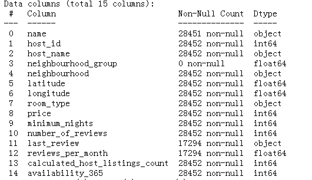

数据为短租房源基础信息，包括房源、房东、位置、类型、价格、评论数量和可租时间等等。

#### 1.3 数据预处理

1. 发现neighbourhood_group一栏全部都是缺失,因此舍弃这一列
2. 对于neighbourhood这一列,我们只需要地区的中文名称即可,可以将后面的英文名称删除
3. 根据listings.info()的信息,name列存在缺失值,name缺失,则这条数据是没有意义的,应该将此行删除
4. last_reviews是最新评论时间,如果缺失,我们可以选择直接舍弃该行
5. reviews_per_month是指平均每个月收到的评论数量,此处若有数据值缺失,我们可以将缺失值填充为0

### 2. 数据分析与可视化

由于每个房子的name值都是不一样的,对name可视化时没有意义的,因此name不进行可视化

#### 2.1 可视化hostID和hostname

* hostID和hostName指的是短租房的id编号和短租房的名称

```
#频数统计
美婷          223
兴伟          210
Cathy       116
海梅          115
李           112
 ... 
俊万            1
建朋            1
Iu小姐姐        1
ShanShan      1
Effy          1
Name: host_name, Length: 6627, dtype: int64
```

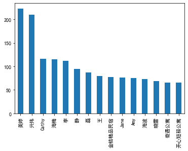

#### 2.2 可视化neighbourhood

* 短租房所处的地区

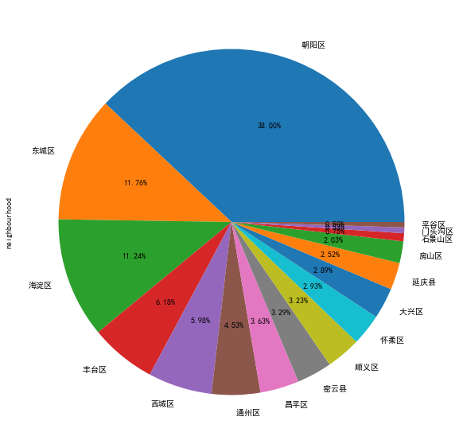

latitude和longitude是指房屋所在的经纬度坐标,没有可视化的必要

#### 2.3 可视化room_type

* room_tyoe是指房屋类型

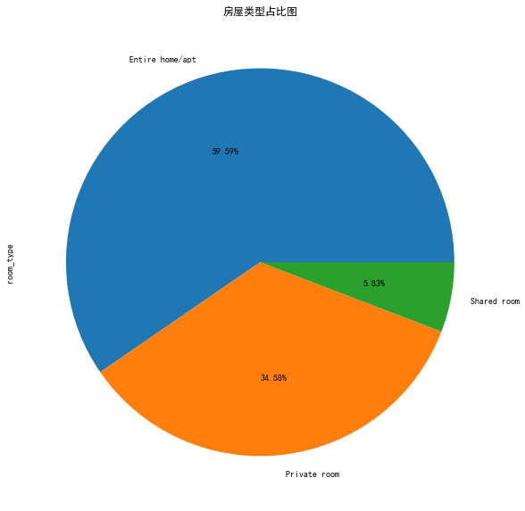

### 2.4 对price数据进行可视化

* price为当前的短租房租金价格
* 绘制price直方图

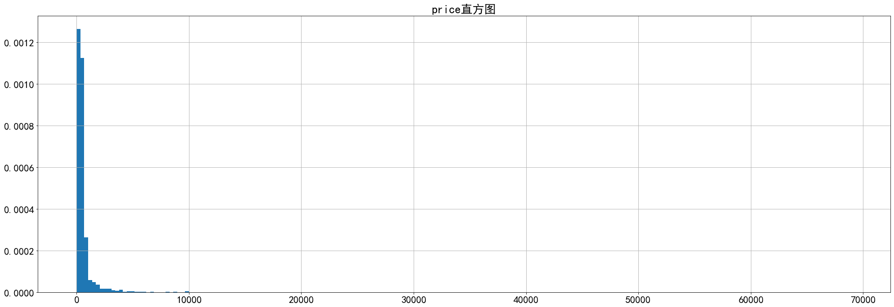

由上图可知,短租房价格一般在0到5000之间,因此,我们可以再检查0-5000之间的价格分布

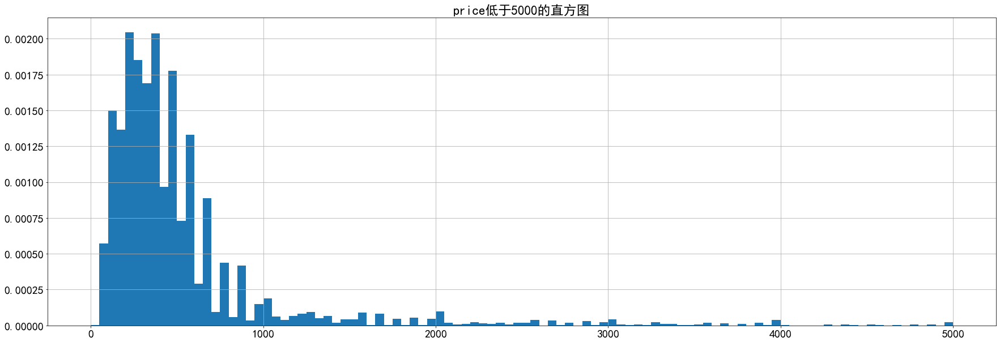

* 绘制price的盒图

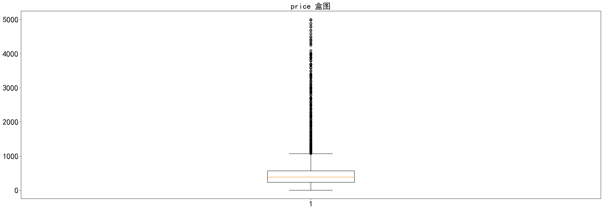

### 2.5 minimum_nights数据可视化

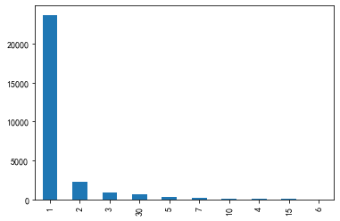

### 2.6 number_of_reviews数据可视化

* number_of_reviews为评论的数量

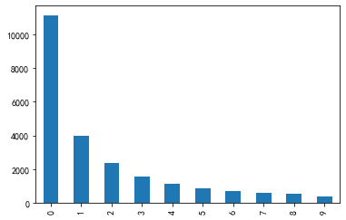

* last_review数据可视化

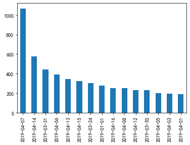

* reviews_per_month数据可视化

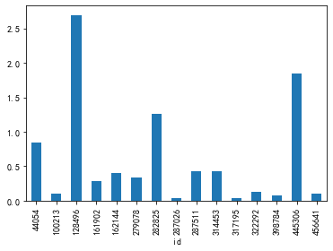

* calculated_host_listings_count数据可视化

availability_365是指可以预定天数

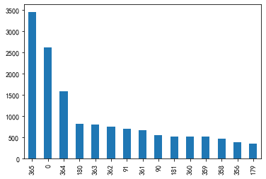

* 查看不同地区短租房的平均价格

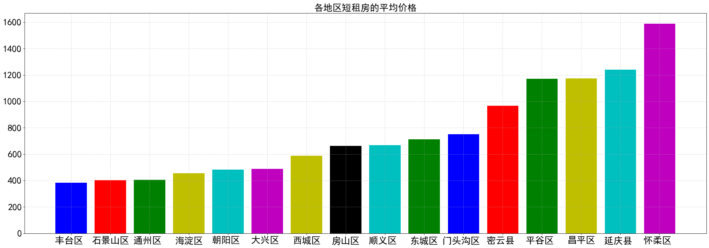

* 查看不同类型的短租房均价

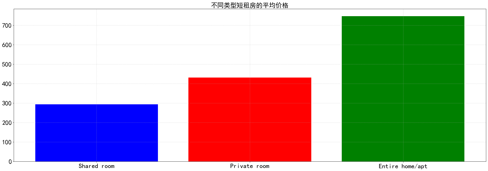

* 查看不同短租房的类型在不同地区的平均价格

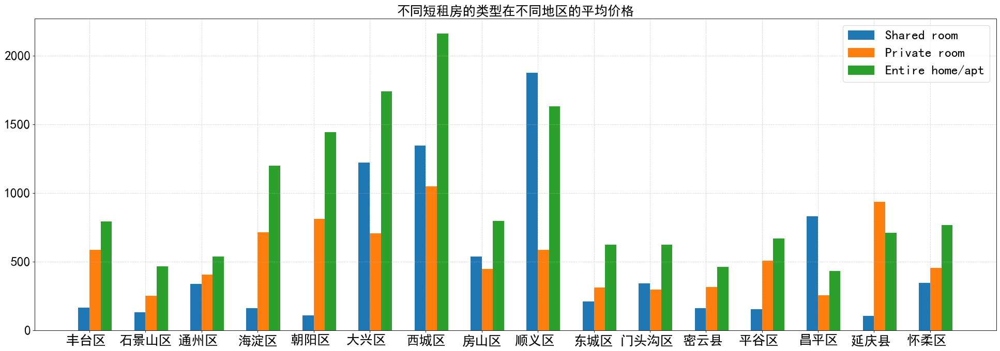

### 3. 频繁项集和关联规则挖掘

#### 3.1 提取数据集中可分析属性

name属性相当于标题，无需考虑；host_id属于编号，无需考虑；latitude和longitude是房子的经纬度，实际租房时并不需要考虑该属性; last_review评论时间属性，无需考虑。

| id | host_name | neighbourhood | room_type | price | number_of_reviews | reviews_per_month | calculated_host_listings_count | availability_365 |
| --- | --- | --- | --- | --- | --- | --- | --- | --- |
| 44054 | East Apartments | 朝阳区 | Entire home/apt | 792 | 89 | 0.85 | 9 | 341 |
| 100213 | Joe | 密云县 | Private room | 1201 | 2 | 0.10 | 4 | 0 |
| 128496 | Cindy | 东城区 | Entire home/apt | 389 | 259 | 2.70 | 1 | 93 |

对数据进对数据进行处理转换成可以进行关联规则挖掘的形式，对price,number_of_reviews,availability_365属性数据进行分层行处理。

| id | host_name | neighbourhood | room_type | price | number_of_reviews | reviews_per_month | calculated_host_listings_count | availability_365 |
| --- | --- | --- | --- | --- | --- | --- | --- | --- |
| 44054 | East Apartments | 朝阳区 | Entire home/apt | price_(591.0, 68983.0] | reviewsNum_(16.0, 322.0] | reviewsPre_0.85 | hostCount_9 | availability_11-12m |
| 100213 | Joe | 密云县 | Private room | price_(591.0, 68983.0] | reviewsNum_(0.999, 3.0] | reviewsPre_0.1 | hostCount_4 | availability_0-5d |
| 128496 | Cindy | 东城区 | Entire home/apt | price_(302.0, 429.0] | reviewsNum_(16.0, 322.0] | reviewsPre_2.7 | hostCount_1 | availability_3-4m |
| 161902 | Robert | 东城区 | Entire home/apt | price_(302.0, 429.0] | reviewsNum_(16.0, 322.0] | reviewsPre_0.28 | hostCount_5 | availability_9-10m |
| 162144 | Robert | 朝阳区 | Entire home/apt | price_(429.0, 591.0] | reviewsNum_(16.0, 322.0] | reviewsPre_0.4 | hostCount_5 | availability_11-12m |
| ... | ... | ... | ... | ... | ... | ... | ... | ... |
| 33889408 | 小田 | 朝阳区 | Entire home/apt | price_(429.0, 591.0] | reviewsNum_(0.999, 3.0] | reviewsPre_1.0 | hostCount_9 | availability_10-20d |
| 33890728 | 小田 | 朝阳区 | Entire home/apt | price_(429.0, 591.0] | reviewsNum_(0.999, 3.0] | reviewsPre_1.0 | hostCount_9 | availability_10-20d |
| 33891613 | 小田 | 朝阳区 | Entire home/apt | price_(429.0, 591.0] | reviewsNum_(0.999, 3.0] | reviewsPre_1.0 | hostCount_9 | availability_5-10d |
| 33892088 | 小田 | 朝阳区 | Entire home/apt | price_(429.0, 591.0] | reviewsNum_(0.999, 3.0] | reviewsPre_1.0 | hostCount_9 | availability_10-20d |
| 33925874 | 向鹏 | 石景山区 | Entire home/apt | price_(302.0, 429.0] | reviewsNum_(0.999, 3.0] | reviewsPre_1.0 | hostCount_2 | availability_11-12m |

#### 3.2 关联规则挖掘

在支持度为0.025和置信度为0.7的条件下，进行关联规则的挖掘,打印挖掘出的规则, 并使用Lift、Kulc和IR指标，评价关联规则

| 规则 |   | 置信度 | Lift | Kulc | IR | SupA | SupB | SupAB |   |
| --- | --- | --- | --- | --- | --- | --- | --- | --- | --- |
| 0 | ( price_(-0.001, 201.0], 朝阳区 , hostCount_1 ) ==> (Private room ) | 454 | 0.790941 | 2.393862 | 0.435197 | 0.881042 | 0.033191 | 0.330404 | 0.026252 |
| 1 | ( 朝阳区 , reviewsNum*(0.999, 3.0], price*(302.0, 429.0] ) ==> (Entire home/apt ) | 498 | 0.834171 | 1.356479 | 0.440499 | 0.935159 | 0.034521 | 0.614953 | 0.028796 |
| 2 | ( 朝阳区 , availability_11-12m, price_(302.0, 429.0] ) ==> (Entire home/apt ) | 543 | 0.871589 | 1.417326 | 0.461323 | 0.934391 | 0.036024 | 0.614953 | 0.031398 |
| 3 | ( reviewsNum*(0.999, 3.0], availability_11-12m, price*(302.0, 429.0] ) ==> (Entire home/apt ) | 665 | 0.814951 | 1.325224 | 0.438740 | 0.910347 | 0.047184 | 0.614953 | 0.038453 |
| 4 | ( reviewsNum*(0.999, 3.0], availability_11-12m, price*(591.0, 68983.0] ) ==> (Entire home/apt ) | 719 | 0.838973 | 1.364288 | 0.453290 | 0.907639 | 0.049555 | 0.614953 | 0.041575 |
| 5 | ( price*(429.0, 591.0], 朝阳区 , reviewsNum*(0.999, 3.0] ) ==> (Entire home/apt ) | 572 | 0.912281 | 1.483496 | 0.483033 | 0.936202 | 0.036255 | 0.614953 | 0.033075 |
| 6 | ( price_(429.0, 591.0], 朝阳区 , availability_11-12m ) ==> (Entire home/apt ) | 637 | 0.949329 | 1.543743 | 0.504613 | 0.933921 | 0.038800 | 0.614953 | 0.036834 |
| 7 | ( price*(429.0, 591.0], reviewsNum*(0.999, 3.0], availability_11-12m ) ==> (Entire home/apt ) | 739 | 0.924906 | 1.504027 | 0.497197 | 0.919682 | 0.046201 | 0.614953 | 0.042732 |
| 8 | ( price_(-0.001, 201.0], hostCount_1 ) ==> (Private room ) | 942 | 0.749403 | 2.268145 | 0.457131 | 0.739260 | 0.072684 | 0.330404 | 0.054470 |
| 9 | ( 朝阳区 , price_(302.0, 429.0] ) ==> (Entire home/apt ) | 1306 | 0.862616 | 1.402734 | 0.492709 | 0.841188 | 0.087545 | 0.614953 | 0.075518 |
| 10 | ( reviewsNum*(0.999, 3.0], price*(302.0, 429.0] ) ==> (Entire home/apt ) | 1291 | 0.807885 | 1.313734 | 0.464638 | 0.825900 | 0.092402 | 0.614953 | 0.074650 |
| 11 | ( price_(302.0, 429.0], hostCount_1 ) ==> (Entire home/apt ) | 622 | 0.852055 | 1.385560 | 0.455270 | 0.921996 | 0.042211 | 0.614953 | 0.035966 |
| 12 | ( availability_11-12m, price_(302.0, 429.0] ) ==> (Entire home/apt ) | 1286 | 0.849967 | 1.382165 | 0.485444 | 0.839809 | 0.087487 | 0.614953 | 0.074361 |
| 13 | ( reviewsNum*(16.0, 322.0], price*(302.0, 429.0] ) ==> (Entire home/apt ) | 667 | 0.878788 | 1.429032 | 0.470753 | 0.920667 | 0.043888 | 0.614953 | 0.038568 |
| 14 | ( price*(-0.001, 201.0], reviewsNum*(16.0, 322.0] ) ==> (Private room ) | 586 | 0.738035 | 2.233739 | 0.420295 | 0.830800 | 0.045912 | 0.330404 | 0.033885 |
| 15 | ( 朝阳区 , price_(591.0, 68983.0] ) ==> (Entire home/apt ) | 949 | 0.922255 | 1.499715 | 0.505744 | 0.896500 | 0.059500 | 0.614953 | 0.054875 |
| 16 | ( reviewsNum*(16.0, 322.0], price*(591.0, 68983.0] ) ==> (Entire home/apt ) | 507 | 0.884817 | 1.438836 | 0.466245 | 0.940286 | 0.033133 | 0.614953 | 0.029317 |
| 17 | ( reviewsNum*(0.999, 3.0], price*(591.0, 68983.0] ) ==> (Entire home/apt ) | 1421 | 0.829055 | 1.348159 | 0.481335 | 0.816343 | 0.099110 | 0.614953 | 0.082167 |
| 18 | ( price_(591.0, 68983.0], hostCount_1 ) ==> (Entire home/apt ) | 542 | 0.878444 | 1.428473 | 0.464704 | 0.935387 | 0.035677 | 0.614953 | 0.031340 |
| 19 | ( availability_11-12m, price_(591.0, 68983.0] ) ==> (Entire home/apt ) | 1336 | 0.860825 | 1.399822 | 0.493224 | 0.837066 | 0.089742 | 0.614953 | 0.077252 |
| 20 | ( reviewsNum*(6.0, 16.0], price*(591.0, 68983.0] ) ==> (Entire home/apt ) | 548 | 0.899836 | 1.463259 | 0.475682 | 0.937360 | 0.035215 | 0.614953 | 0.031687 |
| 21 | ( reviewsNum*(6.0, 16.0], price*(302.0, 429.0] ) ==> (Entire home/apt ) | 579 | 0.856509 | 1.392803 | 0.455476 | 0.927972 | 0.039089 | 0.614953 | 0.033480 |
| 22 | ( price*(-0.001, 201.0], reviewsNum*(6.0, 16.0] ) ==> (Private room ) | 549 | 0.714844 | 2.163547 | 0.405462 | 0.833642 | 0.044408 | 0.330404 | 0.031745 |
| 23 | ( price_(429.0, 591.0], 朝阳区 ) ==> (Entire home/apt ) | 1404 | 0.949290 | 1.543679 | 0.540653 | 0.854902 | 0.085521 | 0.614953 | 0.081184 |
| 24 | ( price*(429.0, 591.0], reviewsNum*(16.0, 322.0] ) ==> (Entire home/apt ) | 544 | 0.902156 | 1.467032 | 0.476654 | 0.938096 | 0.034868 | 0.614953 | 0.031456 |
| 25 | ( price*(429.0, 591.0], reviewsNum*(0.999, 3.0] ) ==> (Entire home/apt ) | 1360 | 0.892388 | 1.451149 | 0.510134 | 0.843689 | 0.088123 | 0.614953 | 0.078640 |
| 26 | ( price*(429.0, 591.0], reviewsNum*(6.0, 16.0] ) ==> (Entire home/apt ) | 623 | 0.939668 | 1.528032 | 0.499124 | 0.934145 | 0.038337 | 0.614953 | 0.036024 |
| 27 | ( price_(429.0, 591.0], hostCount_1 ) ==> (Entire home/apt ) | 449 | 0.910751 | 1.481008 | 0.476485 | 0.949714 | 0.028507 | 0.614953 | 0.025963 |
| 28 | ( price_(429.0, 591.0], availability_11-12m ) ==> (Entire home/apt ) | 1386 | 0.919708 | 1.495574 | 0.525016 | 0.848643 | 0.087140 | 0.614953 | 0.080143 |
| 29 | ( availability_2-3m, price_(591.0, 68983.0] ) ==> (Entire home/apt ) | 437 | 0.863636 | 1.404394 | 0.452364 | 0.946282 | 0.029259 | 0.614953 | 0.025269 |
| 30 | ( availability_2-3m, price_(302.0, 429.0] ) ==> (Entire home/apt ) | 524 | 0.857610 | 1.394595 | 0.453441 | 0.934900 | 0.035330 | 0.614953 | 0.030300 |
| 31 | ( price_(429.0, 591.0], availability_2-3m ) ==> (Entire home/apt ) | 491 | 0.907579 | 1.475850 | 0.476873 | 0.944689 | 0.031283 | 0.614953 | 0.028391 |
| 32 | ( availability_2-3m, price_(-0.001, 201.0] ) ==> (Private room ) | 495 | 0.742129 | 2.246128 | 0.414379 | 0.857458 | 0.038568 | 0.330404 | 0.028623 |
| 33 | ( reviewsNum*(3.0, 6.0], price*(591.0, 68983.0] ) ==> (Entire home/apt ) | 439 | 0.871032 | 1.416420 | 0.456155 | 0.946822 | 0.029143 | 0.614953 | 0.025385 |
| 34 | ( reviewsNum*(3.0, 6.0], price*(302.0, 429.0] ) ==> (Entire home/apt ) | 455 | 0.878378 | 1.428366 | 0.460581 | 0.945691 | 0.029953 | 0.614953 | 0.026310 |
| 35 | ( price*(429.0, 591.0], reviewsNum*(3.0, 6.0] ) ==> (Entire home/apt ) | 459 | 0.931034 | 1.513993 | 0.487097 | 0.950605 | 0.028507 | 0.614953 | 0.026541 |
| 36 | ( 东城区, price_(591.0, 68983.0] ) ==> (Entire home/apt ) | 669 | 0.825926 | 1.343071 | 0.444416 | 0.911748 | 0.046837 | 0.614953 | 0.038684 |
| 37 | ( price_(429.0, 591.0], 东城区 ) ==> (Entire home/apt ) | 472 | 0.867647 | 1.410916 | 0.456014 | 0.942468 | 0.031456 | 0.614953 | 0.027293 |
| 38 | ( 东城区, availability_11-12m ) ==> (Entire home/apt ) | 626 | 0.736471 | 1.197604 | 0.397666 | 0.901096 | 0.049150 | 0.614953 | 0.036198 |
| 39 | ( hostCount_2, price_(-0.001, 201.0] ) ==> (Private room ) | 451 | 0.791228 | 2.394732 | 0.435079 | 0.881879 | 0.032959 | 0.330404 | 0.026078 |
| 40 | ( price_(-0.001, 201.0], availability_0-5d ) ==> (Private room ) | 445 | 0.718901 | 2.175828 | 0.398390 | 0.865319 | 0.035793 | 0.330404 | 0.025731 |
| 41 | ( Entire home/apt, reviewsPre_1.0 ) ==> (reviewsNum_(0.999, 3.0] ) | 637 | 0.969559 | 2.118987 | 0.525030 | 0.914660 | 0.037990 | 0.457558 | 0.036834 |
| 42 | ( reviewsPre_1.0, availability_11-12m ) ==> (reviewsNum_(0.999, 3.0] ) | 457 | 0.978587 | 2.138718 | 0.518170 | 0.939796 | 0.027004 | 0.457558 | 0.026425 |
| 43 | ( 朝阳区 , Shared room ) ==> (price_(-0.001, 201.0] ) | 445 | 0.915638 | 4.178111 | 0.516526 | 0.862438 | 0.028102 | 0.219151 | 0.025731 |
| 44 | ( price_(302.0, 429.0] ) ==> (Entire home/apt ) | 2992 | 0.842580 | 1.370152 | 0.561957 | 0.632839 | 0.205331 | 0.614953 | 0.173008 |
| 45 | ( price_(591.0, 68983.0] ) ==> (Entire home/apt ) | 2915 | 0.857353 | 1.394176 | 0.565724 | 0.650629 | 0.196600 | 0.614953 | 0.168556 |
| 46 | ( price_(429.0, 591.0] ) ==> (Entire home/apt ) | 2986 | 0.909534 | 1.479030 | 0.595153 | 0.672521 | 0.189835 | 0.614953 | 0.172661 |
| 47 | ( reviewsPre_1.0 ) ==> (reviewsNum_(0.999, 3.0] ) | 999 | 0.968962 | 2.117684 | 0.547605 | 0.866205 | 0.059616 | 0.457558 | 0.057766 |
| 48 | ( Shared room ) ==> (price_(-0.001, 201.0] ) | 860 | 0.910053 | 4.152627 | 0.568483 | 0.734194 | 0.054643 | 0.219151 | 0.049728 |

由上数据可以得到关联规则：

* ( price_(-0.001, 201.0], 朝阳区 , hostCount_1 ) ==> (Private room )，即79%朝阳区内有一间房且价格在201元以内的房源都是单人间。
* ( Shared room ) ==> (price_(-0.001, 201.0] )，即91%的共用房间价格在201元以内。
* ( reviewsPre_1.0 ) ==> (reviewsNum_(0.999, 3.0] ) ，即有96.9%的每月评论数在1条的房源，总体评论数在1~3条左右。

由于大部分关联规则都指向房源类型和评论数量，分析价值不大，因此去掉属性 ‘room_type’ 和 'number_of_reviews' ，将支持度设为0.02，置信度设为0.6，挖掘关联规则。

| 规则 | 支持度 | 置信度 | Lift | Kulc | IR | SupA | SupB | SupAB |   |
| --- | --- | --- | --- | --- | --- | --- | --- | --- | --- |
| 0 | (price_(-0.001, 201.0], availability_0-5d ) =... | 380 | 0.613893 | 2.698011 | 0.355231 | 0.794442 | 0.035793 | 0.227536 | 0.021973 |

关联规则：( price_(-0.001, 201.0], availability_0-5d ) ==> (hostCount_1 )即61.3%的一年可住数据在5天以内且价格在201以内的房源的房间数只有1个，说明这些房主一年可能只有少数时间将房屋出租，且一半以上价格较低。

### 4. 模型选取

目前主要采用了numpy库的ndarray和pandas库的DataFrame数据结构完成了数据初始化和可视化工作。

### 5. 挖掘实验的结果

目前，我们进行了数据预处理工作，之后将继续有关数据挖掘的相关任务

### 6. 存在的问题

数据缺失值较多，对缺失值的处理需要针对不同的数据确定不同填充办法。当前我们仅对部分关键特征进行简单的填充和处理，这样可能导致结果出现偏差。

### 7. 下一步工作

* 尝试使用相似性或预测分类的方式进行数据缺失值处理
* 对关联规则的评价指标进行可视化分析
* 对房价进行预测
* 绘制房源分布图

### 8. 任务分配与完成情况

* 王瀚锋、秦肖睿：数据清洗和可视化
* 刘逸凡、田迎晨、林鹤翔：频繁模式和关联规则挖掘、对分析结果的总结
