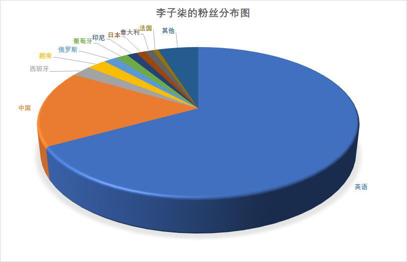
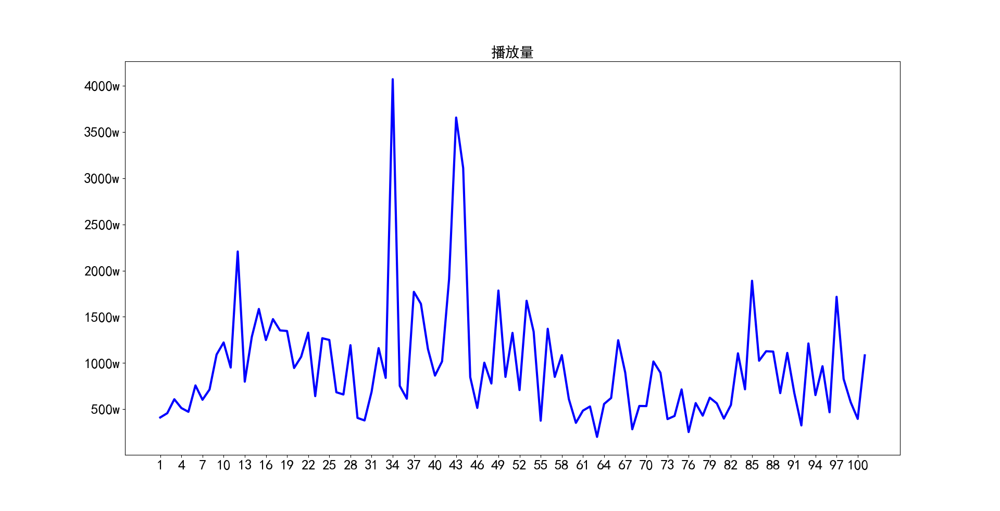
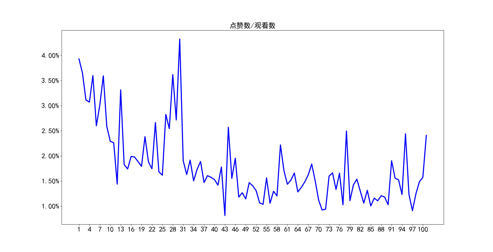
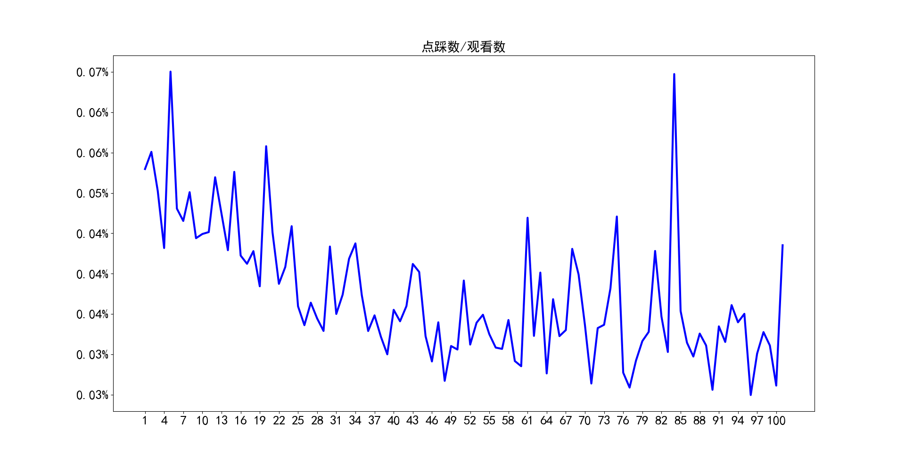

## YouTube评论情感差异分析

### 1. 数据获取及预处理

#### 1.1 数据来源

数据来自Youtube上李子柒最近前100个的视频的前1000条评论信息，以及选取了三个视频的完整评论信息。本项目通过selenium来爬取评论数据，通过模拟人的行为来获取数据，在一定程度上防止了网站的反爬虫机制。

#### 1.2 数据说明

我们爬取的数据主要包括视频的简要信息。 简要信息 包括视频题目、发表的时间、视频时长以及观看人数。爬取到的评论总数为148051条，时间跨度为2年4个月。

#### 1.3 数据预处理

获取数据后，首先删除了一些语句长度过短的数据（可能无法真实反映情感信息），然后将数据按语言类型进行分类。

### 2. 数据分析与可视化

#### 2.1 粉丝分布

通过将评论按语言类型进行区分，同时将英语默认为一个国家。可以发现李子柒的中国观众仅占16%，其观众国籍遍布世界各地，说明了李子柒在海外颇受欢迎。

#### 2.2 视频播放量

通过统计100个视频的播放量我们可以看到李子柒的每个视频播放量都很高，平均在970w左右，最高的有4000w左右的，最小的也有200w的播放量，由此可见李子柒的文化影响力是非常强的。

#### 2.3 点赞率及点踩率

统计了100个视频的点赞数/观看数，以及点踩数/观看数，也就是点赞率和点踩率，经过统计分析，点赞率平均为1.8%，最高为4.3%，最低为0.8%；点踩率平均为0.037%，最高为0,065%，最低为0.025%。通过对比可以看出，观众对于李子柒是喜爱远大于讨厌的。

### 3. 模型选取

对于评论的情感分析任务，这里主要考虑适用两个模型：基于情感词典以及基于树模型的方法。基于情感词典的方法中，词与词之间独立缺乏相关性以及权重难以设定的不足，而树模型可以生成对应消极与积极的频繁模式树，再根据匹配关系来计算情感倾向。

### 4. 挖掘实验的结果

目前只完成了基于情感字典的方法，对14710条评价进行试验，发现积极评价6964条，消极评论1292条，积极评价占比为0.4734.

### 5. 存在的问题

(1)数据获取的较慢。Selenium库虽然可以通过模拟人的行为来防止反爬虫机制，但速度较慢。

(2)基于情感词典的方法效果不佳。李子柒的中文评论中，积极评价实际占比很高，但基于情感词典的方法得出较低。

### 6. 下一步工作

通过基于树模型的方法来分析评论的情感倾向，并与基于情感词典的方法进行比较。

### 7. 任务分配与完成情况

* 王靖淇（3220190879）结果分析 + 文档撰写 已完成
* 孙天艺（3220190867）模型构建 + 文档撰写 已完成
* 孙润庚（3220190866）数据爬取 + 文档撰写 已完成
* 石根 (3220190861) 可视化 + 文档撰写 已完成 