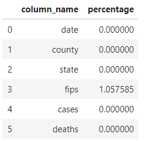
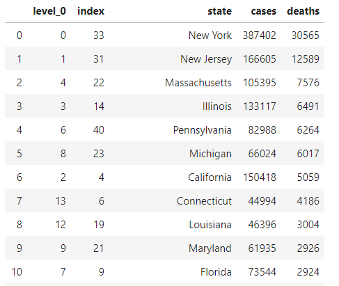

## 新冠肺炎疫情趋势预测

### 1、数据获取及预处理

#### 1.1 数据来源

此次项目使用的数据集来自 Kaggle 美国新冠肺炎数据集：[Us counties COVID 19 dataset](https://www.kaggle.com/fireballbyedimyrnmom/us-counties-covid-19-dataset?select=us-counties.csv) 

#### 1.2 数据说明

数据集包含了自2020年1月21日至近期(2020年6月13日)美国各州郡的新冠肺炎患者以及死亡数据情况。

数据集共有6个字段：

- date：日期，例如：“2020-01-21”，(数据范围：2020.01.21 - 2020.06.13)
- county：郡县名，例如 “Snohomish”
- state：州名，例如 “Washington”
- fips：郡县区别代码
- cases：截止当前日期该郡县的累计确诊病例数量
- deaths：截止当前日期该郡县的累计死亡病例数量

例如：

#### 1.3 数据预处理

首先查看不同字段的数据缺失比例情况：

可以看到除了`fips`字段以外，其他字段都没有缺失情况，而对于`fips`字段，也仅仅只有1%左右的数据缺失，因为 `fips` 与之前的 `county` 字段是一一对应关系，所以可以根据之前的`county`字段进行填充。

### 2、数据分析与可视化

目前我们对数据集进行了简单的统计以及可视化：

美国新冠肺炎确诊病例趋势图：

美国新冠肺炎死亡病例趋势图：

从确认病例以及死亡病例日趋势图来看，两者都在三月末开始爆发，而从确诊以及死亡病例数量发展情况来看，今后的一段时间内有可能还会继续上升。

截止目前每州的确认病例比例统计（前10）：

截止目前每周的死亡病例统计：

### 3、模型选取

机器学习中有许多相关算法可以用来解决时序数据集的预测问题，其中比较简单的logistic回归模型被广泛用于描述人口的增长，而传染病的传播过程会随着时间不断的更新，这与人口的增长有着类似的地方，所以首先决定使用logistic模型进行传染病趋势预测。另一种比较简单的模型是指数Exponential模型，与logistic模型不同的是与logistic模型描述的是在未来某一天传染病终会停止传染，而Exponential模型描述的是传染病将不可阻挡的持续感染，从模型本身考虑，logistic模型与现实更加接近。

### 4、挖掘实验的结果

采用logistic模型与Exponential模型对从1月21日起至6月13为止美国新冠肺炎确诊人数以及死亡人数数据进行拟合，拟合结果如下图所示，左侧为确诊人数数据拟合结果，右侧为死亡人数数据拟合结果，图表下方是两种模型拟合结果的评估，评价指标采用的是RMSE，由结果可以看出只有关于美国新冠肺炎的死亡人数统计基本符合logistic模型并且rmse相对较小，其他的结果显示并不符合logistic模型与Exponential模型的描述。需要进一步改进采取合适的模型对美国新冠肺炎传染趋势进行描述。

### 5、存在的问题

1. 目前数据分析与可视化只完成了比较浅显的部分，对于美国地区新冠肺炎病例分布情况不够直观，需要更好的可视化方式来展示不同地区的疫情情况。
2. 现阶段使用的logistic模型与Exponential模型过于简单，使得回归拟合的曲线与真实情况误差过大，预测能力一般。
3. 得到的RMSE指标结果较大，需要进一步改进。
4. 数据量较少，需要较好的训练策略弥补缺陷。

### 6、下一步工作

1. 继续分析美国不同地区之间疫情之间的关系，并对不同地区数据进行更直观的方式进行可视化。
2. 选择使用拟合程度更好的深度模型进行预测，如深度学习中的LSTM模型。
3. 更改训练策略，例如利用前几天的的数据预测下一天的人数
4. 考虑使用不同的模型结构以及参数设置进一步提升预测质量。

### 7、任务分配与完成情况

- 3220190897-武星  数据分析以及可视化 ：目前对数据进行了简单的处理以及可视化
- 3120191045-孙燕北  构建模型与结果分析 ：目前利用了两种简单模型对数据进行挖掘
