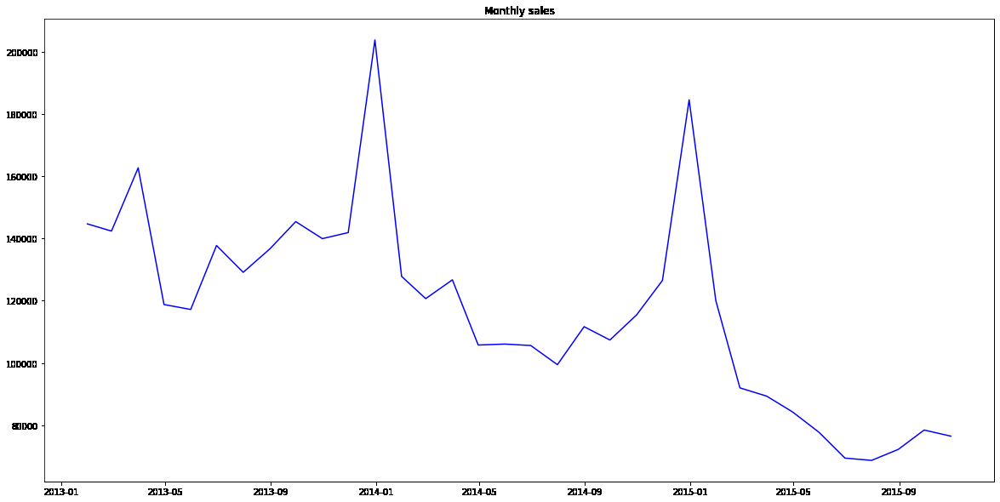
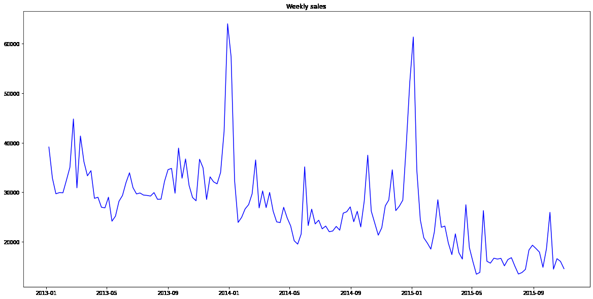
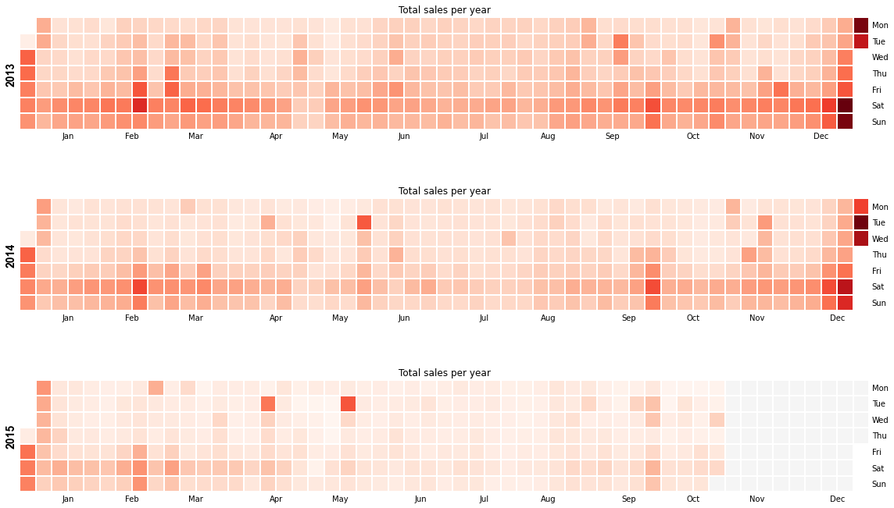
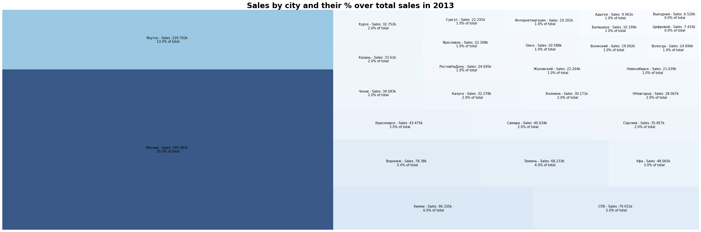
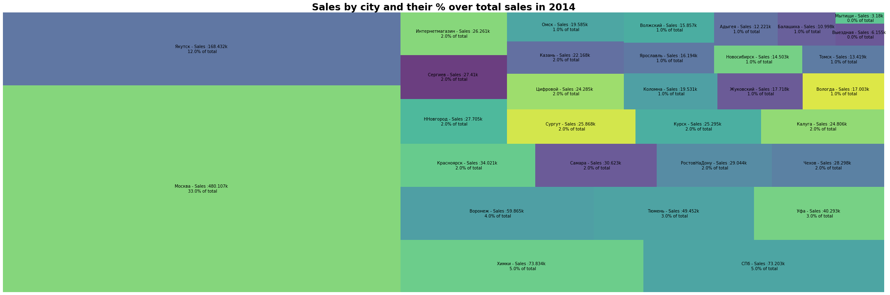
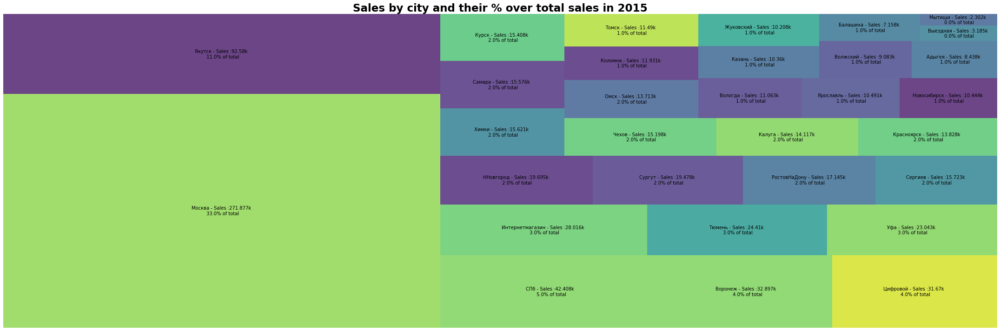
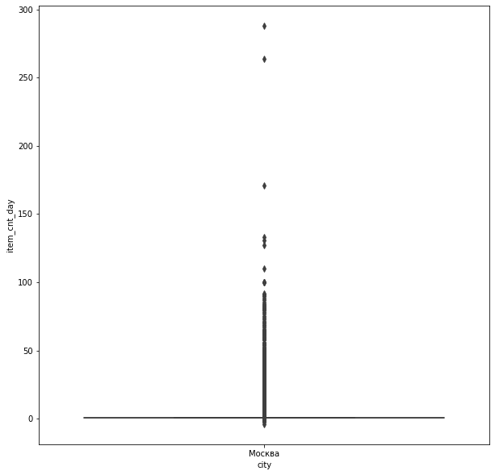
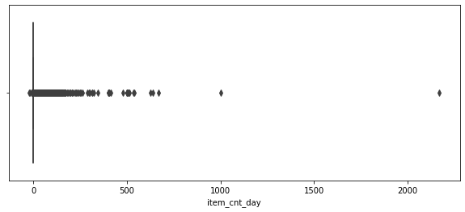
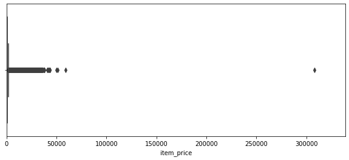
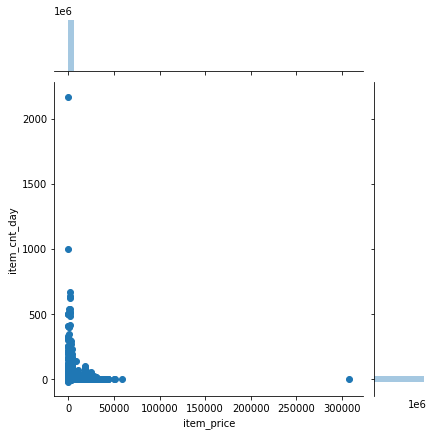

## 基于历史销售数据预测销售情况

### 1. 数据获取及预处理

#### 1.1 数据来源

本项目将使用kaggle中的competitive-data-science-predict-future-sales数据集，数据集中包含2013年1月至2015年10月的每日历史销售数据和这些商店和产品在2015年11月的销售额，分别可以作为训练集和测试集。

#### 1.2 数据说明

sales_train.csv中是2013年1月至2015年10月的每日历史数据，可以作为训练集；test.csv为2015年11月的销售额，可作为测试集。

各个字段及其含义为：

* ID- 代表测试集中的（商店，商品）元组的ID
* shop_id-商店的唯一标识符
* item_id-产品的唯一标识符
* item_category_id-产品类别的唯一标识符
* item_cnt_day-销售的产品数量。预测该指标的每月金额
* item_price-商品的当前价格
* 日期 -格式为dd / mm / yyyy的日期
* date_block_num-连续的月份号。2013年1月为0,2013年2月为1，...，2015年10月为33
* item_name- 项目名称
* shop_name-商店名称
* item_category_name-项目类别名称

#### 1.3 数据预处理

可以发现，训练集中没有缺失值。

检查并删除重复的行，仅保留第一个行。

将物品价格小于0和大于30000的行去掉。

### 2. 数据分析与可视化

#### 2.1 月销售产品数据

上图是月总销售折线图，从图中可以得到：

1. 每天的一月是销售巅峰期，应该是受到俄罗斯国定假日的激励
2. 我们看到时间序列总体呈下降趋势。

#### 2.2 周销售产品数据

上图是每周销售数据，可以看到两周之间会有更多变化，但要点保持不变：在一月份出现高峰，而销售则出现下降。

#### 2.3 每年总销售热力图

通过销售热力图可以看到一年之间各个月份各每周各天的销售情况，可以得到在周末的销售数量一般处于一周之中的最高部分。一年中，年中之间的销售是一年中最淡的时候。

#### 2.4 各城市销售情况

以上分别为2013、14、15年按城市划分的销售额及其占总销售额的百分比。可以看出3年来个个城市的销售占比情况基本没有发生改变，其中俄罗斯首都莫斯科以绝对的大比例3年都是第一；雅库茨克位列第二；其余各城市均占比在5%以下。

使用盒图查看莫斯科市的销售数据：

可以看到莫斯科市销售数据的巨大差异。

#### 2.5 销售产品数量以及价格

采用箱线图绘制销售产品数量

采用箱线图绘制销售价格

联合绘制两者

#### 2.6 小结

通过对销售数据的分析及可视化后，可以得出以下结论：
1. 总销售额随着时间的推移而下降
2. 销售在每年一月份呈现出巨大的峰值，由于假期，所以大多数商品在年底的时候销售数额明显上涨。
3. 排名前三的城市占据了总销售额的50％以上，其中前两名城市的销售额更是远超其他城市，并且莫斯科的销售额占比十分高
4. 数据显示了销售和价格水平的异常值

### 3. 模型选取

训练模型。

首先，利用StandardScaler()进行数据标准化。sklearn.preprocessing.LabelEncoder()标准化标签，将标签值统一转换为range范围内的值。

根据kaggle中的competitive-data-science-predict-future-sales数据集的历史销售数据，有200多万条数据，数据量比较大，且均为数值型数据。  ​  

我们可以采用计算代价低，易于理解和实现的回归算法，通过回归分析，确定预测属性与其他变量间相互依赖的定量关系，可以预测历史销售数据和预测未来数据之间的关系。本实验拟采用SKlearn包的LinearRegression模型。  ​  

基于决策树的算法，在大数据集上的表现良好，运行速度快，准确率较高，实现简单且鲁棒性好。本实验拟采用lightgbm包的GBDT模型。  ​  

人工神经网络是一种模仿大脑神经网络结构和功能而建立的信息处理系统，表示神经网络的输入与输出变量之间关系的模型，根据给定的训练样本调整人工神经网络参数使网络输出接近于已知的样本类标记或其他形式的因变量。可以通过根据历史销售数据训练网络来预测未来销售数据，分类的准确度高，并行分布处理能力强，分布存储及学习能力强，较强的鲁棒性和容错能力。本实验拟采用keras包的KerasRegressor模型。

另一种方案为利用Long short-term memory, 即LSTM神经网络构建模型，使用RMSprop优化模型。

LSTM是一种基于RNN神经网络的模型, 用于处理长时间序列数据。相对于其他序列模型, LSTM能够解决长期依赖问题， 采用门控系统来调整输出值。另外, 由于每个门的操作由附加到单元状态的加法操作, 所以避免了梯度消失的问题。由于近年来LSTM在自然语言处理, 语言翻译, 生物基因和视频等领域取得显著的效果。在对销售数据分析后, 决定采用LSTM模型对产品销量这一时间序列进行预测研究。

### 4. 挖掘实验的结果

利用训练出的模型来预测2015年11月的销售数据。

采用均方根误差（RMSE）测量测试样本中的误差评估 。

### 5. 存在的问题

数据预处理的方式较为简单，对于异常值简单的丢弃，可能造成数据缺失和模型鲁棒性降低等情况，可以尝试一些其他的策略，比如：异常值替换为认为合理的区间的端点值；连续变量根据分位数或人工限定阈值离散化变为类别变量，消除极端值的影响等等方式。

由于时间和算力资源所限，实验次数比较少，且采用的模型相对简单，预测效果不佳。

### 6. 下一步工作

进一步优化模型，尝试CNN、MLP等神经网络，比较预测效果。

### 7. 任务分配与完成情况

* 白璐： 数据处理、文档编写、训练模型：已完成；优化模型：未完成
* 易晗：文档编写：已完成；优化模型：未完成
* 田君玉：‘数据分析、文档编写：已完成；优化模型：未完成
* 胡玉龙：训练模型、文档编写：已完成；优化模型：未完成
* 范晟杰：数据分析可视化、文档编写：已完成；优化模型：未完成
