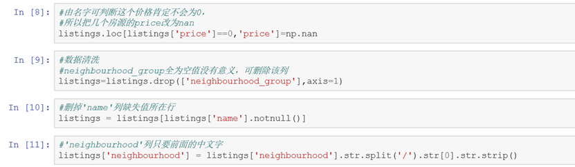
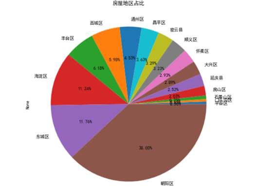
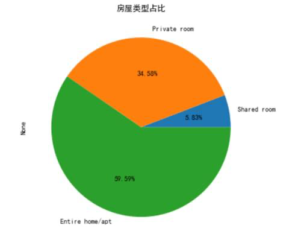
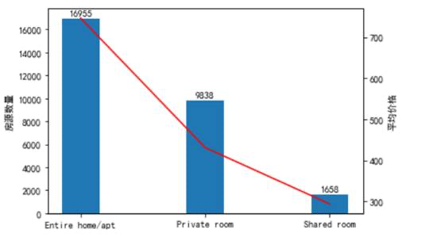
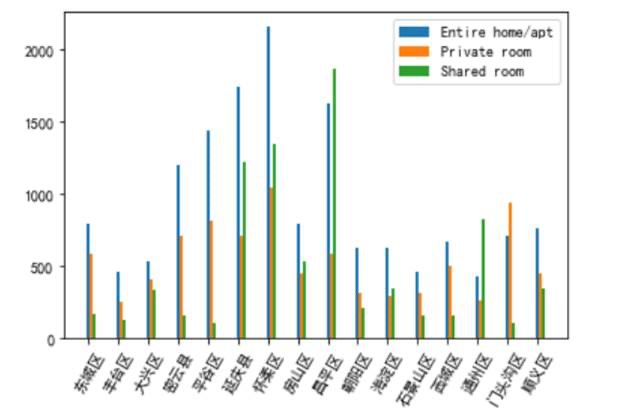

## 北京市短租房源推荐

### 1.数据获取和预处理

#### 1.1 数据来源

数据来自天池大赛Tianchi Data Hero Cup-短租数据集分析官方提供的数据集，活动数据来自Airbnb公开的北京地区的房屋短租数据。

#### 1.2 数据说明

数据集中包含28469行信息，其中每条数据包含16个字段，包含数值型、字符型、日期型等众多数据类型。

| **字段** | **说明** | **字段** | **说明** |
| --- | --- | --- | --- |
| **Id** | 记录id | **Name** | 短租房名称 |
| **Host_id** | 房主id | **Host_name** | 房主名 |
| **Neighbourhood_group** | 行政区划组 | **Neighbourhood** | 行政区划 |
| **Lattitude** | 经度 | **Longitude** | 维度 |
| **Room_type** | 房屋类别 | **Price** | 价格 |
| **minimum_nights** | 最短居住时间 | **number_of_reviews** | 评论数 |
| **last_review** | 最近评论时间 | **reviews_per_month** | 每月评论占比 |
| **calculated_host_listings_count** | 可出租房屋 | **availability_365** | 可租时间 |

#### 1.3 数据预处理

对数据进行预处理，由于neigborhood_group列为空值，对数据挖掘没有用处，所以将本列删除，由于包含空值的记录相对于总体数据集来说占比较少，所以直接删除包含缺失值的记录。

### 2.数据分析和可视化

#### 2.1 房源

我们先对房源的位置进行了分析，根据数据分析我们可以看出在朝阳区的房屋占比更高，高达38%。

一共有三种类型的房源，分别是整租、合租、群租，其中整租的房间占比很大，高达59.9%。

#### 2.2 价格

以下是不同房型的房源数量和平均价格，由图可以看出整租或公寓的价格最高且数量较多，因为现在人们在满足衣食住行的同时还注重生活品质，个人隐私等问题，所以几百年整租价格更高但房源却更多。

不同房型在不同地区的价格也有明显的差别，我们截取了每种房型25%-75%之间的价格，防止离群点对数据分析的影响，可以看出怀柔、昌平、延庆县的房屋价格更高，而房源更加密集的朝阳区价格比较低。

### 3.模型选取

我们决定采用经典算法Aprior算法实现，而Aprior算法的基本思想是首先是找出所有大于最小支持度的频繁项集，然后由频繁项集产生关联规则，这些规则必须满足最小支持度和最小可信度。Apriori算法是用来发现频繁项集的一种方法。在通过Aprior算法对数据进行挖掘后，再通过长短期记忆网络(LSTM)对短租房的评论进行情感分析，推荐优质房源。

#### 4.挖掘实验的结果

数据的预处理和分析已经进行完毕，在数据处理上花费了一些时间，挖掘实验还没有出结果。挖掘实验的结果将在最终报告中展示。

#### 5.存在的问题

在数据处理的过程中，出现了同一地区整租的价格低于合租价格的情况，这明显是不切合实际的，我们在剔除了离群点后再对数据进行可视化分析，符合实际情况。

#### 6.下一步工作

之后我们将继续进行数据挖掘，根据需求进行简单的房源推荐。对满足条件的房源信息进行评论挖掘，使用LSTM进行文本情感分析，推荐优质房源。
